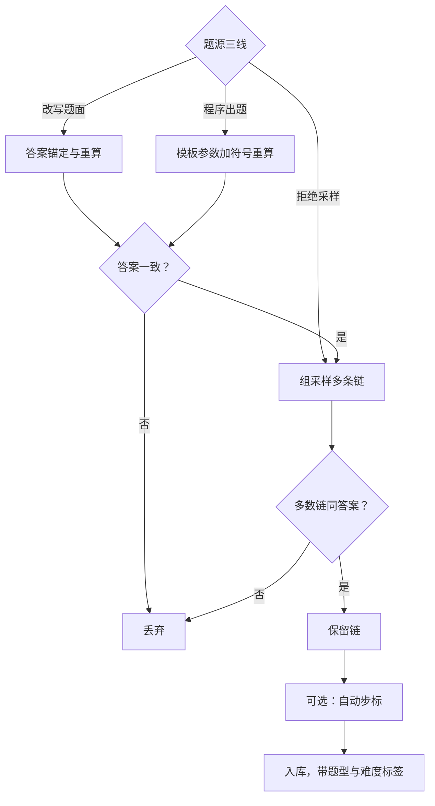
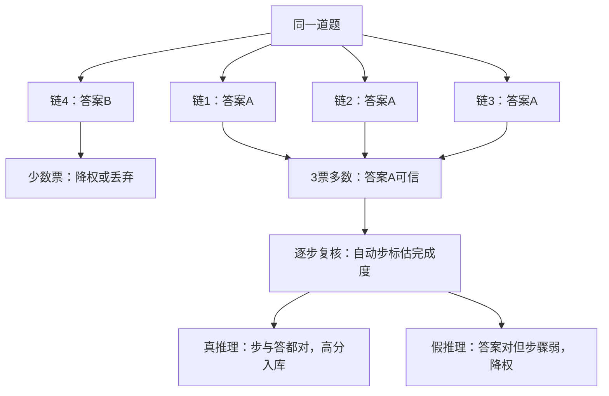

# 数学数据的合成

    
数学是合成数据的第一个主场：真值可以由程序裁决，于是生成可以放量、错误可以拦截——上限只剩验证器等价性的写法。

    <footer>—— 据 Yu 等 Meta-Math；Yuan 等 RFT；Lightman 等 Let's Verify Step by Step 整理</footer>

[上一课](/llm/synthetic-dedup-contamination)收掉了通用管线的身份关卡，从本课起进入域合成。数学域的特别之处在验证器：答案对不对可以交给符号计算与等价检查，[验证器等价](/llm/math-verifier-equivalence)课已写清「对」的判定本身是工程。本课写题与解从哪来——改写题面、拒绝采样造解、程序出题三条线——以及它们各自把哪类错误放进了数据。

## 问题

三条线各有缺口。改写线：对已有题做答案保持或答案可追的变异（换数字、换情境、反向提问），题量指数上涨，但改写出的题可能无解、多解或与原答案脱钩——「题面改了答案没改」是最高产的事故。拒绝采样线：同一道题让模型采样多条推理链，只保留最终答案正确的，便宜且天然带链多样性；但答案对不等于推理对，凑答案、反推、蒙对都会混进来。程序出题线：从知识点模板生成题与标准答案，真值最干净，但表面分布窄，模板化风险在谱系课已点名。

## 方法

三条线各配一个闸。改写线：以答案为锚——先定答案再生成题面，或改写后重算答案，重算不一致即丢弃；变异算子要带「答案可验证」约束，无解与多解由验证器甄别，不是由教师自评。拒绝采样线：组采样加答案核对，[拒绝采样与 RFT](/llm/rejection-sampling-rft)已讲循环本体；合成语境的增量是链级过滤——同一题保留多条不同链是资产，但链之间要过一致性：同一题的多条链给出同一答案才可信，只对一次的链降权。程序出题线：模板参数采样生成题，答案由符号系统重算而不是模板里存字符串；题型覆盖用知识点网格审计，防止参数采样只在浅层打转。

步级监督是可选的第四站：答案正确的链，其步骤对错仍未知。[过程奖励](/llm/lightman-prm)课讲过人工步标的成本，Math-Shepherd 式的自动步标用蒙特卡洛完成度估计每一步的价值——把 PRM 推到规模的是步标的自动化，不是 PRM 本身。

## 机制

为什么数学能放量而开放域不能：拦截率决定放量上限。数学的拦截是程序级的，每一条入库样本都过了可复算的检查；开放域的拦截靠裁判，检查本身有偏。链级过滤的机制在于分离「答案误差」与「推理误差」：只看最终答案时，假推理与真推理同样得分，训练把「说得像对的」而不是「对的」放大；多链一致性与步标是把两个误差源拆开的手段——前者投票压随机误差，后者逐步定位系统误差。改写线的机制风险则是分布塌缩到原题邻域：改写保留答案结构，也保留了原题的解法偏置，题量大不等于覆盖宽，覆盖要交给多样性度量课的网格审计。

蒙特卡洛完成度估计可以翻译成「从这里出发还有多少胜算」：把某一步之后的推理随机续写 8 次，最终答对 6 次，这一步就得 0.75 分。它用胜算代替人工标注给每一步打分，Math-Shepherd 靠这一手把过程奖励推到了规模。

Meta-Math 的答案是条件改写：以「原题加答案」为条件生成新题面，把答案变成生成约束而不是事后核对。这一步让改写的有效率大幅上升——约束放在生成侧，永远比放在过滤侧便宜。

多链一致性给个数字实例：同一题采 8 条链，6 条给出答案 A、2 条给出 B，一致率 75%，达到阈值就收 A；若 8 条链答案五花八门，说明题目多半超出模型当前能力，整题丢弃，而不是硬凑一个两票对一票的「多数」。

## 边界

验证器等价是全线的天花板：数值等价、符号等价、格式归一没写对，拦截率就失真——好样本被丢，坏样本被留。初学者容易以为改写出的一万道题等于一万道不同的题。实际上改写大多落在原题邻域：换个人名、换个数字，解法套路一模一样，模型刷再多也只是背熟同一类模板，覆盖要靠知识点网格审计兜底。证明题只有终结判定没有过程真值，拒绝采样只能收「证完了」的链，步级监督退化成启发式；几何与含图题的验证器覆盖更薄。改写与程序出题产出的「难」是结构难，不等于对学生难，入库时带的难度标签要留给难度分级课用通过率重标。最后，数学合成的产出常被蒸馏管线二次消费，链的长短与文体要按学生口径再过滤，这是[推理蒸馏到小模型](/llm/reasoning-distill-small)的辖区，本课不越界。

## 小结

- 三条题源线：答案锚定改写、组采样拒绝过滤、模板加符号重算。
- 答案对不等于推理对：多链一致性与步级监督拆开两类误差。
- 拦截率是程序级的，数学才能放量；验证器等价性是全线天花板。
- 步标自动化（蒙特卡洛完成度）把 PRM 推到规模。
- 改写保结构也保偏置，题量不等于覆盖。
- 出处：Yu 等 Meta-Math 2023；Yuan 等 RFT 2023；Lightman 等 2023；Wang 等 Math-Shepherd 2023。
