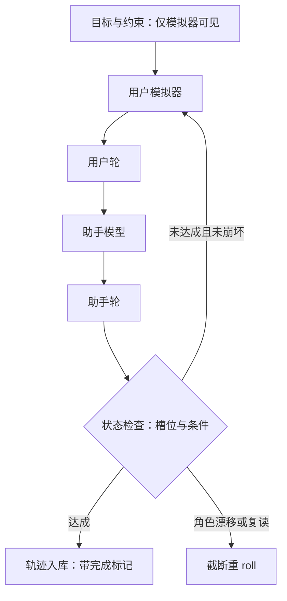
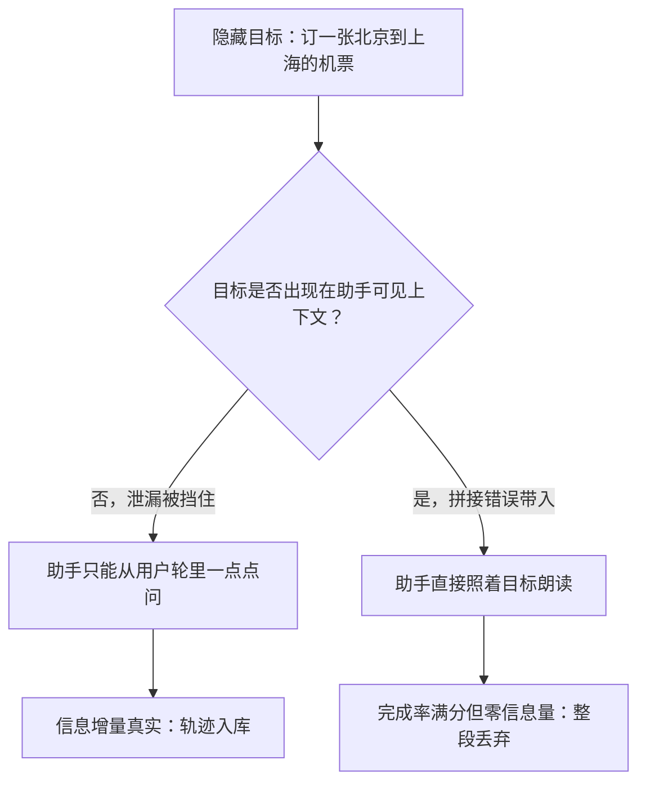

# 多轮对话合成

    
对话合成的核心设计不是让两个模型说话，是让它们知道的不一样：信息不对称立住了，多轮才有信息量。

    <footer>—— 据 Li 等 CAMEL；Ding 等 UltraChat 整理</footer>

[上一课](/llm/synthetic-code-pipeline)的代码域靠执行把真值钉死；对话域没有程序真值，验证从「判对错」退到「判连贯、一致与目标达成」，质量控制的重心随之后移——从过滤器移到生成结构的设计。本课写多轮对话的三种生成结构，以及它们各自在何处最常崩。

## 问题

多轮数据的合成难点不是生成单轮回复——那是教师的老本行——而是制造「有内容的轮次推进」。三种结构的缺口不同。角色扮演双模型：给两个模型各设角色自由互聊，便宜且长，但会崩向两种吸收态：无限客套（双方礼貌互捧不推进任务）与角色漂移（几轮后用户开始替助手答）。用户模拟器结构：一个模型持隐藏目标扮用户，另一个扮助手，轮次推进由目标驱动，目标达成度可以程序化判定——这是对话域里少有的准真值，但它的质量完全押在模拟器的纪律上。单模型自问自答：教师一个人写整段对话，最便宜，但轮间相关性极强，深轮次基本是首轮的复述。

## 方法

结构选型按任务定。任务导向对话（订票、排查、表单填写）用用户模拟器：目标与约束写进模拟器侧的系统提示，助手不可见；任务完成判定用状态检查——槽位填齐、条件确认——这给了过滤一个程序抓手。开放域对话用角色扮演加崩溃检测：角色卡要带「禁止替对方说话」与轮次职责边界，检测器盯三类崩坏——角色漂移、任务遗忘、复读循环——命中即截断重 roll，不让坏轨迹流进整形。自问自答只当增广：多轮损失只打助手轮（[多轮 loss mask](/llm/multiturn-loss-mask)课的规矩），用户轮文本质量的影响本就低，但对话级通顺仍要人审抽样。

轮次深度是配比维度：合成对话普遍停在三四轮，因为每深一轮，模拟器要同时记住的活跃约束和槽位继续累积。深轮次要专门造——长任务、多约束、中途改需求三类模板——并单独配比，否则训练出的模型见长对话就崩。深一轮贵多少可以直接数：一轮要守 1 条约束，三四轮对话模拟器得同时记住 3-4 个槽位加历史承诺，到六轮以上约束数翻倍、崩坏率随之上升——这就是合成对话普遍停在三四轮的算术原因。

## 机制

信息不对称是机制核心：模拟器知道目标而助手不知道，对话的信息量来自助手从「不知道」走到「知道」的过程。泄漏摧毁这个机制——目标一旦出现在助手可见上下文里（模板拼接错误、多轮改写时带入），对话就退化成朗读，完成率虚高。崩溃检测的存在理由是吸收态不是随机噪声而是吸引子：客套互捧对双方都是低风险高流利的续写方向，采样天然滑进去；检测器按崩坏类型分类统计，哪类吸收态占比上升，就补哪个方向的算子或角色卡约束。模拟器与助手同源的风险与代码域的自食同构：同一教师既出题又答题，题会越来越像它能答的样子；缓解照旧——生成与判定分离，模拟器与助手至少用不同版本或不同温度段。

多轮合成的常见事故不是答错，是「用户帮忙」：模拟器把约束和目标全替助手说了，完成率满分但对话无信息量。审计指标不是完成率，是助手轮的信息增量——目标信息首次由助手自己问出来才算数。

信息不对称可以类比猜谜：出谜的人知道答案，猜的人才觉得有趣。模拟器持目标扮用户，助手必须靠提问把信息问出来；一旦谜底提前贴在墙上（目标泄漏），「猜谜」就退化成「念谜底」，这段对话对训练毫无价值。

吸收态、吸引子是动力系统术语，意思是演化到某个状态后就出不来了。对话里「好的谢谢」「请再说一遍」式客套互捧就是这样的状态——对语言模型是低风险高流利的续写方向，采样天然滑进去，所以要按崩坏类型检测、命中即截断重 roll。

## 边界

无程序真值的部分（开放闲聊的情感推进、风格一致性）只能裁判打分加人审，拦截率回到谱系里最弱的一档。模拟器的语言与人群偏置直接写进数据：它会用同一种口吻「当用户」，用户侧多样性要靠角色卡与语料种子显式撑开。长对话的上下文成本随轮次增长，深轮次合成的算力预算要单独列。最后，对话合成与偏好数据的分工不同：这里造的是「对话怎么进行」，偏好对造的是「哪种回复更好」，两者的数据形状与训练目标都不同，不要用一套管线硬融。

## 小结

- 三种结构：用户模拟器持隐藏目标、角色扮演加崩溃检测、自问自答只当增广。
- 信息不对称是多轮信息量的来源，目标泄漏让对话退化成朗读。
- 吸收态是吸引子：客套互捧与复读要按类型检测、截断重 roll。
- 轮次深度是配比维度，深轮次要专门造。
- 审计看助手轮的信息增量，不看完成率。
- 出处：Li 等 CAMEL 2023；Ding 等 UltraChat 2023；loss mask 规矩见本站专课。
