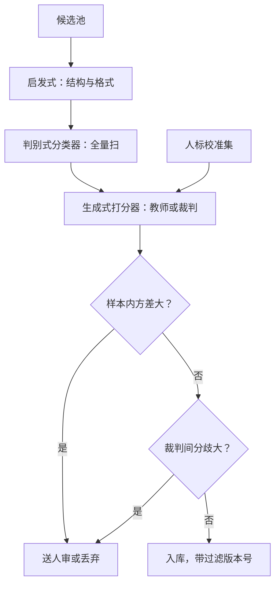

# 质量过滤：打分器与一致性

    
过滤器不是在挑「好样本」，是在把教师分布投影到你声明的目标分布上——投影错了方向，数据越多离目标越远。

    <footer>—— 据 Chen 等 AlpaGasus；Zheng 等 LLM-as-judge 整理</footer>

[上一课](/llm/self-instruct-evol)把自举与演化接成了题池扩张机，但扩张进来的一切都只是候选。把候选变成训练集的关卡是过滤：启发式、判别式分类器、生成式打分器三层递进。预训练网页侧的过滤在[质量过滤与分类器](/llm/data-quality-filter)与 [DCLM 数据过滤](/llm/dclm-filter)已讲；本课写指令与轨迹侧的打分器：监督信号是教师的判断而非参照文档，失败模式因此不同。

## 问题

合成数据的过滤难点在于「质量」没有外部定义。网页数据至少有「像高质量文档」这个参照；指令数据的「好」取决于目标能力——同一套数据做聊天助手是好，做数学推理是噪声。工程错误有两类。其一，只用一套固定打分器，把教师的风格偏好当成质量：长答案与讨好语气被系统性打高分。其二，只用一次性打分，把裁判的随机性当成样本属性：同一样本两次打分可能跨两档。两者的共同后果是过滤器在系统性地选择一种风格，训练分布被投影到「教师喜欢的样子」而不是「任务需要的样子」。

## 方法

三层过滤各拦各的。启发式层拦结构与格式：长度界、语言检测、格式完整性、模板残留，便宜且近乎无偏置，但只看得见表层。判别式层用小分类器放大规模：人工分层样本作正例，扫全量候选；预训练侧 DCLM 已证明对齐良好的 fastText 能压过多数复杂启发式，指令侧同理，成本在标注集要覆盖目标能力。生成式打分器层用教师或裁判逐条打分或做成对比较，粒度最细、偏置也最大——要冻结提示、温度与解析规则，把裁判当成有版本的代码。

一致性的三个检查。样本内自洽：同一样本多次打分的方差，方差大的送人审或丢弃。裁判间一致：两个不同模型（或教师加规则）交叉打分，分歧样本信息量最大——分歧小而系统化说明裁判同源，分歧大说明质量信号本身不稳。与人标锚定：留一小批人标注做校准集，定期算裁判与人的一致率，漂移要在污染配比前发现。

## 机制

过滤的真实作用是重加权：每一道关卡都在改写样本进入训练分布的概率，阈值就是权重曲线。这意味着「过滤掉多少」不是质量指标，被保留集合的分布才是——AlpaGasus 用裁判从 5.2 万条 Alpaca 数据里筛出约 9 千条，训练更快、评测更高，说明被筛掉的部分不少是负迁移。反过来，过滤器太窄会把高难样本当低质量丢掉：长链条多步推理在打分器眼里「可读性」天然差，质量与难度在裁判那里是混着的——难度问题本课程后面用通过率单独解决，过滤器不要越权替它做决定。打分器还有实证的自我偏好（[自我偏好](/llm/self-preference-bias)）：裁判对出自自身风格的样本系统性偏高，所以生成与打分应尽量分离。一致性检查的机制意义在于分离两种误差：样本内方差量的是裁判的随机误差，裁判间分歧量的是系统性偏置——只查前者会漏掉最危险的后者。

AlpaGasus 的 5.2 万到 9 千不是「删脏数据」那么简单：它同时把训练时间缩短到几分之一。过滤器太弱时，「更多数据」掩盖的常常是负迁移——数量从来不是质量的上位替代。

## 边界

打分器的上限是教师的上限，且教师不会说「我不会」：超出教师能力的样本不会被标成低质量，只会被标成「不像教师」，这类样本的缺失在池内无从察觉，只能靠 held-out 真题的增量审计兜底。三层过滤顺序有讲究：贵的放后面，先启发式压量再上裁判，反过来会把预算烧在显然的坏样本上。最后，过滤阈值的任何变动都会改变配比——过滤器与配比是同一根轴上的两个旋钮，消融时不能分开归因，这一点留给配方消融课展开。

## 小结

- 三层过滤：启发式拦格式，分类器扫全量，打分器给细粒度。
- 质量是相对目标能力的声明，不是样本的内禀属性。
- 一致性三查：样本内方差量随机误差，裁判间分歧量系统偏置，人标锚定防漂移。
- 过滤即重加权：看被保留集合的分布，不看过滤比例。
- 生成与打分分离，防自我偏好变成自选择。
- 出处：Chen 等 AlpaGasus 2023；Zheng 等 2023；DCLM 2024。
