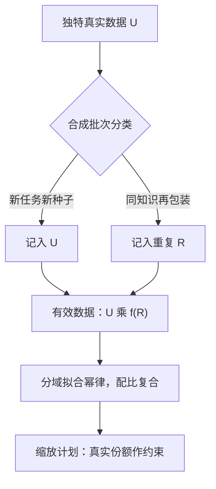

# 合成数据的缩放律

    
合成数据便宜，不等于合成数据的边际收益高：账要用幂律算，不能用单价算。

    <footer>—— 据 Muennighoff 等 Scaling Data-Constrained Language Models 整理</footer>

[上一课](/llm/synthetic-ablation-design)回答「哪个旋钮在起作用」；本课回答规模问题：数据加倍，损失降多少；合成的那一份，按什么汇率折算。基础工具已在[数据约束下的扩展](/llm/data-constrained-scaling)与[多 epoch 与重复数据](/llm/multi-epoch-repetition)立好：独特数据 $U$ 与名义 token 分开记账，重复前约四个 epoch 接近新数据、之后收益衰减。本课把合成数据放进这套账本。

## 问题

合成数据在缩放账本里最容易记错行。「再包装」类合成——同一知识的改写、复述、翻译——更像重复而不是新数据：它抬高名义 token，独特信息的增量有限，记成 $U$ 会高估预算。「真扩充」类合成——新题、新任务、新程序验证样本——才真的增加 $U$，但它的「独特」是相对什么说的：相对真实分布还是相对训练池，两种口径差得很远。错误记账的直接后果是规划失真：按合成占比算出的「数据充足」判断，在真实分布的泛化上不兑现；更隐蔽的后果是闭环自食的代数被低估——[模型坍缩的实证](/llm/model-collapse-empirics)的损害随代数累积，缩放计划若不绑定真实数据供给，等于在加速消耗。

## 方法

记账三步。分类入账：每个合成批次声明它增加的是 $U$（新任务、新参数组合、新真实种子扩展）还是 $R$（同知识再包装），后者折算进重复预算，按 $D_{\mathrm{eff}} = U \cdot f(R)$ 计有效数据；$f$ 的形状用自己数据拟合，四个 epoch 的经验值只是先验。分域拟合：合成子分布拟合自己的幂律——高密度教材式数据常常指数更优，同样的损失只需要更少 token；但这是子分布内的汇率，混进总配方后，总损失由配比加权的复合决定，[配比定律](/llm/data-mixture-laws)的框架接管。绑定供给：缩放计划里真实数据的份额与回混比例写成约束（坍缩实证的量级是约一成回混即大幅推迟坍缩），合成再便宜也不能把真实锚点挤到零。

## 机制

合成缩放的深层约束是「教师是源分布」：合成样本是教师分布的采样，规模越大，合成部分与教师分布贴合越紧，它带来的损失下降越像「拟合教师」而不是「拟合世界」——真实探针与合成损失的裂口随规模放大，这正是预训练侧「日志会骗人」在缩放视角的形态。幂律拟合的机制风险在外推：小规模拟合的指数到目标规模可能变号，尤其当合成占比随规模计划上调时，配比本身在变，「单一分布」的拟合假设被打破——可行的做法是把占比固定成几个档位，各档分别拟合，插值只做参考。坍缩与缩放在闭环处交汇：自训练的每一代都把上一代输出并入语料，等效于 $R$ 无限增大的极限情形，$f$ 趋近于零；回混真实数据，就是把 $U$ 重新接进回路。

Muennighoff 等 2024 的量化口径：数据受限下，重复约四个 epoch 内近似新数据，随后边际收益快速衰减。据此规划的 $D_{\mathrm{eff}}$ 不能用「名义 token 除以成本」的直觉替代——重复的汇率不是一比一，也远不是零。

## 边界

幂律指数不可跨分布平移：教材式数据的优势汇率只对它自己成立，混配后不能当通用折扣用。拟合窗口要避开退火与课程阶段——那些阶段的损失形状由计划主导，不服从稳态幂律。合成批次的「独特性」判定带有主观性（新题但同解法算 $U$ 还是 $R$），入账口径要在配方版本里写死并前后一致，否则账本本身失真。最后，缩放律回答平均值，不回答尾部：真实探针的尾部指标——低频任务、长尾格式——随合成占比上升的恶化，不在任何幂律的预测范围里，要单独立监测。

## 小结

- 合成批次分两类入账：真扩充记 $U$，再包装记 $R$，按有效数据算账。
- 教材式数据的优指数是子分布汇率，混合后由配比复合接管。
- 教师是源分布：合成损失降得多不代表世界拟合得好，真实探针定案。
- 幂律拟合按合成占比分档做，外推只做参考。
- 缩放计划绑定真实供给与回混约束，防闭环坍缩。
- 出处：Muennighoff 等 2024；Kaplan 等 2020；Hoffmann 等 Chinchilla 2022；Shumailov 等 2024。
