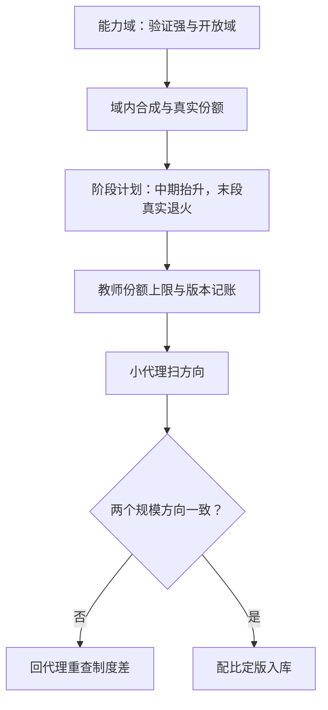

# 小模型的数据配比

    
小模型不是缩一号的大模型：容量更小，对坏样本更不宽容，对好配方更敏感——配比在小模型上是一等决策。

    <footer>—— 据 Mukherjee 等 Orca；Gunasekar 等 Textbooks；Abdin 等 Phi-3 整理</footer>

[上一课](/llm/synthetic-diversity-metrics)定下覆盖怎么量；本课回答配比问题：合成与真实、各能力域之间，份额怎么分。这件事在小模型上被推到极端——[合成数据在预训练中的位置](/llm/synthetic-pretrain)讲过合成是补丁不是主食，[教科书式合成](/llm/textbook-synthetic)给过「高密度合成是有硬上限的调料」的结论。小模型让这些结论的每一个词都更重：它既没有容量吸收坏样本，也没有冗余稀释好配方。

## 问题

小模型的配比与[配比定律与领域配比](/llm/data-mixture-laws)的大模型图景有两处结构性不同。其一，噪声敏感度：大模型有容量装下噪声样本，损失被平均掉；小模型的每一分容量都要花在刀刃上，质量过滤的档位必须更紧——大模型配比里能容忍的合成占比，直接搬到小模型常常失败。其二，风格吸收：小模型更容易学表面模式，合成数据的教师风格会被更深地烙进去，多教师、去风格化在小模型上不是可选优化。矛盾在于：小模型恰恰是蒸馏与合成的最大受益者——[推理蒸馏到小模型](/llm/reasoning-distill-small)证明过滤后的长链能把小模型推过原本的规模线。收益与风险同源，配比就是在这对矛盾里找平衡点。

## 方法

配比按三个粒度定。能力域粒度：验证强的域（数学、代码）合成占比可以高——拦截率撑得住；开放域占比压低并以真实锚点兜底，沿用预训练侧「有源改写优于无源生成」的口径。阶段粒度：占比是训练阶段的函数——中期可以把高密度合成抬高（学技能），末段用真实数据退火（对齐分布）；倒序会让模型先学坏再难改。教师粒度：单教师的份额设上限，配比表按教师版本记账；教师升级时旧份额不自动顺延——教师换了，它那部分数据要重过滤。

规模是配比的隐藏维度：用小代理扫出来的最优配比不能直接平移到目标规模，[小模型代理实验](/llm/proxy-model-experiments)的假阳性口径（数据制度不同）在合成数据上尤其常见——代理模型学合成的效率与目标模型不同构，方向性结论至少要在两个规模各验一遍。

## 机制

小模型放大「合成更好学」的偏差：高密度合成去噪充分、密度均匀，训练损失与开发集都更好看，但合成分布与真实分布的缝隙在日志里不可见——这正是预训练侧「合成往往更好学，日志会骗人」的结论。小模型把这口陷阱挖得更深，因为它的容量不足以在外部保留真实分布的对照，所以小模型评测里真实探针的权重必须更高：日志选型、探针定案。蒸馏配比的特殊性在于教师链已经替你做了一层质量与难度过滤，蒸馏数据与自合成数据不是同一类资产——前者继承教师分布的偏置，后者叠加本模型的偏置，两类份额要分开记账，混在「合成」一个桶里会互相掩盖各自的上限。

DeepSeek-R1 的蒸馏系列是配比第一性的例证：约八十万条过滤后的教师长链直接 SFT，小模型推理大幅越线，全程无需 RL。第一步永远是把教师与过滤器选对，其次才是调百分比。

## 边界

配比结论的时效以教师与基座的换代为界：基座换版，旧配比的最优点整体作废，能继承的只有结构——域份额的相对次序与阶段形状。验证弱域的合成占比没有安全上界公式，只有探针增量这一个裁判。蒸馏数据的许可与教师条款是配比之外的闸门，本课程后面有专课；此处只立规矩：配比表里每一份都要能回答「从哪来、谁生成、凭什么能用」。小模型的多轮与 agent 能力配比本课不展开——它们的上限更多卡在任务与环境，不在数据百分比。

## 小结

- 小模型对噪声更不宽容、对风格吸收更深：过滤更紧、教师份额记账。
- 配比三粒度：能力域、训练阶段、教师版本；末段真实退火。
- 合成更好学会骗日志：真实探针权重必须更高。
- 蒸馏数据与自合成数据分开记账，偏置来源不同。
- 代理扫配比要跨两个规模验方向，防制度差假阳性。
- 出处：Mukherjee 等 Orca 2023；Gunasekar 等 2023；Abdin 等 Phi-3 2024；DeepSeek-AI R1 2025。
