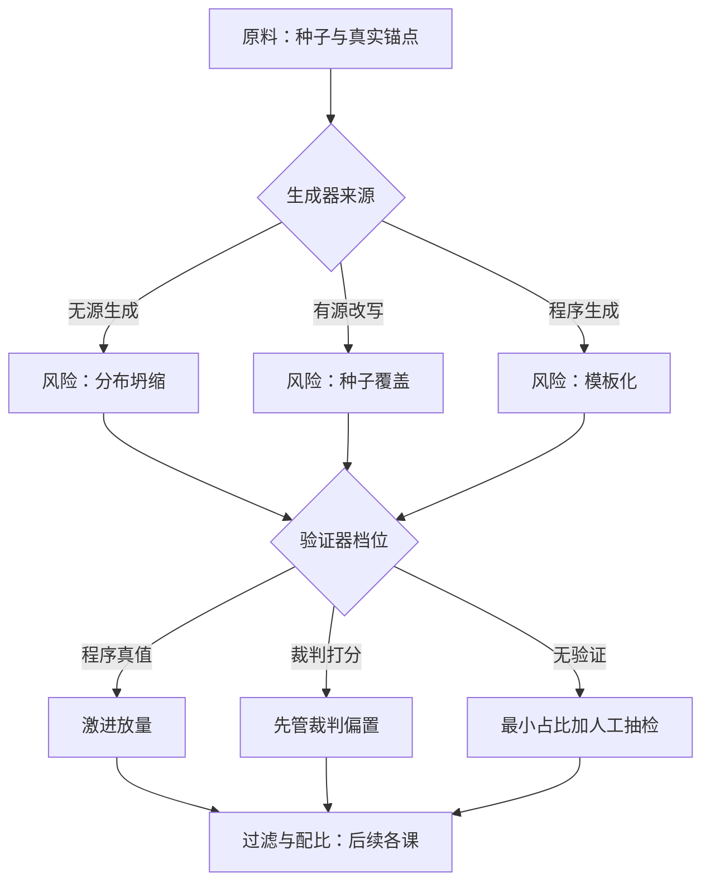

# 合成数据的谱系与分类

    
合成数据的分类学不是文献综述，是风险清单：每一种生成方式都对应一种特定的失败模式，和一只专门管它的阀门。

    <footer>—— 据 Wang 等 Self-Instruct；Gunasekar 等 Textbooks Are All You Need 整理</footer>

[上一课](/llm/rm-engineering-map)把奖励模型工程收成一条主线：RM 是比较数据的回归器，数据定天花板，策略做放大器；根本解只有改数据的经验分布这一个入口。天花板要抬，除了向标注员买，还可以让模型自己造数据——合成数据。此前[自指令](/llm/self-instruct)、[教科书式合成](/llm/textbook-synthetic)、[合成数据在预训练中的位置](/llm/synthetic-pretrain)、[推理蒸馏到小模型](/llm/reasoning-distill-small)、[模型坍缩的实证](/llm/model-collapse-empirics)散落在各课序里，各讲各的管线与失败。本课程把散点收拢成一门工程学科：合成数据不是一种数据，而是一组生产线，用同一套语言描述、验收、止损。本课先建坐标系。

## 问题

工程决策里第一个问题从来不是「怎么生成」，而是「选哪条生成线」。给指令池扩覆盖、给推理模型造题、给预训练补稀疏域，三条线的原料、验证器、风险完全不同。把「合成数据」当一个桶，会犯两类错：用预训练网页的启发式过滤去质检数学题——质量信号根本不在文本表面上；或者用自指令的去重阈值去管纯生成数据——重复风险与坍缩风险不是一回事。分类的目的，是让每类数据在进配比之前就带着自己的风险说明书。

## 方法

把任何一条合成生产线写成五元组：原料、生成器、验证器、过滤器、配比。原料是种子与锚点：种子喂给生成器，锚点对真实分布校准。生成器按来源分三档：无源生成（教师自由采样）、有源改写（围绕种子自举、演化、改写、回译）、程序生成（模板加符号）。验证器按真值来源分三档：程序可验证（答案核对、单元测试、执行反馈）、裁判打分（教师或裁判模型）、无验证（纯生成直接入库）。过滤器与配比留给后续各课。

三档来源对应三类风险。无源生成怕分布坍缩：没有锚点，模型自食输出，尾部先丢、熵收缩。有源改写怕种子覆盖：生成的多样性上限被种子池锁死，种子偏了整条线跟着偏。程序生成怕模板化：真值干净但表面分布窄，模型学到的是模板正则性而不是能力。验证器的可信度决定上游可以多激进：有程序真值的域可以放开采样量，靠裁判打分的域要把裁判偏置当一等公民来管。

## 机制

为什么分类决定风险而不只是决定出处：因为验证器是传导链的中枢。上游生成得再野，程序真值能在入库前拦下错误——数学与代码敢放量，靠的是验证器比生成器可信。反过来，裁判打分的数据里，裁判的偏置会原样写进训练分布：教师偏爱长答案，长答案被反复保留，长度偏置从裁判流入模型。所以合成数据能占多少配比，不取决于生成多便宜，取决于这条线上「错误被拦截的比例」。[模型坍缩的实证](/llm/model-collapse-empirics)给出的是下界情形：无验证、无回混的闭环，几代之内尾部就近乎不可逆地丢掉；而约一成的真实数据回混就能大幅推迟坍缩——锚点在谱系表里是最高优先级。

Alpaca 用 Self-Instruct 式自举生成 5.2 万条指令，公开口径 API 成本不到五百美元——生成成本从人月降到美元之后，工程重心整体从「采集」移到「控制」：原料、验证、过滤、配比取代了标注指南。

## 边界

谱系表本身不产生质量，它只保证你问对了问题。三轴之间有耦合：同一条线可以换验证器（数学题从裁判打分换成程序核对），风险结构随之改变，分类要跟着重画。教师模型的上限是所有线的共同天花板——谱系再精巧，也生成不出教师分布之外的能力。另外，本课程把人写数据当外部锚点而不是一类合成：人写与合成的分工在[人写 vs 合成指令](/llm/human-vs-synthetic-instruct)已讲，此处只取结论——人写定义好回答，合成扩张覆盖。

## 小结

- 合成生产线是五元组：原料、生成器、验证器、过滤器、配比。
- 来源三档：无源生成怕坍缩，有源改写怕种子覆盖，程序生成怕模板化。
- 验证器三档：程序真值可放量，裁判打分先管偏置，无验证只配最小占比。
- 验证器可信度决定上游激进度，错误拦截比例决定合成占比上限。
- 真实数据回混与真实锚点是所有线的共同保险。
- 出处：Wang 等 Self-Instruct 2022；Gunasekar 等 2023；Shumailov 等 2024。
