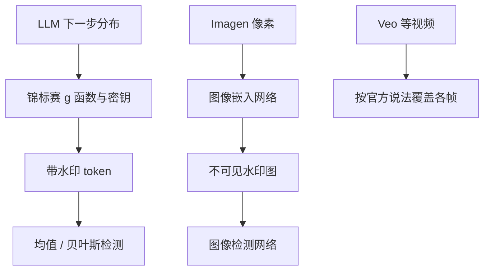

# SynthID

    
SynthID-Text 不改训练、只改采样；检测不必再跑底层 LLM，并能与推测解码结合，从而在生产系统里规模化加水印。

    <footer>—— Dathathri et al., Scalable watermarking for identifying large language model outputs, Nature 634, 818–823 (2024)</footer>

Google DeepMind 的 **SynthID** 是一套跨模态的生成内容水印与检测工具，而不是单一损失函数。图像线于 2023 年 8 月 29 日博客 *Identifying AI-generated images with SynthID* 上线：把不可感知水印打进 Imagen 像素，Vertex AI 有限内测。文本线的可引用方法学是 Nature 2024 的 SynthID-Text（Dathathri 等）：锦标赛采样。视频与音频在 2024–2025 的 DeepMind / Google 博客里写成「在帧上扩展图像方法」「Lyria / Veo 输出带水印」，**没有**把内部网络图画成可复现架构。检测门户 SynthID Detector 与「已打水印条数」以当时产品博客为准。本篇分清：图像编码器—解码器（官方描述）、文本锦标赛（Nature）、视音频（产品句）。不发明 Veo 水印的层数。

## 问题

生成内容与真实内容在像素和字面上越来越分不开。可见水印破坏版面、易被裁；仅靠文件元数据，一转码就丢。需要一种打在信号里、对常见变换够稳、又不明显伤质量的标记，并且检测方不必保存原图。文本更苛刻：任何改 logits 的方案都可能伤事实性与文风；还要能跟推测解码一起用，否则生产延迟不可接受。

SynthID 的产品问题还有归属：检测「像不像 AI」与检测「是不是 Google 家模型打过的 SynthID」不是同一任务。官方反复写：不是银弹，是透明工具箱里的一块；极端编辑仍可能毁掉图像水印。

### 图像：成对深度网络，不是角标

2023-08-29 博客：两个一起训的深度学习模型，分别嵌入与检测；目标含正确检出与视觉上把水印对齐原图，以保持不可见。水印铺在像素里，裁切、滤镜、亮度、JPEG 有损后仍希望可检。输出三档置信度：「若检出，则部分图像可能由 Imagen 生成」。兼容元数据方案：元数据丢了，像素里还在。明确写：对极端操作不完美。这是后处理嵌入，博客未给出与扩散采样器耦合的公式——不要把文本的锦标赛抄到图像上。

后来产品页把 SynthID 扩到 Gemini 文本、Lyria 音频、Veo 视频，并在 I/O 沟通里给出「数十亿」量级的已标记内容。条数是部署统计，不是检测精度。Detector 门户按上传文件扫水印，并可标出更可能带水印的局部。

## 方法

**文本（Nature）。** 不改训练。生成下一步时，用密钥与最近上下文种子，对词表打 $m$ 个伪随机 $g$ 函数分。从 $p_{\mathrm{LM}}$ 抽 $2^m$ 个候选，两两按 $g_1$ 比分晋级，再按 $g_2$，直到 $g_m$ 决出 token。检测端对已生成文本重算 $g$ 值，用均值、加权均值或需训练的贝叶斯检测器打分，在低假阳性下看真阳性。可配成近似不扭曲分布（保质量）或扭曲分布（更好检）。与推测解码的集成是规模化关键。Gemini 上近 2000 万次回复的在线实验被用来说明质量未掉。代码：`google-deepmind/synthid-text`，Apache 2.0 参考实现，README 写明非生产、哈希无密码学保证。

**图像（博客）。** 生成后（或生成管道内）用嵌入网络写水印，检测网络出似然。Vertex AI + Imagen 为第一批云上通道。

**视频 / 音频（博客句）。** 2024-05-14 DeepMind 文：视频水印建立在图像与音频方法上，覆盖生成视频的所有帧；文本进 Gemini App。音频随 Lyria 等音乐模型。这些句子不够画出时域滤波器或逐帧是否共享图像网络。Veo 3 的 I/O 稿只保证输出带 SynthID，不保证检测在强重编码后的召回。

### 检测器与内容凭证是两条轨

SynthID 是隐式信号。C2PA 等凭证是签名元数据。Google 后续把二者一起放进 Gemini / Search 的「这内容怎么来的」叙事。工程上应并存：凭证告诉「谁声明」，水印告诉「信号里有没有自家标记」。OpenAI、NVIDIA Cosmos 等「接入 SynthID」的合作以 Google 官方后续博客为准，不是 Nature 论文实验。

## 机制

文本锦标赛的机制是：在 LM 已经给出的分布上，用密钥相关的伪随机比赛轻微偏向「水印友好」的 token。足够长的片段会让 $g$ 均值偏离无水印文本的机会水平。短文本、低熵文本（例如强制 JSON、复述固定答案）可检性下降——Nature 文讨论质量—检测权衡，生产上不能对一句「是」做司法鉴定。不扭曲配置尽量保持采样分布，检测更难；扭曲相反。

图像机制是全图分布式嵌入（博客用「对齐原内容」描述不可见性），故局部裁切仍可能残留。这与角落 logo 相反。视频「每帧都打」意味着时间上可抽帧检测，也意味着抽帧后重拼、变速、裁时间轴是攻击面；官方未给这些攻击的 ROC。音频同理：博客强调不可听，不给感知编码后的 BER。

Kirchenbauer 等的红绿名单水印是学术对照系；Nature 文将 SynthID-Text 与既有方法比检测率。不要在未引 Nature 实验设置时宣称「全面碾压」。开源的是文本参考实现，不是 Imagen 嵌入网络。

### 规模化约束改变算法选择

若水印不能进推测解码，服务要么关加速、要么不打水印。SynthID-Text 把这条写成一等需求。图像线则强调与云上 Imagen 的责任生成捆绑：先有生成通道，才有一致的检测密钥。密钥管理、跨产品假阳性、第三方模型误报，产品博客多一笔带过；参考实现也警告不要当密码学防伪。

## 边界与工程取舍

不能证明「不是 AI」，只能说「有没有检出 SynthID」。非 Google 模型默认无此印。重写、翻译、截短文本会稀释统计。图像极端滤镜、截图再拍、强压缩仍是博客承认的弱点。Detector 门户的可用性、地区与模态以页面为准。把 SynthID 当版权或安全审核的唯一闸门，过载。

不要用第三方对 Gemini 采样的猜测当 Nature 算法。不要把 [Veo 3](/llm/veo-3) 的原生音频写成音频水印的实现细节。与 Kirchenbauer 水印比较应另文引用 2023 年 LLM watermark 论文，本文只在对照意义上点名。

出处：Sven Gowal & Pushmeet Kohli，*Identifying AI-generated images with SynthID*，DeepMind，2023-08-29。Sumanth Dathathri et al.，*Scalable watermarking for identifying large language model outputs*，Nature 634:818–823 (2024)，doi:10.1038/s41586-024-08025-4。产品扩展：*Watermarking AI-generated text and video with SynthID*（2024-05-14）；SynthID Detector 与 I/O 部署统计见 blog.google 相应稿。

## 小结

- SynthID 是 DeepMind 的跨模态水印家族：图像像素嵌入、文本锦标赛采样、视音频按产品博客扩展。
- SynthID-Text 只改采样、可检无需原 LLM，并考虑推测解码；Gemini 大规模在线实验用于保质量。
- 图像线 2023 年随 Imagen / Vertex AI 发布，强调不可见与常见编辑鲁棒，非银弹。
- 检测「自家水印」≠ 开放域「是否 AI」；应与元数据凭证并用。
- 开源参考实现覆盖文本，不覆盖 Imagen / Veo 网络。
- 出处：DeepMind 2023-08-29 博客与 Nature 2024 文本水印论文。
