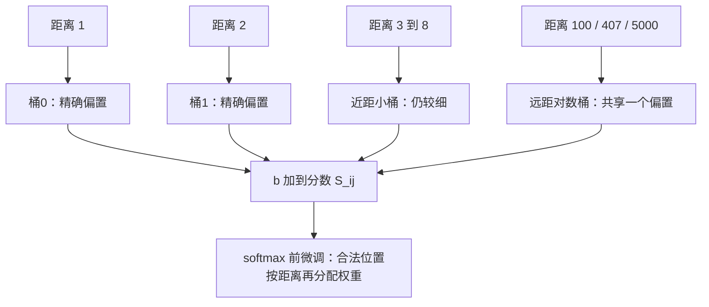
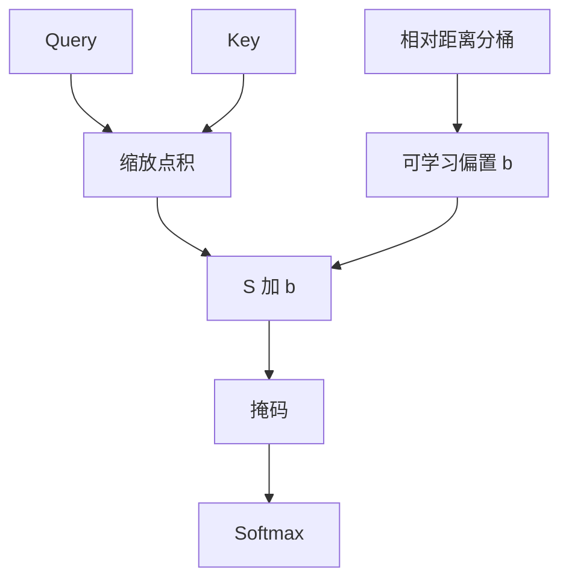

# T5 相对位置偏置

我们不用正弦或学习到的绝对位置嵌入，而是在注意力 logits 上加一个随距离变化的标量偏置。

<footer>—— Raffel et al., Exploring the Limits of Transfer Learning with a Unified Text-to-Text Transformer, JMLR 2020</footer>

[上一课](/llm/bert-encoder)把双向编码器的层序、段嵌入和 `[CLS]` 钉死。位置仍是可学习绝对向量，加在嵌入上，最长 512。本课补的缺口：编解码模型若要把任意长度的源与目标送进同一套注意力，绝对下标会先饱和，段嵌入也帮不上跨序列的相对距离。T5 把位置从「加在输入上的向量」改成「加在注意力分数上的偏置」。后课的 BART、前缀掩码都默认你会这种 logits 侧的相对位置，不再回到 BERT 的绝对表。

## 问题

[BERT 编码器](/llm/bert-encoder)的位置嵌入 $p_i\in\mathbb{R}^d$ 与 token 相加，位置是内容的一部分。[正弦位置](/llm/sinusoidal-pe)同样作用在输入，只是用封闭公式生成。两种都把「第 $i$ 个槽」当成绝对坐标。编码器–解码器里源长 $m$、目标长 $n$ 经常超过预训练截断；绝对坐标一溢出，模型看见的是从未训练过的下标，而不是「相距 $k$ 步」。

Shaw 等人已经把相对位置写进注意力：让 $q_i$ 与 $k_j$ 的相容性依赖 $j-i$。T5 要的更窄——不必学一组相对键向量，只要在 [SDPA](/llm/sdpa) 的分数上加一个标量，让距离成为打分的加性修正。缺口是：**位置信息进 logits，不进嵌入和**。

ALiBi 也是 logits 侧的线性偏置，但是固定斜率、不学习分桶。T5 的偏置可学习、按距离分桶。后课比较外推时不要把两者收成同一种方法。

## 方法

记分数 $S_{ij}=q_i^\top k_j/\sqrt{d_k}$。T5 写成

$$
S_{ij}\leftarrow S_{ij}+b_{\mathrm{bucket}(j-i)},
$$

$b$ 是每个注意力头一份的可学习向量，下标由距离分桶给出。分桶对近距离一一对应，远距离对数压缩，避免为每个可能的 $|j-i|$ 各养一个参数。偏置只用在两处自注意力：编码器自注意力与解码器掩码自注意力。T5 的[编码器–解码器注意力](/llm/encoder-decoder-attention)不加位置偏置：$i$ 与 $j$ 分属目标与源，$j-i$ 不再有自然语义，对齐完全交给内容点积。

嵌入层不再加位置向量。内容与位置在加法上解耦：token 嵌入只编码身份，距离只改谁更容易被看见。位置进 logits 而不进嵌入，可以类比阅卷加分：不在考卷上标注谁坐前排后排（不改内容），而是在评分时按座位距离加分减分（改分数）。token 身份不变，只是「谁更容易被看见」被距离调整。

### 分桶而不是全表

若为每个偏移存一个 $b$，最大长度一涨，参数与缓存都涨。对数分桶把「很远」收成少数几个共享偏置，表达的是粗粒度的远距先验，不是精确的第 407 步。这是相对偏置能接到 512 以外的代价：远距分辨率下降。分桶给个数字实例：距离 1、2、3 各占一个桶，偏置逐位可学；距离几百步时，相邻的多个距离被压进同一个桶、共享同一个偏置——表是「近处逐级精确、远处一档打包」，512 以外也有桶可查，只是查到的是「远」这个档位。

## 机制

相对偏置不改变 softmax 的行随机性，只改变哪一列在竞争中占优。头与头可以学到不同的距离偏好：有的头偏近邻，有的头几乎平坦。因为偏置加在缩放点积之后、softmax 之前，它与因果掩码相容——非法位置仍是 $-\infty$，合法位置内部再按距离微调。

交叉注意力里源与目标没有共享绝对坐标，T5 因此不给它任何位置偏置：对齐完全由内容点积做，没有相对桶参与；偏置要打破的置换对称属于自注意力那一侧。

```mermaid
flowchart TD
  D1["距离 1"] --> B1["桶0：精确偏置"]
  D2["距离 2"] --> B2["桶1：精确偏置"]
  D3["距离 3 到 8"] --> B3["近距小桶：仍较细"]
  D4["距离 100 / 407 / 5000"] --> B4["远距对数桶：共享一个偏置"]
  B1 --> ADD["b 加到分数 S_ij"]
  B2 --> ADD
  B3 --> ADD
  B4 --> ADD
  ADD --> SM["softmax 前微调：合法位置按距离再分配权重"]
```

这张图回答的问题是：查表到底怎么发生。每个 token 对按距离 $j-i$ 查桶、取出标量 $b$，加在缩放点积之后、softmax 之前——近处几个桶一一对应分得细，远处全部打包成少数档位，这就是「能接到 512 以外」与「远距分不开」同一件事的两面。

置换对称：若既无位置嵌入也无相对偏置，交换两个源 token 只改内容项。相对偏置让「左边的源」和「右边的源」在分数上可区分，即便内容相似。

## 边界

相对偏置不是长度外推的保证。桶表在训练长度内学到的远距值，推到更远时往往落在同一个桶，模型把「更远」当成「已经很远」。T5 的文本生成长度靠相对偏置加编解码结构共同撑起，不要单归因于 $b$。绝对位置在短编码器、句对分类里仍简单；本课不废除它，只是在编解码主干上换默认。初学者容易以为「相对位置 = 天然支持任意长文本」。桶表在训练长度内学习：推到更远时落在最后一个远距桶，模型只知道「很远」，分不清 1000 步和 5000 步——能接住不等于分得开。

```mermaid
flowchart TD
  Q["Query"] --> S["缩放点积"]
  K["Key"] --> S
  D["相对距离分桶"] --> B["可学习偏置 b"]
  S --> A["S 加 b"]
  B --> A
  A --> M["掩码"]
  M --> P["Softmax"]
```

## 小结

- T5 把位置从输入加法挪到注意力 logits 的相对标量偏置，按距离分桶、按头学习。
- 嵌入不再携带绝对下标；远距分辨率由桶的对数压缩决定。
- 偏置只加在编码器与解码器的自注意力上；T5 的交叉注意力不带位置偏置，对齐完全靠内容点积。
- 分桶能接到训练长度以外，但不等于外推已经解决。
- 出处：Raffel et al., *T5*, JMLR 2020；相对位置的前身见 Shaw et al., NAACL 2018。
