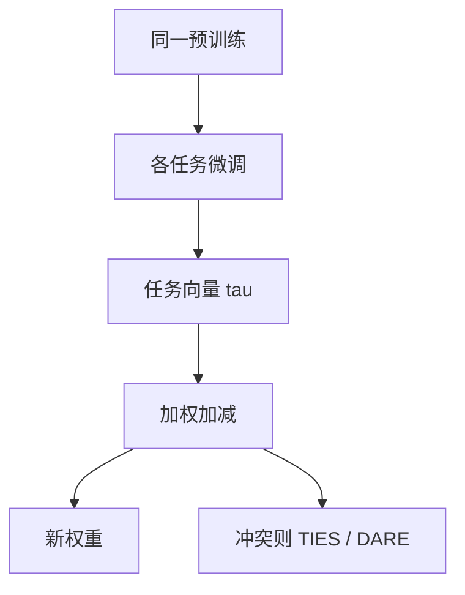

# 任务向量算术

微调相对预训练的位移可以当向量用：相加组合技能，相减削弱技能，在同一基座上有时能得到没有单独训过的行为。

<footer>—— Ilharco et al., Editing Models with Task Arithmetic, ICLR 2023</footer>

[上一课](/llm/model-merging)把 $\delta$ 从汤里拆出来，并用 TIES / DARE 处理冲突。缺口是算术本身：Ilharco 等人定义任务向量 $\tau_t=\theta_t^{\mathrm{ft}}-\theta_{\mathrm{pre}}$，然后 $\theta_{\mathrm{new}}=\theta_{\mathrm{pre}}+\sum_t\lambda_t\tau_t$。本课是补层「训练基础与稳定性」的最后一课：缩放实践收在「已有检查点如何组合成新点」，不再从反传讲起。后课若进入附录或其它补层，默认你会：$\tau$ 与基座绑定、系数 $\lambda$ 要扫、冲突时回到 TIES。

## 问题

希望「代码能力 + 拒答策略 − 过度啰嗦」而不重新训。若各微调只是在预训练盆地里走了一小步，位移近似线性，算术有意义。$\lambda>1$ 是外推，可能增强任务也放大不稳（LSE、熵）；$\lambda<0$ 是削弱，可能伤及与该任务纠缠的通用能力。Ilharco 在视觉与部分语言设定上展示加、减、类比式组合。失败时不是调一个全局学习率能修的：那是几何假设破了，应减小 $\|\tau\|$、DARE 稀疏、或回到数据上真训。

与模型汤：汤平均的是 $\theta$ 本身；任务算术平均（或加减）的是相对**同一预训练**的 $\delta$。基座不同不能减。与 EMA：EMA 无任务语义，是时间滤波。

$\lambda$ 不是学习率。它缩放的是已经学完的位移。$\lambda=0.5$ 的两个任务加和，才近似「各学一半」的汤；$\lambda=1$ 两个满血相加，相当于假设方向正交，否则必冲突。

## 方法

1. 所有 $\theta_t$ 从同一 $\theta_{\mathrm{pre}}$ 微调，记录配方以免 $\tau$ 含无关差异（不同 dropout、$n$、词表）。
2. 选验证集扫 $\lambda$（通常 $[-1,2]$ 量级），任务间可不同 $\lambda_t$。
3. 冲突先 TIES/DARE 再算术，或先算术再看哪一任务崩。
4. 安全相关行为：减法不能当成对齐保证；拒答被减掉是已知风险，评测必须含安全集。

不要把 RLHF 后的策略与 SFT 的 $\tau$ 默认可加：RL 步可能离开线性区。先测 $\theta_{\mathrm{pre}}+\lambda(\theta_{\mathrm{rl}}-\theta_{\mathrm{pre}})$ 的单轴，再多任务加。

## 机制

线性假设：损失在 $\theta_{\mathrm{pre}}$ 附近沿各 $\tau$ 的低维子空间近似二次，交叉项小则加成立。训练越久、$\eta$ 越大、任务越改表示，$\tau$ 越大、交叉项越大。这与「微调应当短」的经验一致：短 $\tau$ 更好加。深度扩展、MoE 升级改变参数布局，旧 $\tau$ 不能往新布局上贴。

数值上 $\tau$ 应在 FP32 存储。多个 $\lambda_t\tau_t$ 求和后加回，一次完成，避免连锁 BF16 舍入把小任务吃掉。

## 边界

本课不声称任意技能可向量化，也不进入图像编辑里的那套扩散算术。词表或 tokenizer 不同的两个 $\theta$ 不能减；那是另一条基座，应先对齐词表再谈 $\tau$。

补层到此结束：从注意力反向、初始化、稳定性传感器，走到缩放账与检查点几何。论文、型号与审计仍是附录，不插回这条主干之后的补层课序。

## 小结

- 任务向量是相对同一预训练的 $\delta$；加减组合技能，系数 $\lambda$ 要扫。
- $\lambda=1$ 多任务相加假设方向近正交；否则先稀疏或符号决议。
- 与汤、EMA、RL 步的几何前提不同，不能混减不同基座。
- 安全行为可被减法去掉，必须单列评测。
- 本补层从反传到检查点算术收束；后课默认已读完本课序。
- 出处：Ilharco et al., ICLR 2023。
