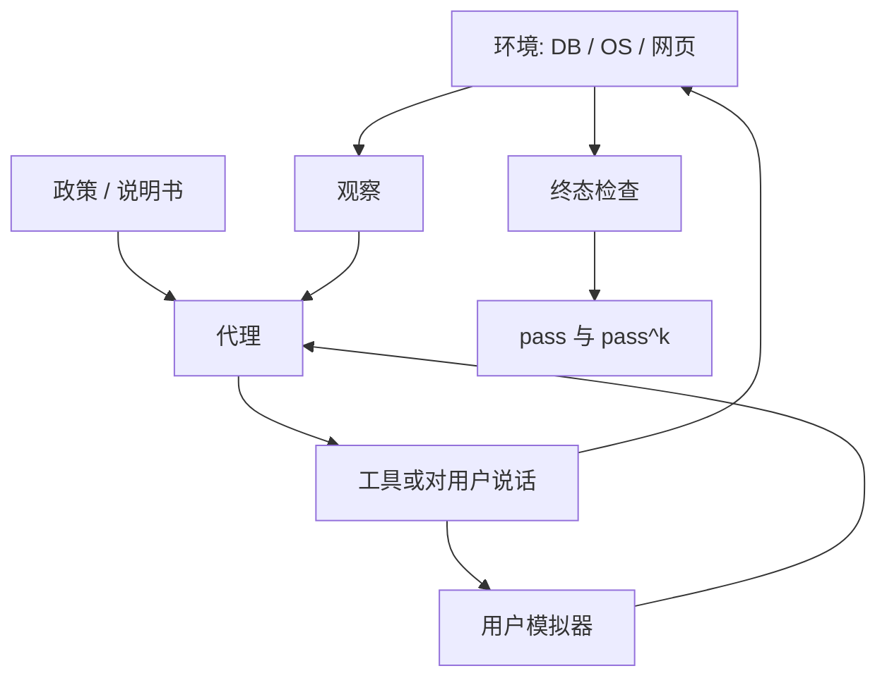

# τ-bench / AgentBench

代理评测若只看单轮函数名是否写对，会漏掉用户改口、政策冲突和工具观察之后的状态；要把模型放进带数据库、规则和对话对手的环境里，再用多次独立试验看它稳不稳。

<footer>—— Yao et al., τ-bench；Liu et al., AgentBench</footer>

[BFCL](/llm/bfcl) 冻结的是一次或数次工具调用的结构。用户真正交给代理的任务更脏：零售退货要同时满足数据库里的订单状态和 PDF 里的政策例外，航空改签要对着会改主意的旅客，操作系统任务要在真 shell 里试错。Yao 等人的 τ-bench（tau-bench）把零售与航空做成带 API、数据库与政策文档的领域，对面是语言模型模拟的用户，指标不只是一次成功，还有 $k$ 次独立运行全过的 $\mathrm{pass}^k$。Liu 等人的 AgentBench 走宽度：操作系统、数据库、知识图谱、网店、网页浏览、家庭任务等八类环境，看语言模型当代理时在交互循环里的成功率。两套都比 [ReAct](/llm/react) 的单篇示范更接近「环境里的智能体」，但一个深而窄、一个广而浅。本篇写环境、用户模拟、可靠性指标，以及为什么单次成功率会撒谎。

## 问题

工具调用对了，任务仍可能失败：调了退款 API，却违反「已发货不可全额」的政策；SQL 能跑，却改错了行；用户说「那就改明天的」，代理忘记上一轮已经锁了座位。这些失败发生在多轮状态上，不发生在单条 JSON 的 AST 上。需要带状态的环境：可执行的工具、可检查的终局、以及会说话的用户或会变化的世界。

宽度也是问题。只在零售退货上刷分，不能说明会管 Linux 或会查知识图谱。AgentBench 用多环境防止「一个领域的提示工程」冒充通用代理。代价是每个环境的保真度有限，成功标准各写各的，总分必须非常小心。τ-bench 相反：领域少，但政策与用户模拟更认真，专门打「像客服一样又要听话又要守规」的场景。

### 一次成功可能是运气，pass^k 才谈可靠性

解码有温度，用户模拟有随机性，工具返回可有次序差。同一策略跑十次，三次走对政策分支、七次在用户改口时把状态写坏，单次成功率 0.3 会被发成「还行」。τ-bench 强调

$$
\mathrm{pass}^k=\Pr(\text{$k$ 次独立试验全部成功}).
$$

对伯努利成功率 $p$，若试验近似独立，$\mathrm{pass}^k\approx p^k$，对不稳的代理惩罚极狠。产品要的是「这个退货流程今晚不要翻车」，不是「平均来说有时可以」。AgentBench 各环境也应报多次种子，而不是一次轨迹。

用户模拟器本身是模型。它会过度配合、会提前说出槽位、也会胡搅。τ-bench 的分数耦合了代理与模拟器；换模拟器模型，名次可能动。协议必须冻结模拟器版本与提示。

## 方法

τ-bench 的一次试验：给定领域（零售 / 航空等）、初始数据库、政策文本、用户目标。代理看见工具清单与政策，与用户多轮对话并调 API，直到结束。金标是数据库终态与任务约束（该退的退了、不该改的没改），而不是对话好不好听。政策是一等输入：模型必须在「用户恳求」和「规则禁止」之间选规则。评测脚本比较终态，对话过程只用于调试。

AgentBench 为每个环境定义动作空间与成功谓词：OS 上是否出现目标文件与正确权限，DB 上查询结果是否匹配，网店是否买到指定商品。循环是观察→思考→动作，步数有上限。汇总时常报各环境成功率再宏平均。宏平均会让极难环境与较易环境同等权重，这是设计选择：要的是剖面，不是被简单环境撑起来的总分。

两边都要锁：最大步数、是否允许额外网络、工具错误如何写回、解码温度。环境若是 docker 或仿真器，镜像哈希应进协议，否则「OS 任务」不可复现。

### 政策遵循与工具正确是两列分

τ-bench 上常见的一种假成功：API 调用形状完全正确，终态却违反政策——例如在窗口外退款。BFCL 会给这种轨迹高 AST 分。应单独报：任务完成、政策违规次数、不必要调用。AgentBench 的 OS 环境同样：命令能执行不等于做的是用户要的那件事，成功谓词必须绑目标状态，而不是「没有报错」。

## 机制

代理循环把模型用成策略：上下文里塞着政策、对话、工具观察，每一步要决定对用户说还是对 API 说。失败往往是**状态不同步**——数据库已改、嘴上还在问已过时的槽；或**政策未接地**——训练先验是「尽量满足用户」，政策要求拒绝。τ-bench 把后者变成主命题：有用性奖励与规则冲突时，谁赢。这与单轮有用性 Arena 可以反向。

AgentBench 的机制因环境而异。OS 与 DB 接近程序交互，错一条命令可以不可逆；知识图谱更像多跳检索；网页有 DOM 噪声。同一权重在各环境上的剖面，比总分更能说明它像哪种代理（脚本小子、检索器、还是会点页面的浏览者）。不要假设「AgentBench 高」等于 τ-bench 的守规客服。

### 长轨迹上的指令遵循不同于 IFEval

政策文档是长约束，用户话是短约束，二者冲突时要以政策为准。这不是 [IFEval](/llm/ifeval) 的表面谓词，而是带优先级的条件指令，还要在多轮里维持。模型可能第一轮读了政策，第十轮被用户情绪带跑。τ-bench 的长度与冲突正是为了考这一种遗忘。缩短政策、或把规则写成 schema 必填项，会让任务退化成 BFCL。

pass^k 对 $p$ 极敏感。$p=0.7$ 时 $\mathrm{pass}^8$ 已经很小。比较两个模型必须同时报 $p$ 和 $k$，只报 $\mathrm{pass}^k$ 会把小差距放大成「一个能用一个不能用」。

## 边界与工程取舍

仿真环境不是生产。零售 API 的字段比真商店少，OS 任务比真运维短，网页是简化沙箱。高分说明在该仿真器里循环能闭合，不说明可以无人值守接客服电话。用户模拟器更会系统性地比真人好对付或更胡搅，两种偏差都会扭曲。

AgentBench 环境多，维护成本高，部分环境会随依赖过时。引用分数必须带版本。τ-bench 领域少，容易针对性提示工程与针对政策文本的训练泄漏。内部应轮换用户目标与政策条款，逻辑同 [动态基准](/llm/live-benchmarks)。

步数上限与费用直接相关。给太多步，模型可以暴力试错刷 OS；给太少，合理探索被截断。上限是任务定义的一部分，不是实现细节。与 [Plan vs ReAct](/llm/plan-vs-react) 的关系：评测应允许两种提示策略，但分表，避免把「更会写计划」和「环境更简单」混为一谈。

不要用 AgentBench 宏平均签发「通用代理」。缺的环境（真浏览器多站、真支付、真多人协作）恰恰是风险最高的。剖面里为产品相关的那一两列单独设门禁。

## 小结

- τ-bench 用带政策、数据库和用户模拟的领域任务测守规的多轮工具代理，并用 $\mathrm{pass}^k$ 惩罚不稳。
- AgentBench 用多环境成功率画代理能力剖面，宏平均不能替代分环境。
- 终态与政策违规应分列；AST 正确不等于任务成功。
- 模拟器版本、步数上限、温度和环境镜像属于协议。
- 两套都是仿真，不能直接当成生产客服或无人值守运维的证书。
- 出处：Yao et al., *τ-bench: A Benchmark for Tool-Agent-User Interaction in Real-World Domains*；Liu et al., *AgentBench: Evaluating LLMs as Agents*。
