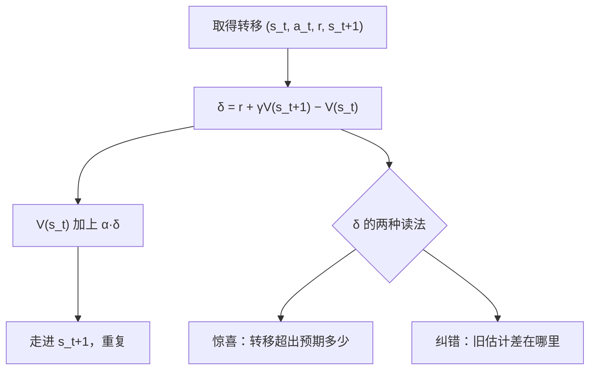

# TD(0) 与自举

用自己还没兑现的估计当真值，一步一学；偏差是自举收的学费，换来的是不等大结局。

<footer>—— 据 Sutton, Learning to Predict by the Methods of Temporal Differences, 1988；Sutton & Barto, 2018, 第 6 章整理</footer>

[上一课](/llm/monte-carlo-evaluation)把无模型评估落在经验回报的平均上：无偏、高方差、必须等回合跑完。缺口跟着「等」字来：回合很长、终止很远、甚至没有终止时，蒙特卡洛一步也学不动；走了一半才发现方向不对，前面几百步的采样白费。本课写 TD(0)：每走一步就用当前估计造一个目标、立即更新，不等大结局。后面的 SARSA、Q 学习与致命三要素，都建立在这套自举语法上。

## 问题

蒙特卡洛的目标 $G_t$ 在回合结束前不存在。TD(0) 把目标换成一个立刻可得的东西：$r_{t+1}+\gamma V(s_{t+1})$。第一项是刚到手的真实奖励，第二项是当前估计——**用估计替换期望里还不知道的余下部分**，这一步叫自举。若 $V$ 已经是 $v_\pi$，目标在期望上恰好对齐：$\mathbb{E}_\pi[r_{t+1}+\gamma V(s_{t+1})\mid s_t]=v_\pi(s_t)$；$V$ 不准时，目标是「当前认知下的 $v_\pi$」，学习变成追赶自己的影子。自举因此先天地带偏：估计进了目标，误差就有机会被当成信号学回去。

## 方法

更新式只有一行：

$$V(s_t)\leftarrow V(s_t)+\alpha\big[\,r_{t+1}+\gamma V(s_{t+1})-V(s_t)\,\big]$$

方括号里是 TD 误差 $\delta_t$：现实与预期之差。本课钉两点。一，$\delta_t$ 不是噪声而是学习信号：它同时读出「这条转移带来多少惊喜」与「$V(s_t)$ 错了多少」，后面的优势估计与 critic 回归用的都是它。二，终止状态钉死 $V=0$：若 $s_{t+1}$ 终止，目标只剩 $r_{t+1}$；这条约定忘了，终止状态自己也会被更新，$\delta$ 永远拖着一项假的。算法在线运行：一步、一状态、一次更新，内存 $O(1)$，回合中途就在学。

## 机制

偏差-方差账本。目标含 $V(s_{t+1})$：$V$ 不准，目标就偏，且自举把误差沿状态链传播——一个高估的格子会通过目标抬高它的前驱。但目标只含一步的真实随机性：蒙特卡洛目标的方差随余下回合长度增长，TD 目标只有一步抽样加一层旧估计的误差，通常小得多。收敛账在表格与固定策略下成立：步长按 Robbins–Monro 条件衰减时，TD(0) 收敛到 $v_\pi$（Sutton 1988；Tsitsiklis &amp; Van Roy 1997 给出一般分析）。账本之外还有适用面：持续任务没有终止，蒙特卡洛干脆无定义，TD 照跑；样本效率上，每条转移被立刻用掉一次，不必攒到回合末。

Sutton 1988 的原文把监督学习、蒙特卡洛与 TD 放进同一个预测框架：TD 目标是「当前估计下的期望的样本」——这也是后来一切 critic 回归 $r+\gamma V(s')$ 的出处。

初值的角色变了：蒙特卡洛目标无偏，从哪个 $V$ 起步只影响速度；TD 目标带着旧估计，初值差会拖着收敛路径走一段弯路。这不是实现瑕疵，是自举的结构性代价——本课程后面讲致命三要素时会看到，同一结构在函数逼近与离策略加入后走得更远。

## 边界

偏差不免费：学到的 $V$ 会先系统性偏离再爬回来，步长与初值决定路径形状。TD(0) 只取一步：一步目标与完全蒙特卡洛之间是 n 步与 TD(λ) 的连续谱，本课程到 actor-critic 一带才需要中间档，现在只钉两端。深度 RLHF 里 critic 每步回归 $r+\gamma V_\psi(s')$ 正是这套目标；它的稳定性问题——目标随参数动、误差沿链放大——要到函数逼近与离策略凑齐时才升级成定理级警告，此处先记下结构。TD(0) 评估的是给定策略，控制的半步还缺着：下一课把自举搬到 $(s,a)$ 上。

## 小结

- TD(0) 用 $r_{t+1}+\gamma V(s_{t+1})$ 当目标，每步更新；自举即用估计估估计。
- TD 误差 $\delta_t$ 是学习信号：一步惊喜与估计纠错二合一。
- 偏差换方差：目标带旧估计的偏，但只含一步真实随机性；在线、省样本、可用于持续任务。
- 表格、固定策略、衰减步长下收敛到 $v_\pi$；初值影响路径，误差沿链传播。
- 终止状态价值钉死为零，否则 $\delta$ 永远带假项。
- 出处：Sutton, Learning to Predict by the Methods of Temporal Differences, Machine Learning, 1988；Sutton & Barto 2018 第 6 章；Tsitsiklis & Van Roy 1997。
