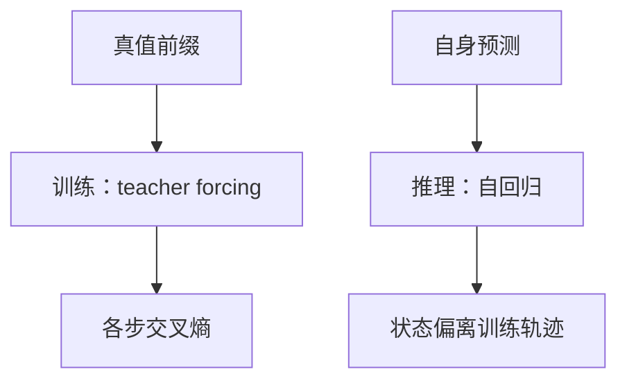

# Teacher forcing

训练时把金标准的前一个目标词喂给解码器，前向可以沿时间并行算损失；推理时却必须吃自己的预测，两条条件分布并不相同。

<footer>—— 据 Williams &amp; Zipser, A Learning Algorithm for Continually Running Fully Recurrent Neural Networks, Neural Computation, 1989；Bengio et al., Scheduled Sampling, NeurIPS 2015 整理</footer>

[Seq2Seq 编码解码](/llm/seq2seq-encode-decode)规定解码器每步读 $y_{t-1}$。本课不重画 $s$。缺口是：$y_{t-1}$ 在训练与推理上来源不同。训练若用模型自己的抽样，错误会沿时间累积，早期难收敛；若用真值（teacher forcing），条件是对的，部署时却从未见过「自己刚写错一个词」的状态。本课把这份落差钉住。注意力下一课才出现，不在这里用对齐来掩盖强迫。

## 问题

解码器定义 $P(y_t\mid y_{\lt t},s)$。训练语料提供完整 $y_{1:m}$，于是可以在每一步把真值 $y_{t-1}$ 当输入，同时用 $y_t$ 当标签——与[下一词分类](/llm/clm-as-next-token)相同，只是条件里多了 $s$。这样每步损失可并行（RNN 状态仍串行，但输入不再依赖模型输出）。缺口是：推理没有真值 $y_{\lt t}$，必须用 $\hat y_{\lt t}$。若训练从未让解码器看见错误前缀，测试时一旦偏离，状态进入训练集外区域，错误级联。

Williams & Zipser 把「用真值当下一输入」称为 teacher forcing。它不是作弊标签——标签仍是 $y_t$，只是条件输入被替换。把 forcing 理解成「损失里用了未来」，是把输入与标签搞混。标签左移一位与 forcing 经常一起出现，但是两件事。

### Teacher forcing 不是 scheduled sampling 的同义词

按一定概率把输入换成模型预测，是为了缩小训练—推理落差的后续补丁（Bengio et al., 2015）。本课的对象是默认协议：训练全强迫。未讲清楚强迫，采样调度没有对照。强迫也不会自动解决瓶颈 $s$：即使每步条件都是真值，解码器仍然只从 $s$ 取源信息。落差与瓶颈是两个缺口。

强迫使训练时 $h_t^{\mathrm{dec}}$ 走在「金标准前缀」的轨迹上。推理轨迹不同，即使参数相同。评估必须走推理协议：自回归展开，不能用真值输入报 BLEU。

## 方法

训练步：编码器读源得到 $s$；解码器输入序列是 $\langle\mathrm{bos}\rangle,y_1,\ldots,y_{m-1}$，标签是 $y_1,\ldots,y_m$；损失为掩码平均交叉熵。推理：从 $\langle\mathrm{bos}\rangle$ 与 $s$ 开始，每步取 $\hat y_t$，写回下一步输入，直到 EOS 或最大长度。束搜索改变的是取 $\hat y$ 的方式，不改变「输入是自身输出」。暴露偏差（exposure bias）即两条轨迹的差异。

## 机制

强迫把信用分配变局部：当前交叉熵主要责怪当前步的分类头，因为输入是对的。好处是信号稳定、收敛快。坏处是模型从未练习「带着错误继续写」。长目标上级联更明显。缓解可以是计划采样、自己生成再训练（SEARN 一类）、或后课注意力让每步直接读源从而减少对自身前缀的脆弱依赖——但注意力并不取消这条协议差异。

与语言模型预训练的关系：纯 LM 训练也是 forcing（真值前缀）。聊天推理同样自回归。Seq2Seq 只是把同一落差放在「还有一个源」的条件下，显得更刺眼。

## 边界

本课不引入加性注意力。下一课[Bahdanau 加性注意力](/llm/bahdanau-additive-attention)针对瓶颈 $s$，让解码器每步读全体编码器隐状态。后课默认：训练用 teacher forcing 除非声明；报告生成质量必须走自回归协议。

## 小结

- Teacher forcing 用真值 $y_{t-1}$ 当解码器输入，标签仍是 $y_t$。
- 推理吃自身预测，轨迹与训练不同，错误会级联。
- 强迫不等于泄漏未来标签；评估不能在真值输入下报生成指标。
- 计划采样是后续补丁，不是本课默认。
- 出处：Williams & Zipser, 1989；Bengio et al., NeurIPS 2015。
