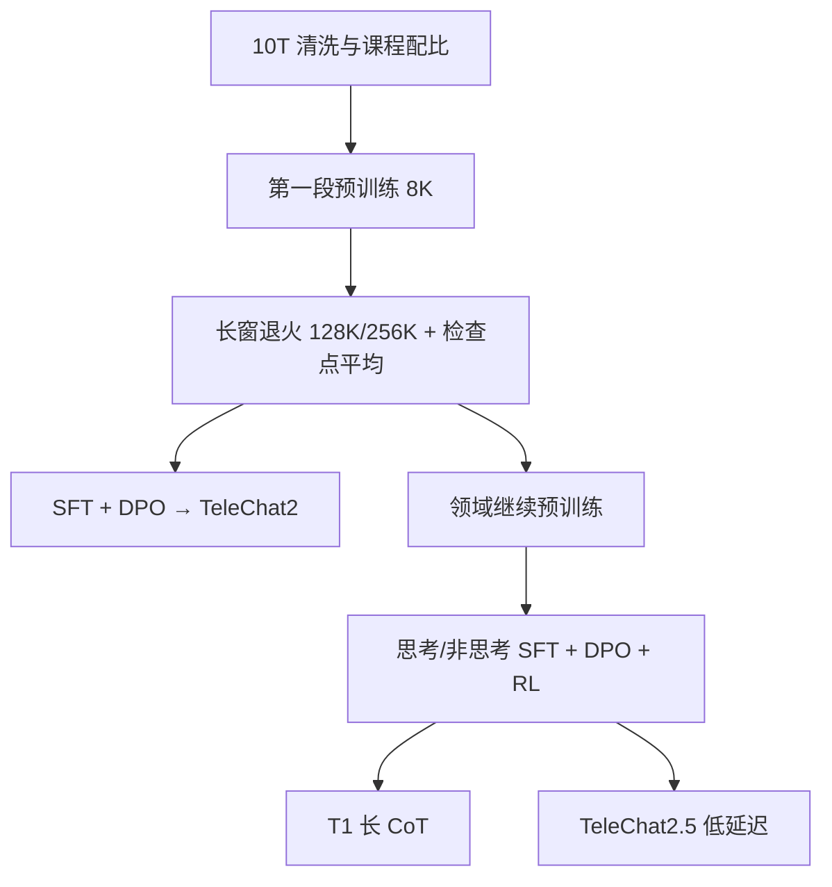

# TeleChat2

    
架构几乎不动，把预训练从 3T 级拉到 10T，再在退火阶段把窗口接到 128K/256K；2.5 与 T1 才用继续训加 RL 把快慢思考拆开。

    <footer>—— Wang 等，Technical Report of TeleChat2, TeleChat2.5 and T1，arXiv:2507.18013</footer>

中国电信人工智能研究院的 **TeleChat2** 是星辰语义一代开源升级：官方强调 **完全基于国产算力**（Atlas 900 A2，约 8000 张昇腾，MindSpore 4D 并行，天翼云上海）。系列含 TeleChat2、TeleChat2.5 与推理向 **T1**，旗舰稠密 **115B**，另有 35B。2 的主路径是 10T 预训练 + SFT + DPO；2.5/T1 在此之上做领域继续预训练与 RL，T1 走长 CoT，2.5 走低延迟。本篇以 2507.18013 与 Tele-AI GitHub 为准，写清三条线如何分叉，不把 T1 的 o1-mini 对照表算成 TeleChat2 基座成绩。

## 问题

上一代 TeleChat 数据约 3T、窗口与推理都偏短，架构却已经是可用的 Pre-Norm 解码器。电信选择 **少改结构、大改数据与后训练**：证明在昇腾上把 115B 稠密训到 10T 可行，并把长窗退火塞进同一阶段，避免「先短后长」的灾难遗忘。115B 的 KV 若仍用 MHA 会在 128K 上爆；因此只在 115B 上改 [GQA](/llm/gqa)（8 个 KV 头），35B 仍 48 头满注意力。

第二条是产品分叉：同一骨架要同时给「快」和「深」。2.5 与 T1 都是 35B/115B，差别在继续训与 RL 目标，而不是两套层数。

### 国产算力是约束不是口号

报告写明训练在 8000 卡昇腾上用 MindSpore。这意味着通信拓扑、融合算子与故障恢复都绑定 CANN/MindSpore，迁移到 NVIDIA 参考实现会丢他们的系统贡献。模型仍是标准 Transformer，不是「昇腾专用结构」。

词表统一 131072，BPE 字节回退，数字切 digit，并加对话角色与工具特殊 token。2 / 2.5 / T1 共用词表，便于 AI-Flow 跨端协作（报告引用的框架）。

## 方法

结构：RMSNorm Pre-Norm、SwiGLU、RoPE。35B：64 层，隐藏 6144，FFN 20480，48 头 / 48 KV，词表 131072。115B：96 层，隐藏 8192，FFN 40960，64 头 / **8 KV**。相对一代，主要改 GQA 与 RoPE 基频。

预训练两段。第一段：10T 高质量多样 token，来源含网页、书、百科、新闻、社交、论文、代码及二十余个行业库。清洗：URL/文档/段落分层去重；启发式（过短、标点异常、脏词、低星 GitHub）；模型语义过滤；数学代码用静态分析、执行/符号校验与 LLM 交叉。配比在 3B/7B 小模型上试中英比例与课程：先通后专，每 100B token 评一次再调采样。Adam，$\beta_2=0.95$，余弦到峰值 10%，35B 峰值 LR $3\times 10^{-4}$、batch 8M token；115B 峰值 $2\times 10^{-4}$、batch 6M。同来源拼接，**不加跨样本掩码**，第一段最大长 **8K**。

### 长窗退火与检查点平均

退火把长窗扩展与能力增强合成一段：35B 到 **256K**，115B 到 **128K**，并保持与 8K 对照的通识。数据按 0–8K / 8–16K / 16–32K / 32–128K / 128K+ 分桶，再按考试、网页、代码等域切开；0–8K 与其余约 **7:3**，考试与代码升权。RoPE base：32K 用 $10^6$，128K 用 $8\times 10^6$，256K 用 $4\times 10^7$。每段完整退火约 50B token 即够。NIAH 在 4K–128K 上报告可用。最后把末 **5 个检查点** 做参数平均。

### 后训练三条流水线

TeleChat2：Base 上 SFT + DPO。查询按学科标签收集，公开集清洗聚类，缺口用 self-instruct / 进化补；回复生成后过质检。DPO 含偏好构建、合并与迭代 DPO。工具调用与指令遵循有专节加强；开源 3B/7B/35B 强调 Function Call。

TeleChat2.5 与 T1：先领域继续预训练，再 **思考/非思考** SFT，再 DPO，再 RL 加码数学与代码。T1 为长 CoT；2.5 为快推理。报告称 T1-115B 在其评测上超过 o1-mini 与 GPT-4o——这是 T1 数字，不是 TeleChat2-115B Chat。

## 机制

10T 相对 3T 主要加的是世界知识与代码/数学密度；结构不变意味着增益来自数据与调度。GQA 只给 115B，是因为 35B 的 KV 在目标窗口上尚可承受，115B×128K 必须砍 KV 头。同来源拼接不加跨样本掩码，等于允许文档内连续统计，也等于允许相邻无关文档互相可见——这是效率选择，可能造成假长依赖，报告沿用一代做法。

长窗退火把「升 RoPE 基频 + 混入真长文 + 短文 7 成」绑在学习率余弦下降上，避免单独拉长窗时通识崩。50B/段说明他们认同「长依赖可被短训释放」。检查点平均平滑退火末的噪声，类似随机权平均，降低单一最低点对评测集的过拟合。T1/2.5 的分叉证明：同一 10T 基座可以用 RL 与 CoT 数据特化成两种产品，而不必重训 96 层。课程学习里英文不能过低：报告用小模型实验解释，中文语料平均质量与语言复杂度都使纯中文配比伤英文，大模型上按小模型外推选配比，这是 115B 无法网格搜索时的权宜。

开源列出 TeleChat2-3B/7B/35B/115B 等对话权重。3B/7B 的工具调用优化是 2 代产品能力，不要用 115B 的 NIAH 图去描述 3B。

## 边界与工程取舍

TeleChat2 本身不是长 CoT 推理模型；要 T1。2.5 的「快」来自后训练取舍，不是蒸馏成小模型。MindSpore 权重与 Hugging Face 格式转换以仓库脚本为准。社区许可含商用申请流程（邮箱 tele_ai@chinatelecom.cn），与 Apache 直用不同。评测表很大，引用须分 Base / Chat / T1。

不要把 TeleChat 一代论文的 3T 细节当成 2 的清洗代码；2 写了分层去重与执行校验，粒度仍不可字节级复现。代码与数学在清洗阶段就要求可执行、可符号核对，这比网页启发式严，也解释了为何 2.5/T1 还要再做领域继续训：10T 通识基座并不自动等于竞赛级解题。工具调用在开源小尺寸上专项优化，说明电信把 Function Call 当成落地约束，而不是 115B 独有的涌现。长窗 NIAH 满分仍不等于长文档 QA；报告用针测证明位置方案成立，真实合同与通话记录还要靠退火里升权的考试/代码域来撑。115B 的 batch 只有 6M token、低于 35B 的 8M，是显存与通信约束下的折中，不能当成「更大模型用更小 batch 一定更好」的定律。

AI-Flow 跨 35B/115B 协作是系统主张，本篇不展开调度协议。模型只保证共用词表与同源数据。

## 小结

- TeleChat2：国产算力上的稠密 35B/115B，10T 预训练，8K→128K/256K 退火，SFT+DPO；115B 用 GQA。
- TeleChat2.5 / T1 共享骨架，用继续训与 RL 拆出快慢思考；T1 的闭源对照分不属于 2。
- 词表 131072 全系列统一；开源含多尺寸 Chat 与工具调用。
- 出处：Wang 等，*Technical Report of TeleChat2, TeleChat2.5 and T1*，arXiv:2507.18013，2025。
