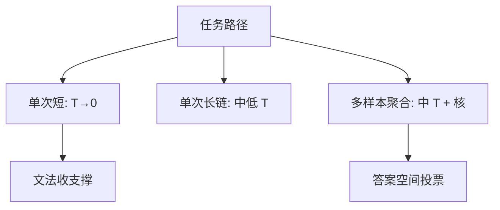

# 温度对推理的影响

自洽需要多样的思维链，多样来自非零温度；把推理任务一律调到贪心，等于关掉投票所依赖的覆盖。

<footer>—— Wang et al., Self-Consistency Improves Chain of Thought Reasoning, ICLR 2023；温度作为逐步熵见 Holtzman et al., ICLR 2020</footer>

[上一课](/llm/logit-bias)把逐步仿射钉死。本课把[温度](/llm/sampling-temperature-topp)从开放生成的文风旋钮，接到推理任务：思维链、工具调用、数学。主干里 [Self-Consistency](/llm/self-consistency) 已经用 $T\gt 0$ 抽多条链再投票；这里只补缺口——同一 $\pi$ 上，$T=0$ 与 $T=0.7$ 改变的不只是重复率，还有 *能不能碰到正确盆地*。后课转向加速：自投机与 Jacobi，默认你会按任务选 $T$，而不是全局一份 `temperature=0`。

## 问题

产品习惯把「推理 / 代码」设成 $T=0$，把「聊天」设成 $T=0.8$。这在单次交付、且任务接近模式匹配时合理：贪心方差小、可复现。多步推理上，正确解往往不是逐步 MAP。早期一步走错，贪心会把错误写圆；略高的温度才能跳出。Wang 等人的自洽明确在 $T=0.5$–$0.7$ 量级采样。缺口是：单次贪心与多样本采样是两条产品路径，温度必须跟路径走，不能跟「这是推理模型」这个标签走。

另一侧：温度过高，语法与格式先崩，投票的解析器失败率上升，$N$ 再大也聚合不到答案。推理用的 $T$ 有用区间通常窄于闲聊。代码填空、JSON 工具参数应低温甚至贪心，多样性让给外层的 $N$ 条独立请求，而不是逐步熵。

$T=0$ 在实现里常是 argmax，与极小 $T$ 的并列规则不同。评测脚本若用 `temperature=0`、线上思考模式用 $0.7$，比较的是不同策略。先修课已写过这一点，这里只强调它对 pass@k 与自洽的含义。

## 方法

把路径分成三档，而不是一个全局 $T$：

- **单次短推理**（分类、工具名、是非）：$T=0$ 或 $\le 0.2$，关核或放宽，让文法收支撑。
- **单次长思维链、只交一条**：中低 $T$（约 $0.3$–$0.5$）减少胡话，仍留一点跳出局部的可能；不要用闲聊的 $0.8$。
- **要聚合的多样本**：$T$ 与核必须足以产生 *答案空间* 上的不同 $y$，而不是标点差。过低则 $N$ 条近似复制，投票无意义；过高则解析失败。从自洽原文的区间出发扫，不要从聊天默认出发。

[Best-of-N](/llm/best-of-n) 用外部 $s$ 时，$T$ 还要保证 $s$ 能看见对的候选：过尖的分布让 $s$ 只能在套话里挑。RL rollout 必须接近训练时的 $T$，否则线上贪心不是训练过的策略。

## 机制

温度改熵、不删 token；核才删。推理失败有两种：没覆盖到正确链，以及覆盖到了但格式坏掉。前者要升高 $T$ 或加 $N$，后者要降低 $T$ 或加约束。经验上的「推理用低温」只覆盖第二种。Renze 与 Guven 等后续测量表明：在若干多选题上，中等温度区间内准确率可以相对平坦——这不是允许乱设 $T$，而是警告：不要把某一基准上的平坦区间写成普适定律。思维链长度随 $T$ 变：高温往往写得更长、更散，延迟账单与质量账单绑在一起。

投机解码的接受率随 $T$ 升高而下降。思考模式开高 $T$ 时，加速比要用同一 $T$ 测，不能用贪心加速比宣传。

## 边界与工程取舍

不要把温度交给最终用户无上界拉高还不截断。不要用 $T=0$ 的单链准确率与 $T=0.7,N=16$ 的自洽比「模型变强了」——多的是测试时计算。种子在张量并行下不可比特级复现，推理回归测试不要依赖 $T\gt 0$ 的逐 token 对齐。

出处：Wang et al., ICLR 2023；Holtzman et al., ICLR 2020。后续温度敏感性测量以各自论文的任务集为准，不发明编号。

## 小结

- 推理路径决定 $T$：单次短用贪心，多样本聚合必须非零温度。
- 自洽与 BoN 的 $N$ 在 $T\to 0$ 时退化成复制。
- 过高 $T$ 先打崩解析，再谈覆盖无意义。
- 评测、RL、投机接受率都必须钉同一 $T$。
- 「推理模型所以 $T=0$」不是定理。
- 后课把逐步熵放下，改加速：不用第二模型的投机。
- 出处：Wang et al., ICLR 2023；Holtzman et al., ICLR 2020。
