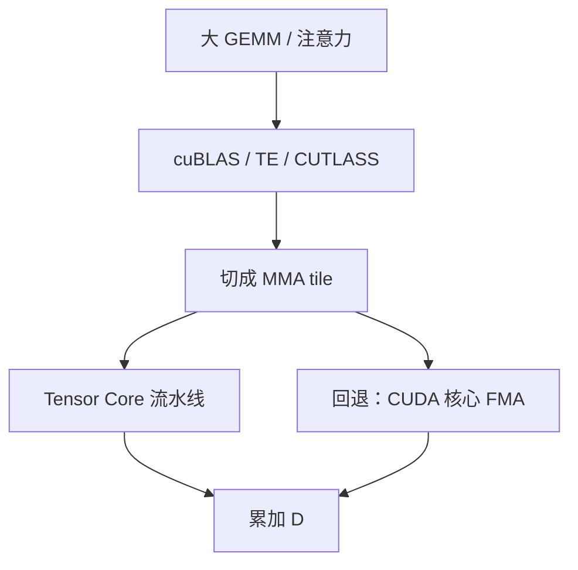

# Tensor Core 与 MMA

    
矩阵乘加是 GPU 上的一等公民：Tensor Core 吃的是小块 MMA，不是逐元素的 CUDA 核心循环。

    <footer>—— NVIDIA CUDA 编程指南中的 Warp Matrix Functions / MMA 与各代架构白皮书</footer>

LLM 里绝大多数 FLOP 是 GEMM：投影、MLP、注意力里的 $QK^\top$ 与 $AV$。这些乘若走普通 CUDA 核心的 FMA，峰值比产品表上的 Tensor Core 低一个数量级以上。Tensor Core 是 SM 里专做小块矩阵乘加（MMA）的流水线；软件通过 WMMA、PTX `mma.sync`、Hopper 起的 warpgroup MMA，以及库（cuBLAS、cuDNN、Transformer Engine）把大 GEMM 切成硬件能吞的 tile。本篇写 MMA 是什么、精度如何对上各代核心、以及为什么形状不对就回到带宽墙或 CUDA 核心。不编造未公开的微架构发射宽度。

代际精度见 [A100 / H100 / Blackwell](/llm/nvidia-gpu-gen)；强度见 [屋顶线](/llm/hbm-roofline)。

## 问题

一次 MMA 在概念上是

$$
D = A B + C,
$$

其中 $A,B,C,D$ 是很小的矩阵，形状由指令集规定，例如 16×16×16 一类 tile（具体以该代 CUDA / PTX 文档为准）。大 GEMM 被库切成许多这样的 tile，在 SM 上流水。问题有三。第一，数据类型必须是 Tensor Core 认识的：TF32、BF16、FP16、INT8、FP8、FP4 等，随代增加；FP32 标量路径不是同一条流水线。第二，布局与对齐：行主序 / 列主序、K 维对齐、是否走稀疏 2:4，都会决定能不能发出 MMA。第三，启动与融合：每次 MMA 前后若都把中间结果写回 HBM，算术强度塌掉，有核心等于没有。

注意力曾长期不是「标准 GEMM」：softmax 插在两次乘之间。FlashAttention 把 softmax 留在 SRAM 里，使两次乘仍能以高强度靠近 Tensor Core 屋顶。没有这块融合，MMA 再快也被 HBM 往返稀释。

### 从 WMMA 到 warpgroup

Volta 引入第一代 Tensor Core，CUDA 用 warp-level WMMA API 把一个 warp 的寄存器拼成小矩阵。Ampere（A100）第三代核心加上 TF32、BF16、稀疏，PTX `mma.sync` 成为更底层的控制面。Hopper（H100）引入 warpgroup 级 MMA：多个 warp 协同发出更大的异步 MMA，与 Tensor Memory Accelerator 一类异步拷贝配合，减少「搬运与计算」的同步税。Blackwell 第五代核心把 FP4 / FP6 与微缩放格式收进 MMA，产品页把它和 Transformer Engine 第二代写在一起。编程接口可以仍是库；自己写 PTX 必须跟代走，不能把 Volta 的 WMMA 形状假设成 Hopper 的 wgmma。

「Tensor Core」是硬件流水线，「MMA」是指令 / 运算。口语里混用无妨；排错时要问：这条 kernel 发出的是 `mma` 还是普通 `fma`。Nsight Compute 的 Tensor Pipe 占用比 SM 占用更能回答这个问题。

## 方法

优先让库发 MMA，而不是手写。cuBLAS / CUTLASS / Transformer Engine 已经按代选择 tile、流水与精度。框架侧要保证：

- dtype 落在该代 Tensor Core 支持集。H100 上训练走 FP8 TE，需要缩放因子与饱和策略，不是 `tensor.to(float8)` 完事。
- 形状尽量让 M、N、K 对齐 tile。过瘦的 decode GEMM（M=1）即使走 MMA，也填不满阵列，强度仍低。
- 融合：MLP 的两层、注意力的两段 GEMM，能留在片上就不要拆成三个全局 kernel。
- 稀疏：2:4 需要权重结构满足模式，且走稀疏 MMA 路径；稠密权重不会因为表上印了 sparse 峰值就自动翻倍。

手写 MMA 的合法理由是：新融合、新布局、库尚未覆盖的微缩放格式。代价是要处理流水、共享内存 bank、以及异步拷贝与计算的重叠。Hopper 文档强调 wgmma 与 TMA 的协同；在 A100 上照抄会编译失败或静默变慢。Blackwell 的 FP4 MMA 还带块缩放元数据，忽略元数据等于算错。

### 精度、缩放与数值

TF32 用 10 位尾数做 MMA，累加常在更高精度。FP16 / BF16 MMA 的累加可以是 FP32。FP8 / FP4 必须有缩放，否则动态范围不够。Transformer Engine 把缩放做成延迟更新的张量级或块级因子；Blackwell 的微缩放把因子绑到更细的块。这是数值协议，不是性能开关：协议错，loss 会先炸，再谈占用。INT8 MMA 用于推理量化路径，累加通常升到 INT32。不要把产品表上的 INT8 TOPS 与 FP8 TFLOPS 直接当同一工作负载的两种读数。

注意力里 softmax 仍是非 MMA 的指数与归约。把它留在高带宽片上，MMA 才能连着跑 $QK^\top$ 与 $AV$。这是 FlashAttention 与 Tensor Core 的交接面：前者管访存与融合，后者管乘加峰值。MLP 的两段线性同样：中间激活若写回 HBM 再读回来，两次 MMA 之间夹进一次带宽墙，产品表上的 TFLOPS 只出现在两头的短窗口里。

## 机制

Tensor Core 之所以快，是因为在固定形状上做密集乘加，数据从寄存器 / 共享内存以规则模式喂入，避免 CUDA 核心那种灵活但低吞吐的逐线程 FMA。代价是灵活性：不规则稀疏、极小形状、以及无法向量化的逐元素链，都喂不饱它。屋顶线上，MMA 抬的是 $P$；若 $I$ 不够，你只是站在更高的平台旁边，实际仍走斜边。

异步是 Hopper 之后的一等机制。计算发出 MMA 的同时，TMA 一类引擎把下一块从 HBM 搬进共享内存。软件若在每次 MMA 后 `syncthreads` 到数据完全落地，异步被浪费，表现回到「计算与搬运串行」。CUDA Graph 可以减少 CPU 侧提交这些流水的开销，但不改变 MMA 本身，见 [CUDA Graph](/llm/cuda-graph)。

产品表的 Tensor Core 峰值几乎总是「理想形状 + 对应精度 + 常含稀疏」。Nsight 里看到 60% Tensor Pipe 已是好核；看到 0% 则是根本没走 MMA。不要用表头去除墙钟来反推「利用率」。

### 与 NVLink、HBM 的关系

MMA 吃的是已经在 SM 附近的数据。数据从本卡 HBM 来，受 $B$ 约束；从远端 GPU 来，受 NVLink 约束。TP 把大矩阵切开，每卡 MMA 变小，但增加 All-Reduce——你用互连换近端形状。切得过碎，tile 填不满，既丢 $P$ 又付通信。这是 TP 度不能只按显存容量选的原因：还要看 MMA 形状与域带宽，见 [张量并行](/llm/tensor-parallel)。

## 边界与工程取舍

不要为了「用上 Tensor Core」把必须保持 FP32 的归约强行改成 FP16 MMA。不要在 M=1 的 decode 上期待接近表头 TFLOPS。不要把 CUTLASS 例子里的 tile 抄到错误的 sm 版本。依据是 CUDA 文档与架构白皮书，不另造未公开论文来撑峰值表。

库与编译器会静默回退到 CUDA 核心。没有计数器，你以为在吃第五代核心，实际在跑 FMA。任何精度换代的验收都应包含 Tensor Pipe 指标与数值对照。昇腾的 Cube / MMA 是另一套指令与形状，不能把 `mma.sync` 的 tile 写过去。

出处：NVIDIA CUDA C++ Programming Guide（WMMA / MMA / Graphs 相关章）、Ampere / Hopper / Blackwell 架构白皮书与产品页的精度表。不引用未公开的发射宽度。

## 小结

- Tensor Core 执行固定形状的 MMA；大 GEMM 由库切 tile。没走 MMA 就吃不到产品表峰值。
- 精度随代：A100 的 TF32/稀疏，H100 的 FP8 TE 与 wgmma，Blackwell 的 FP4/FP6 微缩放。
- 形状、布局、融合、异步拷贝决定能否喂饱流水线；decode 的瘦 GEMM 天生喂不饱。
- 稀疏峰值需要结构化稀疏路径；dense 工作负载不要用 sparse 表头。
- MMA 抬 $P$，强度不够则仍是 HBM 墙；TP 切分要兼顾 tile 与互连。
- 出处：CUDA 文档与 NVIDIA 架构白皮书。
