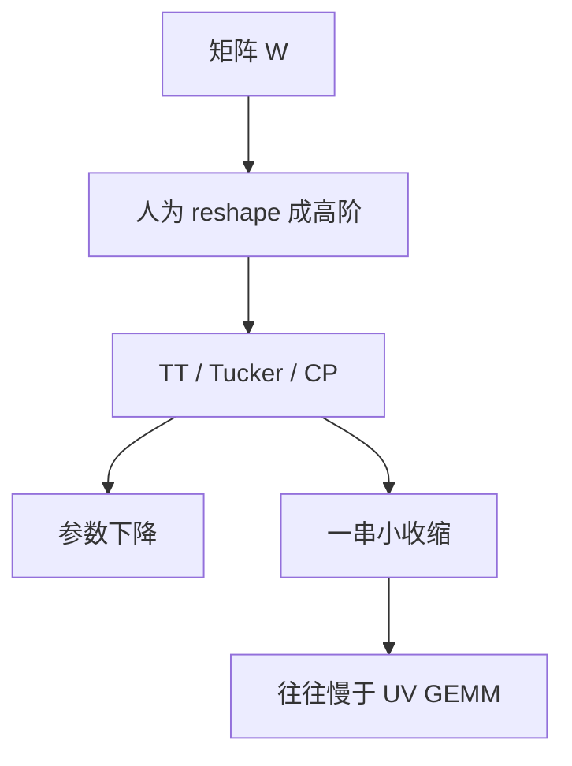

# 张量分解

把矩阵再劈成多维数组，用 TT 或 Tucker 核去逼近。参数可以再降一截；GPU 上却很少有比两次 GEMM 更合适的核。

<footer>—— Novikov et al., Tensorizing Neural Networks, NeurIPS 2015；TT 格式见 Oseledets, 2011</footer>

[上一课](/llm/low-rank-factorization) 用两个矩阵因子压一层。本课把同一层看成 $d_1\times d_2\times\cdots$ 的张量，用 CP / Tucker / Tensor-Train 分解。缺口是：LLM 的线性层天生是矩阵，张量化是**人为 reshape**，表达力与核都要为此交税。后课离开权重，去压提示词。不发明新的 arXiv 编号。

## 问题

Novikov 等人把全连接权重 reshape 成高阶张量，再用 TT 链乘，参数随阶数几乎线性而不是乘积增长。嵌入表尤其诱人：$|V|\times d$ 很大，切成若干模上的小核，存储大降。问题立刻有两个。第一，reshape 的切法是超参，切错等于把不该绑在一起的轴绑死。第二，TT 链乘是一串小张量收缩，在 GPU 上通常打不过一个大 GEMM，更打不过上一课的 $UV$。

因此张量分解在 LLM 主栈里是嵌入 / 窄层的候选，不是 4096×11008 的 FFN 默认路径。课序要把它标成「存储极端、计算不友好」，避免与 SVD 课比参数量时假装也更快。

CP 分解把张量写成秩一和，优化对初值敏感、易退化。Tucker 有核心张量，更稳也更重。TT 在链长上折中。选型先问有没有收缩核，再问秩。

## 方法

嵌入：把词表轴与隐轴拆成多模，训 TT/Tucker 嵌入，或对已有表做分解再微调。线性层：reshape 成四阶再 Tucker，核心尺寸当秩预算。校准目标仍应尽量靠近 $WX$，而不是张量 Frobenius——与 FWSVD 同一教训，只是优化更难，常退回先 SVD 再把因子张量化，收益有限。

与量化：[GPTQ](/llm/gptq) 假定一层一块矩阵。分解后应对每个因子分别量化，或先收缩再量化——两种误差不可交换，必须选定一条推理路径并沿它校准。

## 机制

低秩矩阵假设 $W$ 的奇异谱快衰减。张量秩假设的是**多线性**结构：reshape 后各模上可分。语言模型权重没有先验保证这一结构，所以压缩率好看时，往往已经把不该可分的交互砍掉，算术与长上下文先崩——退化模式与量化课同类，处方却不是加 bit，而是加核心尺寸或退回 SVD。

训练期直接用 TT 层（而不是事后分解）让优化适应多线性约束，比 PTQ 式张量化更自洽，也更贵，接近再训一小模型。

## 边界与工程取舍

不要在 FFN 上用 TT 只为了报告参数量。不要把张量秩与矩阵 $r$ 横比。服务路径没有融合收缩时，本课不进入部署。下一课提示压缩：权重不动，减的是输入 token。

## 小结

- 张量化是 reshape 加上多线性秩约束，不是 SVD 的自动升级。
- 存储可再降；墙钟通常差于低秩两因子。
- 嵌入表比宽 FFN 更合适；切轴是超参。
- 与 GPTQ 叠必须固定收缩后再量化的顺序。
- 出处：Novikov et al., 2015；Oseledets, 2011。
