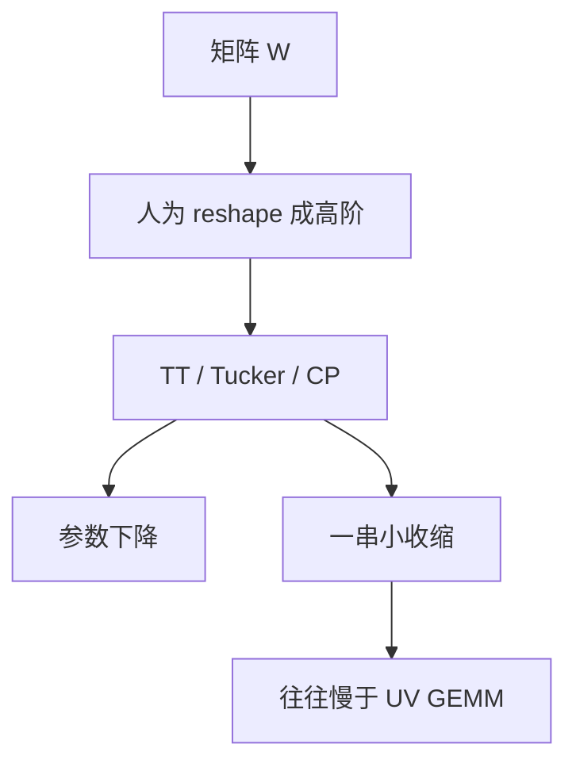
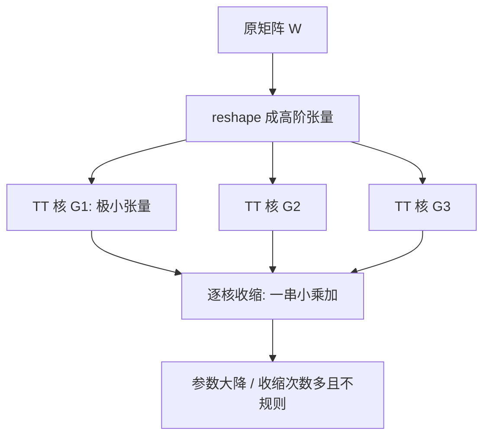

# 张量分解

把矩阵再劈成多维数组，用 TT 或 Tucker 核去逼近。参数可以再降一截；GPU 上却很少有比两次 GEMM 更合适的核。

<footer>—— Novikov et al., Tensorizing Neural Networks, NeurIPS 2015；TT 格式见 Oseledets, 2011</footer>

[上一课](/llm/low-rank-factorization) 用两个矩阵因子压一层。本课把同一层看成 $d_1\times d_2\times\cdots$ 的张量，用 CP / Tucker / Tensor-Train 分解。缺口是：LLM 的线性层天生是矩阵，张量化是**人为 reshape**，表达力与核都要为此交税。后课离开权重，去压提示词。不发明新的 arXiv 编号。

## 问题

Novikov 等人把全连接权重 reshape 成高阶张量，再用 TT 链乘，参数随阶数几乎线性而不是乘积增长。嵌入表尤其诱人：$|V|\times d$ 很大，切成若干模上的小核，存储大降。问题立刻有两个。第一，reshape 的切法是超参，切错等于把不该绑在一起的轴绑死。第二，TT 链乘是一串小张量收缩，在 GPU 上通常打不过一个大 GEMM，更打不过上一课的 $UV$。

因此张量分解在 LLM 主栈里是嵌入 / 窄层的候选，不是 4096×11008 的 FFN 默认路径。课序要把它标成「存储极端、计算不友好」，避免与 SVD 课比参数量时假装也更快。

CP 分解把张量写成秩一和，优化对初值敏感、易退化。Tucker 有核心张量，更稳也更重。TT 在链长上折中。选型先问有没有收缩核，再问秩。

数字实例：一个 $4096\times4096$ 的方阵有约 1670 万参数；若按 SVD 思路取秩 $r=64$ 的两因子，剩 $2\times4096\times64\approx52$ 万；切成 TT 链还能更低。但参数从 1670 万降到 52 万省的是显存，推理墙钟未必跟着降——小核多、收缩链长，GPU 单次发射吃不饱。

## 方法

嵌入：把词表轴与隐轴拆成多模，训 TT/Tucker 嵌入，或对已有表做分解再微调。线性层：reshape 成四阶再 Tucker，核心尺寸当秩预算。校准目标仍应尽量靠近 $WX$，而不是张量 Frobenius——与 FWSVD 同一教训，只是优化更难，常退回先 SVD 再把因子张量化，收益有限。

与量化：[GPTQ](/llm/gptq) 假定一层一块矩阵。分解后应对每个因子分别量化，或先收缩再量化——两种误差不可交换，必须选定一条推理路径并沿它校准。

```mermaid
flowchart TD
  M["矩阵 W"] --> RS["人为 reshape 成高阶"]
  RS --> DEC["TT / Tucker / CP"]
  DEC --> ST["参数下降"]
  DEC --> KER["一串小收缩"]
  KER --> GPU["往往慢于 UV GEMM"]
```

## 机制

低秩矩阵假设 $W$ 的奇异谱快衰减。张量秩假设的是**多线性**结构：reshape 后各模上可分。语言模型权重没有先验保证这一结构，所以压缩率好看时，往往已经把不该可分的交互砍掉，算术与长上下文先崩——退化模式与量化课同类，处方却不是加 bit，而是加核心尺寸或退回 SVD。

训练期直接用 TT 层（而不是事后分解）让优化适应多线性约束，比 PTQ 式张量化更自洽，也更贵，接近再训一小模型。

TT 链乘的账可以拆开看：

```mermaid
flowchart TD
  W["原矩阵 W"] --> R["reshape 成高阶张量"]
  R --> G1["TT 核 G1: 极小张量"]
  R --> G2["TT 核 G2"]
  R --> G3["TT 核 G3"]
  G1 --> S["逐核收缩: 一串小乘加"]
  G2 --> S
  G3 --> S
  S --> O["参数大降 / 收缩次数多且不规则"]
```

直觉类比：多线性假设就是「输出对每个轴的影响可以拆成独立旋钮的乘积」。调色板若只有红、绿、蓝三个独立滑杆，三个数就能描述任意颜色；可语言权重的各维往往互相耦合，硬拆成独立旋钮，等于把「红加绿会变黄」这类交互规则直接砍掉——这就是压缩率好看时算术先崩的原因。

## 边界

不要在 FFN 上用 TT 只为了报告参数量。不要把张量秩与矩阵 $r$ 横比。服务路径没有融合收缩时，本课不进入部署。下一课提示压缩：权重不动，减的是输入 token。

常见误区：初学者容易把「张量秩」当成「矩阵秩的高配版」，直接拿数值横比。两者定义不同：矩阵秩数线性无关的列，张量秩数秩一项的个数，且最佳秩一项本身可能是 NP 难的优化问题。跨格式比压缩，只能比参数量与实测精度，不能比秩的数值。

## 小结

- 张量化是 reshape 加上多线性秩约束，不是 SVD 的自动升级。
- 存储可再降；墙钟通常差于低秩两因子。
- 嵌入表比宽 FFN 更合适；切轴是超参。
- 与 GPTQ 叠必须固定收缩后再量化的顺序。
- 出处：Novikov et al., 2015；Oseledets, 2011。
