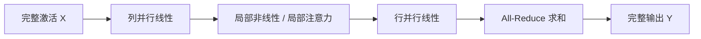

# 张量并行

把一层里的大矩阵沿隐藏维切开，用一次 All-Reduce 把分片结果加回去；卡与卡之间共享同一批 token。

<footer>—— Shoeybi 等，Megatron-LM</footer>

当单卡放不下**一层**的权重与其激活时，数据并行加 ZeRO 也不够：ZeRO-3 仍要在某瞬间聚集完整层。张量并行（TP，Megatron-LM 里的模型并行）把单个线性层的矩阵沿行或列切开，每张卡只存一块，对同一批 token 做局部 GEMM，再用集合通信还原数学上的完整乘。Shoeybi 等人给出 Transformer 里一套能配对的切法：列并行接行并行，中间的非线性可以不通信。注意力则按头切开。TP 的通信发生在层内、每层多次，必须走 NVLink 一类高带宽域，通常不跨机架。本篇只谈这套切片与通信，不把流水线、专家并行写进来当主角。

## 问题

线性层 $Y=XA$，$X\in\mathbb{R}^{b\times s\times d}$，$A\in\mathbb{R}^{d\times d_{\mathrm{out}}}$。$d$ 与 $d_{\mathrm{out}}$ 到上万时，一份 $A$ 加一份 $X$ 的激活就可能超过单卡。数据并行复制 $A$，解决不了单层体积；流水线把不同层放到不同卡，单层仍然完整。必须在矩阵内部切。切法不唯一：切输入维或切输出维，非线性、残差、Dropout 的位置会决定要不要在非线性之前把分片加起来。切错一次，就得在 GeLU 前做一次昂贵的 All-Gather，把 TP 的意义吃掉。

通信模式也不同。数据并行是逐步梯度 All-Reduce；张量并行是前向、反向都在层内 All-Reduce 或 All-Gather。序列越长、微批越大，激活通信的体积越大——与 DP 的「体积跟 $\Phi$ 走」相反。问题是：如何切，才能让非线性局部完成，并把通信次数压到每层常数次。

### 列切与行切的一对

Megatron 对 MLP 的标准配对：第一层 $A$ **列并行**（按输出维切成 $A=[A_1\,A_2]$），各卡算 $X A_i$，再在分片上做 GeLU / SwiGLU 的局部非线性；第二层 $B$ **行并行**（按输入维切），各卡算 $\mathrm{GeLU}(XA_i)\,B_i$，对 $i$ **All-Reduce 求和**得到 $Y$。数学上 $Y=XAB$ 在求和后恢复。前向一次 All-Reduce；反向对 $X$ 的梯度再一次 All-Reduce（落在第一层的输入侧）。非线性从未需要完整向量，这是配对的全部意义。

SwiGLU 有两块上投影。它们一起按列切，门控逐元素乘仍在分片上合法，因为切的是输出通道而不是序列。下投影仍行切。把门控按错误的维切开，逐元素乘会缺少另一半通道，结果无定义。

列并行的每张卡看到完整的 $X$，产出分片的 $Y_i$；行并行的每张卡看到分片的 $X_i$，产出完整形状、但只含部分和的 $Y$，必须 All-Reduce。记住谁持有完整激活，比记住「行 / 列」这两个词更不容易画错。

## 方法

注意力：把 $h$ 个头均分到 $T$ 张卡，$h$ 必须能被 $T$ 整除。QKV 投影列并行，每卡算自己的头，局部 softmax（头与头之间无需通信），输出投影行并行，再 All-Reduce。GQA 时 KV 头更少，KV 头数也要能被 $T$ 整除，或复制 KV 到 TP 组内——复制会吃掉部分内存收益。MLA 一类压缩 KV 的结构要单独设计切分，不能假定「按头切」仍然干净。

嵌入与输出头可以沿词表维切（vocab parallel）：各卡持有词表的一段，logits 的交叉熵用一次并行归约。这能切掉很大的嵌入表，通信是词表维上的 All-Reduce 或 Reduce-Scatter，和隐藏维上的 TP 是同一家族、不同轴。

### 多头注意力怎么切

按头切的好处是 softmax 局部。按隐藏维切单个头会把 $q^\top k$ 拆开，必须在分数上通信，几乎没人这么做。头数 $h<T$ 时 TP 度大于头数，按头切失败，只能降 TP 或改 GQA 头数。这是结构约束，不是性能调参。RoPE 加在每卡自己的 $Q,K$ 上，位置编号仍是全局序列位置，不因 TP 改变。

序列并行（Megatron 后续工作）把 LayerNorm、Dropout 的激活沿序列维再切开，与 TP 配对：TP 组内 All-Reduce 改成 Reduce-Scatter，Norm 只持有 $s/T$ 的序列。那是为了激活内存，通信对象仍是同一组卡。超长上下文把序列切到组外，是上下文并行，另一篇文章。

## 机制

一次 TP All-Reduce 的体积是激活张量：$b\times s\times d$ 的元素，每层 MLP 与注意力输出各一次前向，反向再对称地来。总通信 $\propto$ 层数 $\times b\times s\times d$。对比 DP 的 $\propto\Phi$。因此：**TP 怕长序列和大微批，DP 怕大参数。** 长上下文训练里盲目加 TP 度，通信墙会先于内存墙出现。这是节点内 TP 度常取 2、4、8 而不是跨节点 64 的原因：NVLink 带宽才能盖住 $b s d$ 量级的频繁 All-Reduce。

反向的配对：前向列并行对应反向的 Reduce（对输入梯度），前向行并行对应反向的切分。实现必须让正向的求和与反向的切分用同一组通信域，否则梯度会对错卡。数值上 All-Reduce 的求和顺序导致浮点非结合，TP 度改变时，即使种子相同，logits 也不是比特一致。比较不同 TP 度的损失曲线，应允许末位噪声，不要当数值 bug。

TP 不减小全局 batch，也不减小每卡看到的序列长度（在未开序列并行时）。它减小的是每卡的**隐藏宽度**。有人口头说「TP 把模型切开所以 batch 可以更大」——那是省下的权重内存让给了激活；序列维并未变短。

### 与数据并行、流水线的嵌套

常见 3D：节点内 TP，跨节点 PP，最外层 DP。TP 组是通信域最小、带宽最高的一组。同一 TP 组内的卡必须同步执行同一层的 All-Reduce，因此不能再把这组卡拆进不同的流水线阶段。DP 组平均的是「同一 TP 分片、同一 PP 阶段」上的梯度。ZeRO 若还要切优化器，切的是该分片上的状态，不是把 TP 分片再按另一种下标切开——除非实现明确做了更复杂的映射。

权重更新在分片上本地完成，无需先聚集完整 $A$。这与 ZeRO-3 相反：TP 的权重本来就不完整，Adam 直接打在分片上。检查点按 TP 分片存；导出完整层要沿列或行拼接，方向必须与当时的列/行并行一致。

## 边界与工程取舍

TP 度 $T$ 必须整除头数与 FFN 的可切维。SwiGLU 的中间维 $d_{\mathrm{ff}}$ 也要能被 $T$ 整除。不整除时静默 padding 会浪费算力并改语义。小模型 $T=8$ 往往算不过通信，应降到 2 或不用。经验上先填满节点内 NVLink，再考虑 PP，最后才用跨节点 DP 扩全局 batch。

不要把 TP 和专家并行混淆。TP 切的是同一专家内部的矩阵宽；EP 切的是不同专家到不同卡，通信是 All-to-All token。二者可以叠：先 TP 切隐藏维，再 EP 切专家。通信域不同，NCCL group 必须分开建。

Dropout 与 RNG：行并行之后 All-Reduce，Dropout 应在完整张量上有一致掩码，或改用序列并行那套「在分片上 Dropout 再对齐」。RNG 种子按 rank 错开却在 All-Reduce 后求和，等于把不同掩码加在一起，是经典静默 bug。Megatron 的实现对此有专门处理；自己写 TP 时这是第一批要测的项。

张量并行是训练与推理共用的切法。推理 decode 的 batch 往往为 1，All-Reduce 延迟更刺眼，有时反而不如复制模型。训练期大微批让 TP 划算，不自动推出服务期也要用同一 $T$。

## 小结

- 张量并行沿隐藏维切单层矩阵；Megatron 用列并行接行并行，让非线性与注意力 softmax 留在本地，用 All-Reduce 还原完整乘。
- 注意力按头切；头数必须能被 TP 度整除。
- 通信量 $\propto b s d \times$ 层数，怕长序列，应放在 NVLink 域内。
- 与 DP/PP/ZeRO 嵌套时，TP 组是最小同步域；优化器直接更新分片。
- Dropout / RNG、GQA 头数、SwiGLU 中间维整除，是落地约束。
- 出处：Shoeybi 等，Megatron-LM。序列并行是后续激活内存优化，上下文并行是序列维的另一轴。
