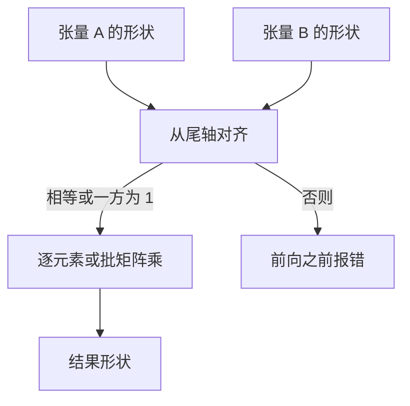

# 张量、形状与广播

深度学习把数据看成多维数组；一个算子能否合法执行，首先取决于各轴能否对齐，而不是公式在纸上写得通。

<footer>—— 据 Goodfellow, Bengio &amp; Courville, Deep Learning, 2016；Harris et al., Array Programming with NumPy, Nature 2020 整理</footer>

本课是**大模型栏第一课**。后课默认已经读完本课：张量有整数形状，批、序列、特征各占一轴，广播从尾轴对齐，$1$ 可扩展，形状错误拦在前向之前。本课从数组形状起笔，不从 Transformer、不从词表、不从注意力起笔。缺口只此一件：没有形状，后面的矩阵乘、损失、嵌入查找都没有可写的对象。

## 问题

可训练程序操作的不是标量，而是带形状的多维数组。一批句子、每个位置一个向量、多头再切开，都表现为整数元组 $(d_1,\ldots,d_k)$。两个数组相加或逐元素相乘，要求对应轴相等，或其中一方为 $1$ 从而可以广播。形状对不上，框架在构图或第一次前向时就失败；模型、梯度、优化器都还没出场。

大模型栏后面会反复出现三种布局：$(B,n,d)$ 是批、序列、特征；$(B,h,n,d_k)$ 是再按头切开；$(B,n,|V|)$ 是每个位置上对词表的打分。这些数字现在还不需要来源，但必须会读：哪一轴是可以并行的批，哪一轴必须在样本内对齐。本课不解释这些轴从哪来，只规定「先读形状再写算子」。

### 广播不是复制出一份新数组再算

语义上，形状 $(B,1,d)$ 与 $(1,n,d)$ 相加得到 $(B,n,d)$，好像把长度为 $1$ 的轴沿对方复制。实现上通常不物化复制，只改步长，让同一段内存被多次索引。把广播理解成「先 tile 再加」会在内存账上算错，也会误以为广播有独立的计算量。它是对齐规则，不是一层网络。

NumPy 与 PyTorch 从尾轴对齐：缺失的前导维视为 $1$。$(n,d)$ 与 $(B,n,d)$ 可以相加，$(B,n)$ 与 $(n,d)$ 不能。报错信息里的 size mismatch 应回溯到这两维各是多少，而不是去改学习率。

## 方法

记张量 $X$ 的形状为 $(d_1,\ldots,d_k)$。逐元素运算从尾部逐轴比较：相等则保留，$1$ 对 $m$ 则结果取 $m$，否则非法。矩阵乘另有约束：对二维，$A$ 的末轴必须等于 $B$ 的次末轴；更高维时，前导维按广播对齐，最后两维做批 GEMM。常见合法例子：$(B,n,d_{\mathrm{in}})$ 右乘 $(d_{\mathrm{in}},d_{\mathrm{out}})$ 得 $(B,n,d_{\mathrm{out}})$；$(B,1,d)$ 加 $(d,)$ 得 $(B,1,d)$。

本课只建立整数 shape。同一形状下 float16 与 float32 仍不能直接相加，那是 dtype 的事，不是轴的事。后课矩阵乘、softmax、嵌入查找都默认你会在纸上写出各张量的形状元组，并指出哪一轴被收缩、哪一轴被广播。

## 机制

形状检查把错误拦在梯度之外。若让 $(B,n,d)$ 与 $(B,d,n)$ 在错误轴上相加，数值不会立刻变成 NaN，但每个位置上加错了对象，损失的几何完全走样。框架拒绝这种图，是在保护后课的链式法则：只有形状合法的局部导数才能沿轴传回去。

广播让「按批共享的向量」不必先 expand。层归一化的增益、注意力里的掩码、位置偏置，常常以 $(d,)$、$(1,n,n)$ 这类瘦形状出现，靠广播贴到 $(B,n,d)$ 或 $(B,h,n,n)$ 上。后课会把这些算子当层来讲；本课只需承认它们合法，是因为轴规则已经允许。

## 边界

本课不讲 GPU 上的 contiguous、stride、padding 到 8 的倍数，也不讲 einsum 的全部字母约定。不把 NumPy 与框架 API 逐项对照。设备、dtype、自动微分都还没出场。下一课[矩阵乘作为一层](/llm/matmul-as-layer)才把「对齐之后做什么」收成可学习的线性层。后课默认：看见 $(B,n,d)$ 就能说出批、长度、宽度，并判断一次加减或一次 GEMM 是否合法。

## 小结

- 张量由整数形状描述；批、序列、特征各占轴，算子先对齐轴再执行。
- 广播从尾轴比较，$1$ 或缺失前导维可扩展，通常不物化复制。
- 矩阵乘收缩末轴与次末轴；前导维按广播对齐。
- 形状错误应在前向之前暴露，否则梯度会沿错误的轴回传。
- 后课默认已会读 $(B,n,d)$ 并在纸上对齐。
- 出处：Goodfellow et al., Deep Learning, 2016；Harris et al., Nature 2020。
