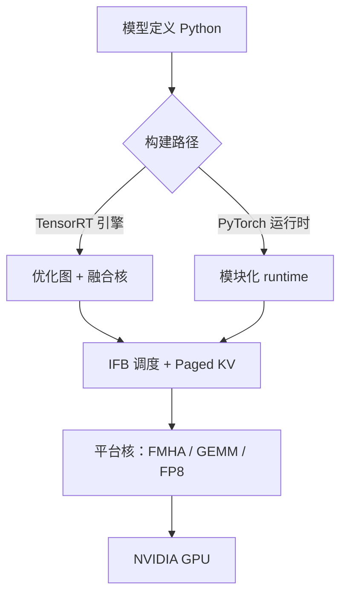

# TensorRT-LLM

在 NVIDIA GPU 上把注意力、分页 KV 与量化核和运行时批处理绑在一起；早期靠编好的 TensorRT 引擎，后来也提供 PyTorch 原生的可扩展路径。

<footer>—— NVIDIA TensorRT-LLM 文档与 2023 年 10 月开源说明</footer>

TensorRT-LLM 是 NVIDIA 的开源 LLM 推理库，目标不是再发明一套注意力公式，而是把 Hopper/Blackwell 上的 Tensor Core、Transformer Engine、FP8/FP4 以及融合核，收成可部署的运行时。2023 年 10 月仓库公开时，主打 in-flight batching、paged KV、流式输出，并强调相对手写 FasterTransformer 的可维护性。随后文档补上 Python LLM API、与 Triton / Dynamo 的衔接，以及 PyTorch 侧可改的模块化架构。本篇按官方文档与开发者博客写能力边界，不编造会议论文编号——它是产品仓库，不是 SOSP 那一类单篇系统论文。

## 问题

NVIDIA GPU 上跑 Transformer，性能差往往差在核够不够融合、KV 是否分页、批能不能在飞行中改成员、量化是否走到硬件原生 FP8。通用 PyTorch eager 一步步 `forward`，启动开销和未融合的 LayerNorm / RoPE / 采样会在 decode 的小步上放大，[ITL](/llm/tpot-itl) 被 CPU 绑住。FasterTransformer 把核写死，模型结构一变就要跟一版 C++。服务商要的是：新结构能较快接入，同时 decode 仍吃到手写级注意力核与 in-flight 批。

第二条是精度栈。H100 起提供 FP8 Tensor Core；权重量化与注意力量化不是一回事，KV 再量化又是第三旋钮。没有一条与硬件对齐的流水线，用户只能在「BF16 又大又慢」和「INT4 质量掉了不知道掉在哪一层」之间跳。TensorRT-LLM 把量化配方（FP8、INT8 SmoothQuant、INT4 AWQ、后续 NVFP4 等）做成构建选项，而不是让每个应用自己写 kernel。

### 编引擎与 eager 是两种交付

经典路径：模型定义 → 构建 TensorRT 引擎（图优化、核选择、可能的 shape 特化）→ C++ runtime 跑 in-flight batch。构建慢、换最大长度或批大小可能要重建，换来的是稳定的执行计划。PyTorch 原生路径降低改模型的成本，性能依赖运行时仍调用同一类融合核。选哪条路是迭代速度对峰值吞吐的取舍，文档两套都在，不要把过时教程里的 `trtllm-build` 当成唯一架构。

官方吞吐数字永远带着 GPU 代数、精度、批大小和是否开启 IFB / paged KV。把某一篇 NVIDIA 博客的 H100 曲线抄到 A10 上，是在比较两块不同的屋顶线。本篇不引用未钉版本的 tokens/s。

## 方法

In-flight batching（IFB）与 Orca / vLLM 的迭代级调度同类：上下文阶段（prefill）与生成阶段可以出现在同一次执行里，完成的序列立刻腾出槽，新序列插进来。文档写明 IFB 要求输入张量 packed、不要靠 padding 填齐。Paged KV 把每层缓存切成块，由 cache manager 分配与回收，对应 Python 里简化过的 `KVCacheManager` 与 C++ batch manager 里更完整的实现；也提供连续 KV 作为对照。调度器与分块 prefill 绑在一起：把长上下文切开，避免单次迭代被超长 prefill 占满，从而稳定 TTFT 与 decode 间隙。

量化：Hopper 上 FP8 可同时降显存与提吞吐，文档称相对 16-bit 有数量级上的带宽收益，质量影响要按模型校准。注意力可走 FP8 context FMHA 或 FP8 paged context FMHA。权重侧另有 INT4 AWQ、SmoothQuant 等。推测解码、EAGLE 类、MTP 等出现在后续特性列表里，属于加速采样，不是 TensorRT 图编译的必然产物。并行：张量并行、流水线、专家并行（宽 EP）写在产品能力里，用来服 MoE 与大稠密模型；具体拓扑随版本与 NVIDIA Dynamo 分离式服务文档更新。

### 与 vLLM / SGLang 的分工

三者都做连续批与分页 KV。TensorRT-LLM 的差异在 **NVIDIA 平台深度**：Transformer Engine、FP8/FP4 核、与 Triton 的生产包装、以及厂商对每代 GPU 的第一天支持。vLLM / SGLang 的差异在社区模型覆盖、Radix 前缀树、研究向调度。同一模型可以在三个引擎里都跑；选的是运维栈与核，不是不同的注意力数学。约束解码、投机、LoRA 多适配器在三者都有实现，完成度跟版本走，要对着当时 release note，不要记成架构永恒差异。

## 机制

Decode 步小、重复、形状相对稳定，最吃：融合（少访存）、图/引擎特化（少 CPU launch）、分页（大 batch）、量化（少字节）。IFB 保证 GPU 上始终有足够的生成查询摊权重。Paged attention 保证并发被 KV 碎片卡住之前先被块池卡住——与 Kwon 等人同一逻辑，NVIDIA 文档直接使用 paged KV 这一名称。FP8 把权重与激活的搬移减半（相对 FP16），在带宽墙的 decode 上往往比在算力墙的巨大 prefill 上更可见；prefill 大 GEMM 已经能喂饱 Tensor Core 时，精度收益更多来自显存里能塞更大的批。

引擎构建把动态维收成优化过的 profile。动态过强（任意长度、任意 LoRA）会迫使更保守的核或回退。这与 [NPU 友好算子](/llm/npu-friendly-ops) 是同一类「编译期形状」压力，只是 GPU 回退的是通用 CUDA 而不是手机 CPU。PyTorch 路径用运行时去填这块灵活性，可能让出峰值。

In-flight batching 在 NVIDIA 文本里常与 continuous batching、iteration-level batching 互换。它不是一种新的注意力，而是调度策略。关掉 IFB 的静态批，延迟特征回到「等最长序列」，核再快也救不了队列。

### 分离式服务仍要传 KV

产品后期列出 disaggregated serving：prefill 与 decode 可以拆池。机制与 DistServe 相同，实现落在 NVIDIA 的编排（文档中的 Dynamo 等）上。拆开后 [decode 亲和](/llm/decode-affinity) 照样成立，TensorRT-LLM 不会自动把 KV 变成全局共享内存。宽 EP 服 DeepSeek 类模型时，还要处理专家通信，那是并行拓扑，不是 IFB 开关能代替的。

## 边界与工程取舍

非 NVIDIA 后端不是目标；AMD、Apple、CPU 应看 [SGLang](/llm/sglang)、[llama.cpp](/llm/llamacpp)、[MLC](/llm/mlc-tvm)。许可证与企业支持走 NVIDIA AI Enterprise / NGC 容器时，和 GitHub 上的 Apache 式使用不是同一合同，部署前读当时仓库的 LICENSE。模型要有对应实现或可表达的层；新结构的第一天往往仍是 vLLM 社区快，厂商核后到。

不要用未标明 commit 的「TRT-LLM 比 vLLM 快 × 倍」做架构结论。快慢取决于量化是否对等、是否同一分页与 IFB、是否同一投机设置。能公平对比的是：同一权重精度、同一最大并发、同一 SLA 定义下的 goodput。自定义核意味着调试符号与剖析都要进 NVIDIA 工具链（Nsight），这是团队技能约束。

出处停留在 https://github.com/NVIDIA/TensorRT-LLM、https://nvidia.github.io/TensorRT-LLM/ 与 NVIDIA 技术博客（2023-10 开源及后续特性文）。不给 TensorRT-LLM 编造 arXiv。

## 小结

- TensorRT-LLM 是 NVIDIA GPU 上的 LLM 推理库：IFB、paged KV、平台量化核与可选的引擎构建。
- IFB 即迭代级连续批；paged KV 的内存逻辑与 vLLM 同类，核是厂商实现。
- FP8/FP4 等精度是硬件对齐的产品能力，质量与加速必须按模型校准，不能当无损耗开关。
- 编引擎换峰值与稳定计划，PyTorch 路径换迭代速度；两套都出现在官方架构说明里。
- 跨厂商或研究向前缀树、LM 程序前端不是它的主场。
- 出处：NVIDIA TensorRT-LLM 文档、GitHub 与开发者博客，而非一篇独立会议论文。
