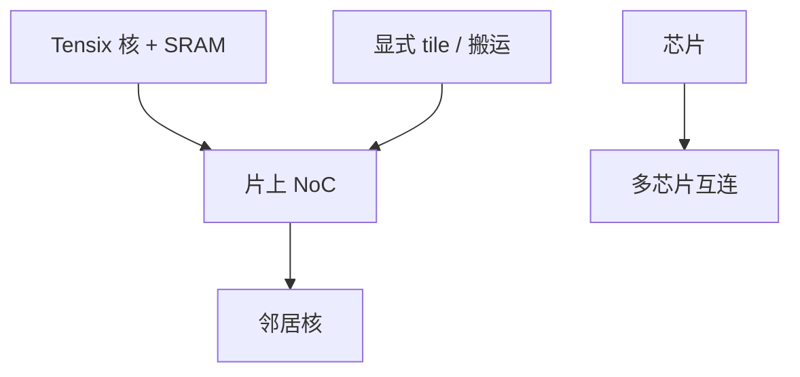

# Tenstorrent

很多小核、片上 SRAM、核间 NoC。看起来像加速器，编程起来更像给 mesh 写显式数据搬运，而不是写一份 CUDA kernel 就结束。

<footer>—— Tenstorrent Tensix / 多核 mesh 的公开架构叙述</footer>

[SambaNova](/llm/sambanova-dataflow) 把图收进可重配置通路。本课 Tenstorrent 走 **多核 + NoC**：Tensix 一类核带本地存储，靠片上网络搬张量。缺口是它与 GPU SIMT、TPU 脉动、数据流机的位置——更接近「分布式片上集群」，集体通信的思维又回来了，只是半径在芯片内。软件栈（TT-Metal 等公开层）成熟度是对比的主维。

## 问题

GPU 用海量线程与缓存把数据搬运藏进硬件。Tenstorrent 把搬运交给程序员或编译器显式调度：谁持有哪块 SRAM、何时经 NoC 发给邻居。映射对了，带宽按片上计；映射错了，NoC 拥塞，核空等，症状类似机柜里的 All-to-All 热点，只是规模在毫米。

生态：CUDA 不直接跑。要内核库与图编译。LLM 能否吃满，取决于注意力与 MLP 的内核是否存在、以及多芯片如何接。问题是 **把集群课的拓扑意识下放到片上**，而不是找 NCCL 的替代 DLL。

公开路线图与产品名变化快。本课只写稳定机制：多核、本地存储、NoC。不填写未发布芯片的 TFLOPS。

## 方法

把层切成核上的 tile：类似手写 GPU 的 tiling，但缺少成熟的自动缓存。多芯片用板级或柜级互连扩展，再一层 $\beta$。训练集体要在这层互连上实现，可能是自研库而不是 NCCL。与 [AMD ROCm](/llm/amd-rocm-stack) 下一课不同：那里至少有 RCCL 去对齐 NCCL 语义。

服务与训练都能做，取决于软件。规划时把「内核是否存在」放在硬件规格之前。

## 机制

NoC 上的同步波与机柜集体同构：逻辑环是否嵌入物理邻居，决定 $\alpha$。编译器或手写内核若按全局共享内存思维写，会把 NoC 打满。这是教学点：集群课的嵌入与轨对齐，在片上重复一遍。

与 Groq 比，运行时更灵活，确定性更弱。与 GPU 比，灵活性仍少（无线程抢占的成熟生态）。落在中间，优缺点都是「你要自己管搬运」。

RISC-V 外围或主机侧控制出现在公开叙述里时，只说明控制面，不说明矩阵乘屋顶线。比 FLOPS 仍要看矩阵单元与内存。

## 边界与工程取舍

不要用 CUDA 占用率公式。不要假设 RCCL / NCCL 测试能直接跑。不要把创始人新闻当规格。下一课 AMD 才是「有 CUDA 替代栈、有 RCCL」的近路。

## 小结

- Tenstorrent：多核 + 本地 SRAM + NoC，数据搬运显式。
- 片上拓扑意识与集群集体同构，只是半径不同。
- 软件与内核库决定能否服务 LLM，先于 TFLOPS 表。
- 灵活性和确定性介于 GPU 与 LPU 之间。
- 出处：Tenstorrent 公开的 Tensix / mesh 架构叙述。
