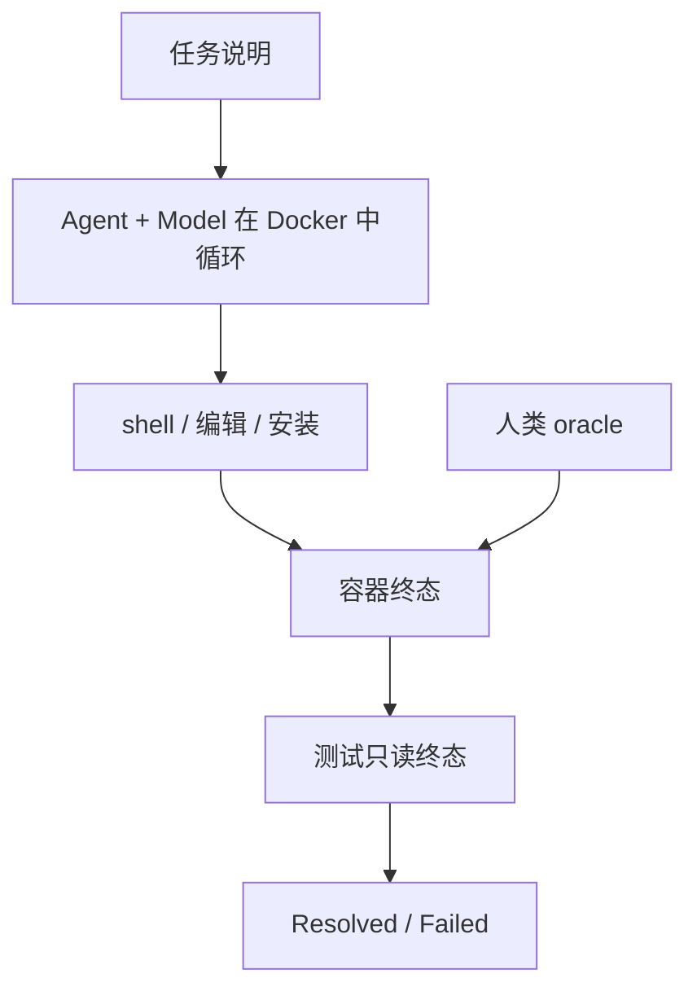

# Terminal-Bench 2

    
任务跑在独立 Docker 里，用人类写的 oracle 与针对最终容器状态的测试来判分；2.0 用更少、更难、经过数小时人工核验的题目，把前沿智能体重新压回远不到满分的区间。

    <footer>—— Stanford / Laude Institute 的 Terminal-Bench 2.0 与 Harbor 评测框架说明</footer>

聊天模型测的是下一 token；软件智能体测的是：在一台真实的 Linux 环境里，能不能用 shell、编辑器、包管理器把一件事做完。Terminal-Bench 把这类工作收成容器内任务——组装、调试、修漏洞、处理数据——并用测试读**最终容器状态**，而不是读模型说自己做了什么。2.0（TB2）在 1.x 过热之后重做题库：去掉过易与不可复现项，强调可解、现实、规格清楚。运行时从旧仓库迁到 **Harbor**。本篇写 2.0 的任务合同与脚手架污染，不把后续 3.x/4.x 题量写成 2.0 的数字，也不把某一天排行榜的百分数当成物理常数。

## 问题

终端任务一旦公开，就会同时变脏和变简单。脏：依赖外网、反爬、变动的 CLI 旗标，去年能复现的 YouTube 下载题今年会因站点策略失败。简单：Hello World 级调试会让前沿模型冲到接近满分，排行榜失去分辨率。原始 Terminal-Bench 在社区贡献下迅速膨胀，质量不齐。2.0 要回答的是：在一套**人工核验过、有 oracle、只看终态**的难题上，智能体的 resolve rate 还剩多少。

第二问是脚手架。同样 89 道题（2.0 公开叙述中的题量），Claude Code、Terminus、Mini-SWE-Agent、Codex CLI 会给出双位数分差。模型名不能单独当行键；必须是 **Agent + Model**。Harbor 把这一点写成一等公民：`harbor run --dataset terminal-bench@2.0 --agent ... --model ...`。

### 2.0 改了题库什么

公开 FAQ / 介绍材料里的筛选原则：(1) **可解**——存在人类 oracle，能在容器里做完；(2) **现实**——像有价值的终端工作，而不是猜谜；(3) **规格清楚**——充分说明成功长什么样，使足够强的智能体有望接近满分，而不是靠题面含混制造难度。为此 2.0 丢掉过易项（如原版 Hello World 调试）和不可复现项（如受反爬影响的下载题）。每道题声称经过数小时人类与语言模型辅助的质检。社区贡献（近百名开发者）仍在，但入集门槛提高。

评测单位：每题一个 Docker 镜像。智能体得到任务说明与 shell，不保证得到测试源码。判分脚本在结束后检查文件系统、进程、或命令输出所留下的状态。**不**根据中间命令是否「看起来对」给分。这避免了「模型复述了正确步骤但没写对文件」的假阳性，也避免了「脏命令碰巧留下对的文件」时过分惩罚——终态才是产品。

2.0 发布时的设计目标包括让前沿组合的成功率留在约 50% 以下，以恢复分辨率。该天花板会随模型与脚手架上移。报分必须带日期、agent 名、以及尝试次数；把「TB2 很难」写成永久属性，会与半年后的榜冲突。

## 方法

推荐入口是 Harbor，而不是旧的 Terminal-Bench 单仓 harness。注册集名称随文档版本写作 `terminal-bench@2.0` 或 `terminal-bench/terminal-bench-2`。本地可先跑 `--agent oracle` 验证镜像与测试：oracle 应用人类解，测试应全绿；oracle 不过，是环境坏了，不是模型弱。并发由 `--n-concurrent` 控制；云沙箱（如 Daytona）把墙钟从 CPU 核数限制里松开，因为 API 模型下试验是 I/O 界。

协议要冻结的东西：镜像摘要、超时倍数、`n_attempts`、是否允许网络、agent 的步数上限。换其中任何一项，resolve rate 不可比。只看终态意味着：智能体可以胡乱 `rm` 再重来，只要最后状态对——成本会计就要另报 token 与美元，否则「高分低效」会赢榜。

### 与 SWE-bench 的分工

[SWE-bench](/llm/swebench-paper) 问的是：在给定仓库与 issue 上交补丁，让 FAIL_TO_PASS 变绿。Terminal-Bench 问的是：在一台空白或半空白的容器里完成多步骤系统工作，仓库可能不存在，成功定义是环境谓词而不是 pytest 列表。前者偏软件工程补丁；后者偏 DevOps、调试、安全、科学计算流水线。二者都把脚手架算进分数。TB2 更短、题更杂、更依赖发行版与工具链；SWE-bench 更长、更依赖定位文件。产品发布应两套都看，再加内部工单，见 [SWE-bench Verified](/llm/swebench-verified) 与 [SWE-Bench Pro](/llm/swe-bench-pro)。

$$
\mathrm{Resolved}=\mathbf{1}\bigl[\mathrm{tests}(\mathrm{final\_state})=1\bigr]
$$

中间轨迹可用于失败分析，但默认榜只用上式。泄漏测试脚本、把 oracle 写进提示，都会让公式退化成「对着答案编程」。

## 机制

TB2 难，是因为搜索空间是整个用户态：包版本、权限、网络是否关闭、错误信息是否误导。模型必须把自然语言目标编译成一串有副作用的命令，并根据 stderr 改计划。这与纯函数代码生成不同，状态不可回滚除非智能体自己做快照。Harbor 重写 harness 的动机是可靠性与可观测性：旧评测框架在大规模并行下的竞态、日志与复现性不够，2.0 把「如何跑」和「跑什么题」拆开。

质检提高的是标签质量。不可复现题会把 Docker 运气写成模型能力；过易题会让所有前沿行挤在 90%+。人工 oracle 保证理论上可解，从而失败更可能来自智能体，而不是坏题。它不消除污染：任务文本、Dockerfile、甚至 oracle 都可能进预训练。copyleft 或私有化不是 TB2 的主策略（那是 SWE-Bench Pro 的），因此 TB2 分数仍可能含记忆成分。动态、隐藏题库才是下一层，见 [动态基准](/llm/live-benchmarks)。

社区贡献是双刃剑。2.0 用更长的人工核验来对冲；若你提交新题，应同时交 oracle、测试、以及「无网可跑」的证明。依赖实时外网的题，本质上不是同一基准。

### 成本与并发是方法的一部分

$$
\mathrm{cost}\propto\ \text{试验次数}\times(\text{模型 token}+\text{容器墙钟})
$$

高 resolve rate 若来自每题数十次重试或百万 token，产品上可能不可用。Harbor 配置里的 `n_attempts`、超时乘数必须写进论文表。云沙箱 32 路并发测的是服务配额，也测 harness 是否在隔离上作弊（共享层缓存导致「第二题莫名其妙更快」）。合理消融：固定 agent 换模型、固定模型换 agent，两张表都给。

## 边界与工程取舍

不要把 tbench.ai 上后续版本的题量与 2.0 的 89 题混用。不要在禁止网络的协议里开外网，或反过来。不要用聊天 Arena 胜率代替 TB2 resolve rate。语言与发行版偏置明显：任务镜像是特定 Ubuntu/工具组合，Windows、macOS、内网代理环境未覆盖。内部应建同构私有集。

泄漏有多层：GitHub 题面、博客 walkthrough、oracle 被爬进语料。时间切分很难。报告应写用的数据集版本哈希。与 [LiveCodeBench](/llm/livecodebench) 相比，TB2 不是按月换新题的水龙头；它是静态但更脏、更系统的终端劳动。两者互补。

出处：harbor-framework/terminal-bench-2 说明与 FAQ；Harbor 文档中的 `terminal-bench@2.0` 入口；Snorkel 等对 89 题、终态判分、Agent+Model 行键的转述。具体榜上百分数以评测当日为准，正文不钉死。

## 小结

- Terminal-Bench 2.0 用独立容器 + 终态测试衡量终端智能体，题更难、更干净、带人类 oracle。
- 分数的主键是 Agent × Model × 协议（超时、尝试次数、网络），不是模型名单独一行。
- 运行应走 Harbor；先跑 oracle 验证环境。
- 与 SWE-bench 分工：系统工作 vs 仓库补丁；都要把脚手架写进名字。
- 静态题库仍有污染与过时风险；不要与后继主版本题量混报。
- 出处：TB2 仓库与 Harbor 文档；对照 [SWE-bench Verified](/llm/swebench-verified) 与 [动态基准](/llm/live-benchmarks)。
