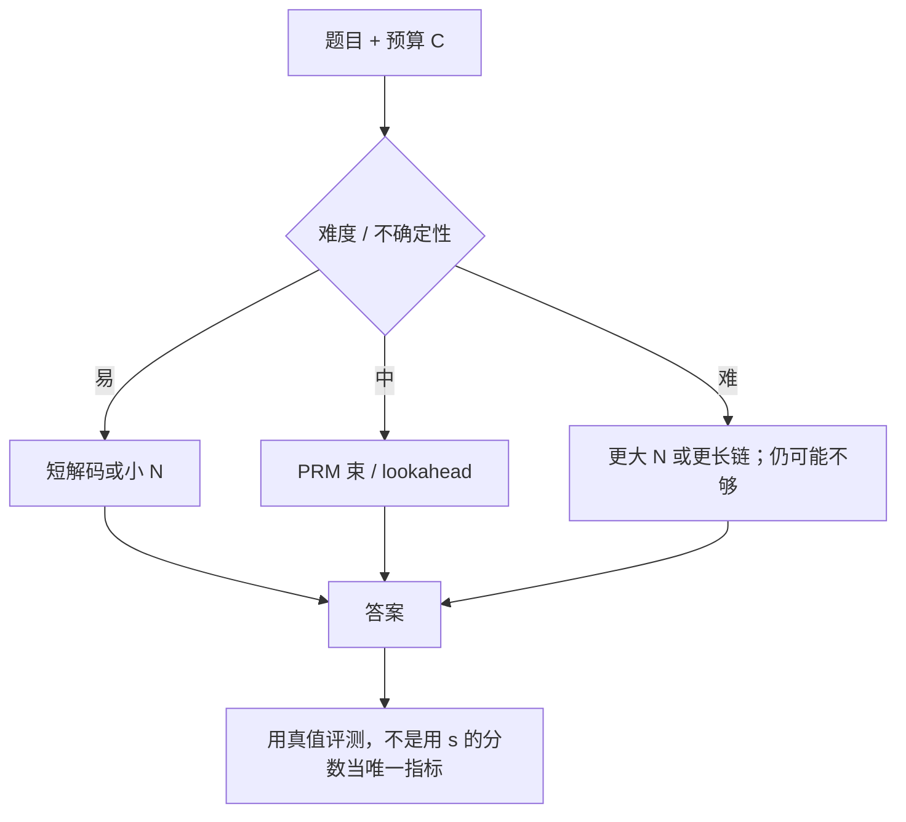

# Test-time compute scaling

按题目难度把推理期算力用对，可以比继续加大预训练参数更有效；最优策略不是对所有提示都做同一种更贵的解码。

<footer>—— Snell, Lee, Xu, Kumar, Scaling LLM Test-Time Compute Optimally can be More Effective than Scaling Model Parameters, 2024</footer>

预训练缩放定律问的是：参数与数据再涨一个数量级，损失掉多少。测试时计算（test-time compute）问的是：对 *已经训好* 的模型，在这一题上再花 FLOPs——更长的思维链、更多候选、更深的树——准确率还能涨多少。OpenAI 在 2024 年 9 月关于 o1 的公开博客里，把「用强化学习训练、在回答前花更多时间思考」写成产品叙事；可引用的机制实验，应以 Snell 等人 2024 年的公开论文为主，而不是给 o1 补一套未发表的公式。本篇写测试时缩放的对象、两条主路径，以及「计算最优」为什么必须分难度。

## 问题

同一道题，贪婪短答可能错，采样 8 条再核对可能对，让模型先写两千 token 的草稿纸也可能对。三种做法花的是不同形态的推理算力：[Prefill](/llm/prefill-compute) 几乎不变（提示相同），Decode 的 token 数、并发条数或树节点数在变。账单按生成 token 与 KV 带宽走，见[显存墙](/llm/decode-memory-wall)。若把测试时预算当成与参数量可互换的通货，必须问：在 *匹配 FLOPs* 下，花在更大模型的预训练上，还是花在小模型的更长搜索上。

Snell 等人指出，答案随 **提示难度** 变。简单题上，[Best-of-N](/llm/best-of-n) 很快饱和，再加 $N$ 几乎只买重复；中等题上，过程引导的搜索可能显著好于盲目加宽；很难的题上，小模型无论怎么搜也可能达不到大模型短解码的水平——搜索不能发明预训练里不存在的知识。把「测试时缩放万能」写成定律，忽略了这道分界。

### 两条机制不要合成一句广告

论文里讨论的主路径大致是：（1）在稠密的过程验证器上做搜索（束、lookahead，与 [MCTS](/llm/mcts-llm) 近亲）；（2）根据提示调整模型在答案上的分布——包括更长的思维链、修订，而不是固定短答。o1 类产品把（2）做成默认用户体验：延迟与费用随「思考」上升。公开博客没有给出与 Snell 逐项对齐的消融，写系统对比时不要把博客曲线和论文表格画成同一张图。

「思考时间」不是架构超参。权重不变，变的是解码程序与停止条件。截断 `max_tokens` 或关掉思考开关，测到的是另一条计算—准确率曲线。评测必须把测试时预算写成方法的一部分，与模型卡上的参数量并列。

## 方法

先固定基座 $\pi$ 与总预算 $C$（生成 token、模拟次数或墙钟）。再选分配器：

- **宽度**：独立采样 $N$ 条，用 ORM / 多数票 / PRM 聚合选一条。
- **深度**：单条链写得更长，或逐步扩展再回溯。
- **自适应**：用一个难度探针（小试探、自洽不确定性、或训练过的难度头）把 $C$ 分给不同提示——简单题 $N=1$，难题才搜。

Snell 等人的计算最优（compute-optimal）指：在每个难度桶上选当时收益最大的那种策略，而不是全局一种 BoN。他们报告在部分设定下，相对盲目 Best-of-N，合适的分配可以把测试时缩放效率提高一个可观倍数；在 FLOPs 匹配比较中，当小模型在该题上已有不可忽略的成功率时，测试时计算可以超过参数量大一个数量级的短解码。这些数字以原文图表为准，不要改写成「14× 永远成立」。

### 与预训练缩放对照

Kaplan / Chinchilla 一类定律描述训练损失随参数、数据、训练 FLOPs 的变化。测试时缩放描述的是 *推理 FLOPs* 对下游准确率。两者单位都是 FLOPs，但边际收益的形状不同：训练 FLOPs 改变权重，对所有未来提示摊销；测试 FLOPs 每次查询重付。产品上只有高频、高价值查询才值得把测试预算加到与预训练边际可比。把「小模型 + 狂搜」当通用部署策略，会在开放聊天上买来延迟，却买不来知识。

## 机制

宽度扩展覆盖 $\pi$ 的多模式：正确模式以概率 $p$ 出现时，独立样本把失败打到 $(1-p)^N$。深度扩展改变的是 *单条轨迹内部的计算*：更多中间 token 让模型做自检、换解法，这要求 $\pi$ 在训练时已经被激励去使用长链（强化学习、长链 SFT），否则加长只是重复套话。过程验证器让深度搜索有可反向的逐步 $Q$，否则深度与宽度都会在错误的目标上浪费预算。

自适应之所以必要，是因为 $p$ 随题变。对 $p\approx 1$ 的题，任何搜索的一阶导数接近 0；对 $p\approx 0$ 的题，导数也可能接近 0，直到 $N$ 大到不现实，或直到知识根本不在模型里。中间区才是测试时计算的甜点。难度估计本身会错：把难题估成易题，等于拒绝给预算；把易题估成难题，等于给用户买延迟。探针应保守，并在产品里允许用户强制「快/慢」覆盖。

匹配 FLOPs 时要写清比较的是预训练 FLOPs 还是该次推理 FLOPs。用「小模型搜了 100 次」去比「大模型只答一次」可以，但必须把 100 次 decode 算进左侧。只比参数量不比生成 token，结论是空的。

## 边界与工程取舍

### 公开论文与封闭系统分开引用

Snell et al., 2024（arXiv:2408.03314）是可核对的测试时缩放实验。OpenAI o1 的公开文本是产品与安全报告级描述，没有同等程度的解码器与搜索消融。DeepSeek-R1 把测试时变长思维写成 RL 的结果，搜索主要在训练期被内化进 $\pi$，推理可以不再跑显式 BoN——这是第三条路：把测试时行为 *训练进权重*。三条路的成本落点不同，不能用同一张「缩放曲线」覆盖。

验证器错误会随搜索预算被放大，见 BoN 的过优化。安全与拒答策略必须进入 $s$，否则更多测试时计算等于更强的对抗搜索。服务上应把思考预算与 KV 池、队列优先级绑在一起：默认全开长链会把共享集群的 decode 打满。不要用针测或短上下文聊天的 SLA 去承诺竞赛级思考延迟。

禁止把未公开的 o1 内部报告写成 arXiv 论文。需要封闭系统数字时，引用官方博客日期与当时的基准声明，并注明不可复现。

## 小结

- 测试时缩放：固定权重，用更多推理计算换准确率；预算要按生成 token / 搜索结构记账。
- 宽度（BoN）与深度（长链、树）机制不同；最优组合随题目难度变。
- 计算最优是按桶选策略，不是全局加大 $N$。
- 很难的题上搜索补不齐预训练缺失的知识；很简单的题上搜索很快饱和。
- FLOPs 匹配必须声明比较的是训练还是该次推理；摊销逻辑完全不同。
- o1 公开叙事与 Snell 2024 应分开引用；R1 把长链训练进策略，推理可不显式搜。
- 出处：Snell et al., 2024, arXiv:2408.03314；OpenAI, *Learning to Reason with LLMs*, 2024 年 9 月博客；DeepSeek-AI, *DeepSeek-R1*, 2025。
