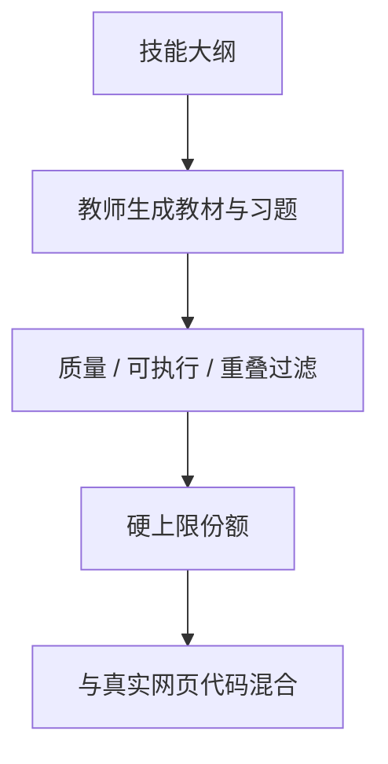

# 教科书式合成

用模型生成写给学生看的教材，而不是再爬一页网页，小模型也能在代码与常识上跳得很快——前提是合成分布没有把评测抄进去。

<footer>—— Gunasekar et al., Textbooks Are All You Need, 2023</footer>

[上一课](/llm/instruction-in-pretrain)把真实示范掺进预训练，规模受许可与人力限制。phi-1 一类工作表明：高质量的合成教科书与习题，可以在远小于网页的 token 预算里推高代码能力。本课不重讲聊天模板。缺口是合成数据在预训练配比里的位置——它是密度放大器，也是污染与风格坍缩的来源。去污染与课程排序是随后两课；本课先把「教科书」这种数据对象定义清楚。

## 问题

网页的信息密度低：广告、重复、含糊。Gunasekar 等人用 GPT-3.5 一类模型生成「教科书」与「习题」，再在过滤后的代码上训小模型，得到 phi-1。Li 等人的后续把故事与常识也写成可控合成（TinyStories、phi-1.5）。工程缺口不是「会不会调用教师模型」，而是：合成桶的 $w$ 设多少、教师与学生如何避免同构背诵、以及合成是否只在退火期出现。主干配比若把合成当普通网页，DoReMi 会因为它又干净又简单而把权重拉满，覆盖崩掉。

合成还与词表耦合：教师若用另一套切分，学生只看见自己词表下的字节。应以学生冻结词表做长度与覆盖审计，与 fertility 课同一报表。

### 密度与多样性的对立

教科书风格短、清楚、重复教学话术。$w_{\mathrm{syn}}$ 高时，模型说话像教材，网页长尾实体消失。Eldan 与 Li 在 TinyStories 里用极简语法换可分析性，那是研究设定；产品预训练必须把合成当调料。指令进预训练提供对话多样性，合成提供讲解密度，不要合成去替代对话桶。

教师模型的拒绝、水印与套路会变成学生的先验。应多教师、多模板，并过滤「过于像某基准」的题面。

## 方法

先规定可合成的技能轴（入门算法、API 用法、小学推理），用明确大纲采样题目，再生成讲解与练习，而不是让教师自由写网页。过滤：语言识别、重复、与评测 n-gram 重叠（细节下一课）、编译或执行检查（代码）。给合成桶硬上限 $w_{\mathrm{syn}}$，不参加无约束 DRO，或只在盒约束内微调。phi 配方把合成与过滤后的真实代码混合；真实代码仍走仓库级排布，合成走单篇教材，打包规则不同，不要拼成假仓库。

时间上，合成可全程小比例，或只在后期退火出现——与退火课衔接。全程大比例只适合明确的小模型实验，不适合通用大模型的主训练。

### 自蒸馏循环

用当前学生生成再训学生，会迅速坍缩。教科书课要求教师强于学生，或至少来源多样。若必须自蒸馏，应加核采样多样性约束，并盯验证集上的新颖 n-gram 比例。

FIM 与合成习题可以结合：生成挖空练习。哨兵仍必须是同一套协议 token。

## 机制

合成改变的是训练测度的密度：同样 token 数里，梯度更常指向「可验证的正确推导」。这与影响函数挑文档同族，只是文档是生成出来的。风险是测度支撑变窄。配比栈里应用硬上限对抗 DRO/RegMix 对低损失桶的偏好——合成的验证损失往往最低，面会骗人。

## 边界

合成不提供开放世界的新事实，除非教师检索了外部知识——那是另一条管线。它也不能修复 glitch token。下一课把「与评测重叠」从合成与网页两侧都写成强制流水线，否则 phi 式跳跃里有一部分只是泄漏。

## 小结

- 本课不重讲真实指令桶；只补高密度合成教材在配比里的角色。
- 合成是有硬上限的调料，真实仓库与网页仍是支撑。
- 用学生词表审计长度；多教师防套路；禁止无约束 DRO 把合成抬成主食。
- 自蒸馏易坍缩；与评测重叠交给去污染关卡。
- 出处：Gunasekar et al., *Textbooks Are All You Need*, 2023；Li et al., phi-1.5；Eldan & Li, TinyStories。
