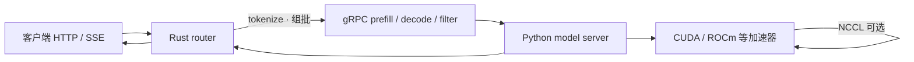

# Hugging Face TGI

路由器收请求、组 batch、发 gRPC；模型服务端加载权重、做张量并行、跑 prefill 与 decode。两者不必落在同一台机器上。

<footer>—— Hugging Face，Text Generation Inference Architecture 文档</footer>

Text Generation Inference（TGI）是 Hugging Face 为开源大模型写的一套生产向推理工具箱：连续批处理、张量并行、Server-Sent Events 流式输出、OpenTelemetry 与 Prometheus、以及后来补上的 OpenAI Messages API。官方架构文档把它拆成三块——Rust 写的 router（也称 webserver）、Python 写的 model server、以及把两者拉起来的 launcher。调度在 router 里发生，GEMM 与 KV 在 model server 里发生，中间用 gRPC。本篇按这份文档写调用流，不把某一版吞吐数字写成论文结果。Hugging Face 后续已把 TGI 标为维护模式，并推荐新部署优先看 vLLM、SGLang 以及本地侧的 llama.cpp / MLX；理解 TGI，是为了看清「HTTP 服务」与「逐步解码引擎」为什么必须拆开，以及后来的引擎继承了哪些接口习惯。

## 问题

自回归生成不是一次 RPC 算完。提示要 prefill，之后每步 decode 出一个 token，客户端还可能中途断开。若把「收 HTTP、做 tokenize、组 batch、跑模型、detokenize、写 SSE」塞进同一个 Python 进程，队列策略、取消语义和 GPU 内核会缠在一起：改调度就要动 CUDA，改模型就要动 HTTP。TGI 要解决的，是把延迟敏感的组批放在靠近客户端的一侧，把权重与集合通信放在靠近加速器的一侧，并用一份稳定的批次协议把两边钉住。

另一半问题是 Hub 上的模型形态。权重在 safetensors 里，结构声明在 `transformers` 的配置里，词表与 [chat template](/llm/chat-template) 跟 tokenizer 绑定。服务端若另写一套架构注册表，每出一个新模型就要分叉。TGI 早期推动「推理引擎直接吃 `transformers` 架构」——官方索引页把这一点写成它对后续引擎的影响，而不是声称自己永远是吞吐最高的实现。

### 维护模式不等于架构作废

维护模式的意思是：仓库仍接受小修复与文档，不再当新特性的主战场。生产上仍有大量已部署实例；OpenAI 兼容路径、SSE、连续批的调用形状，已经被 vLLM 与 SGLang 的 HTTP 层沿用。读 TGI，应把它当成一份把服务拆成 router / engine 的参考实现，而不是一份过时的 Docker 配方。

不要把 TGI 文档里的默认上限（如 `max-concurrent-requests=128`、`max-input-tokens=1024`）抄成模型能力。那是 router 的准入闸门，用来保护 KV 与 prefill 预算，与模型卡上的上下文长度不是同一个数。

## 方法

Launcher 负责拉起一个或多个 model server（模型按卡做张量并行时是多个 shard），再带着匹配的参数启动 router。Router 是 Rust HTTP 服务，吃两套入口：TGI 自己的 HTTP API，以及 OpenAI 的 Messages API。它做校验、tokenize、排队、调度和块分配，产出已经组好的 batch，再经 gRPC 发给 model server。Model server 用 PyTorch 加载模型，在 CUDA / ROCm 等后端上做推理，shard 之间用 NCCL 一类通信对齐 [张量并行](/llm/tensor-parallel)。官方明确写：router 与 model server 可以部署在不同机器上。

gRPC 目前有 v2 与 v3 两套 schema，差别主要在输入分块（文本与图像）以及 paged attention 支持。启动后先做服务发现、取模型信息、健康检查，再 `warmup`：把 `max_input_tokens`、`max_batch_prefill_tokens`、`max_total_tokens`、`max_batch_size` 打进一次预热，避免第一笔真实流量才去编译核、分配 KV。之后的稳态调用是三类：`prefill` 吃新请求，`decode` 推进已缓存的 batch，`filter_batch` 在某条请求结束或客户端离开时，从 cached batch 里摘掉对应 `request_id`。

### Prefill 插入时为什么要停掉当前 decode

文档里的时序图写得很直：新请求到来时，router 向 model server 发一个新的 `prefill`；正在跑的 decode batch 会被停住，prefill 完成后再把新旧 cached batch 合并进下一次 `decode`。这不是实现疏忽，而是连续批处理的代价：prefill 与 decode 的算力画像不同，又共享同一组权重与同一条执行流。客户端中途离开时，router 调 `filter_batch(..., request_ids_to_keep=...)`，只留下还活着的序列，避免空转的 KV 继续占槽。取消语义的展开见 [流式输出与取消](/llm/sse-cancel)。

## 机制

Router 侧的调度旋钮都是为了在「等一等、组更大的 batch」和「别让已在解码的请求饿死」之间找平衡。`waiting-served-ratio`、`max-waiting-tokens`、`max-batch-prefill-tokens` 控制何时插入 prefill、一次 prefill 允许多长。块分配器则约束总 token 上限，防止 KV 把显存打满。Tokenizer 挂在 router 上（`--tokenizer-name`），长度校验发生在进 GPU 之前：非法过长的请求在 Rust 侧被拒，不必先占一次失败的 prefill。这把 [tokenizer 开销](/llm/serving-tokenizer-cost) 从引擎热路径里拆了出来，也让校验工人数（`--validation-workers`）成为独立的 CPU 预算。

Model server 的 CLI 暴露量化（bitsandbytes / GPTQ / AWQ / FP8 等）、推测解码步数、dtype 与是否 sharded。不是每种硬件变体都实现同一组开关：官方列出 CUDA、ROCm、Intel GPU、Gaudi、Neuron、TPU（Optimum TPU）等分支，并写明特性集会因硬件与中间件而不同。量化配方不能跨变体抄。权重下载与量化是独立子命令（`download-weights`、`quantize`），与 `serve` 分开，避免服务进程在第一次请求时才去 Hub 拉盘。

TGI 把 Messages API 做成 router 开关（`--messages-api-enabled`），不是模型能力。关掉它，引擎仍能生成；打开它，只是多了一条与 OpenAI 字段对齐的 HTTP 皮。字段对齐不等于行为对齐，见 [OpenAI 兼容协议](/llm/openai-compat-api)。

### 观测与生产开关

索引页强调分布式追踪（OpenTelemetry）与 Prometheus 指标，这是它相对「脚本里 `model.generate`」真正多出来的一层。Router 还暴露 CORS、最大并发、best-of 与 stop sequence 上限。这些上限是拒绝服务与资源保护，不是采样算法本身。Watermarking、logits warper、guidance（按 schema 约束解码）属于生成侧功能，落在 engine 路径上，但调度合约仍然是 prefill / decode / filter。

## 边界与工程取舍

TGI 的模型覆盖以当时流行的开源结构为准（Llama、Falcon、StarCoder、BLOOM、GPT-NeoX、T5 等），新架构的第一落点已经不在这个仓库。TRT-LLM 等后端会替换 model server 与 launcher，router 仍可保留——这说明「HTTP + 组批」与「某种 CUDA 图」是可替换的。选 TGI 还是 vLLM，应看团队是否已经吃进它的运维面（镜像、指标、Hub 集成），而不是比较一篇没有版本号的延迟表。

分页注意力出现在 gRPC v3，并不意味着每一条硬件分支都有同等实现。Gaudi、Neuron、TPU 上的 KV 布局、量化与投机解码要以对应 fork 的说明为准。不要假设「TGI 支持 Paged Attention」在 Inferentia 上与 A100 上是同一句话。多卡只保证 NCCL 能同步 shard；跨节点 TP 是否划算，仍服从 [通信层次](/llm/pretrain-comm)：decode 小 batch 时 All-Reduce 延迟会被放大。

出处停留在 Hugging Face 的 TGI 架构文档、索引页（含维护模式声明）与 Messages API 说明。不要给 TGI 编造 arXiv 编号；它是工程仓库，不是一篇会议论文。

## 小结

- TGI 把服务拆成 Rust router、Python model server 与 launcher；调度与 tokenize 在 router，推理与张量并行在 server，中间是 gRPC。
- 稳态调用是 `prefill`、`decode`、`filter_batch`；新请求的 prefill 会打断当前 decode batch，再合并继续。
- 连续批、SSE、OpenAI Messages API、OTel / Prometheus 是它留给后续引擎的接口习惯。
- Tokenizer 与长度闸门在 router，不在 GPU 热路径上。
- 仓库处于维护模式；新部署应对照官方推荐的 vLLM / SGLang 等，而不是把旧镜像当成默认最优。
- 出处：Hugging Face *Text Generation Inference* 架构文档与项目说明。
