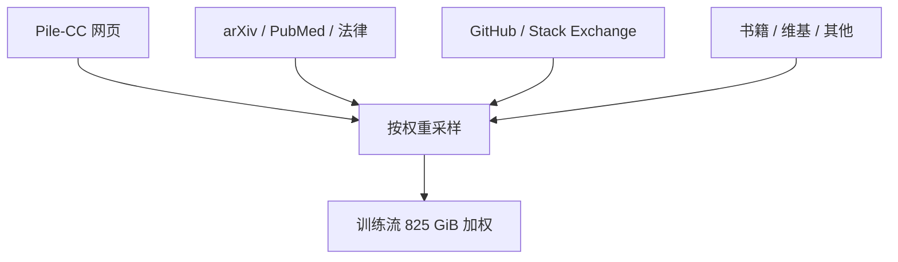

# The Pile

    
用 22 个来源拼出 825 GiB 英语语料：网页只是其中一块，学术、代码、法律与书籍被有意加权，以便跨域泛化而不只拟合爬虫。

    <footer>—— Gao et al., The Pile: An 800GB Dataset of Diverse Text for Language Modeling</footer>

EleutherAI 的 Leo Gao、Stella Biderman、Sid Black 等人发布 **The Pile**（arXiv:2101.00027）：面向大规模语言建模的英语文本集合，体积 **825.18 GiB**，由 **22** 个子集构成——既有已有 NLP 数据，也有新爬或新抽取。设计主张承接 GPT-3 一类实践：大网页抓取之外，混入更小、更高质量、领域各异的来源，以提升跨域知识。他们引入过滤后的 Common Crawl 子集 **Pile-CC**（jusText 从 WARC/HTML 抽取，而不是直接信 WET）。在规模受控比较里，Pile 上训的模型相对 CC-100 英语与原始 CC，在 Pile 各分量上更好，WikiText 等传统基准不崩。GPT-Neo / GPT-J 等开源模型把它当成主语料。本篇写混合物与加权，而不是把「用了 The Pile」当成已说明数据。

## 问题

纯 Common Crawl 量大、质量方差极大，清洗成本高；纯维基+书又太小，撑不起十亿参数。公开、可下载、已经预清洗的英语集（相对 C4/mC4 动辄要分布式预处理）是 2020–2021 年开源训练的瓶颈。Gao 等人要一份**多样且文档化**的语料：学术（arXiv、PubMed）、法律（FreeLaw、USPTO）、代码（GitHub）、问答（Stack Exchange）、书籍与网页并存，并写清各分量体积、训练时的 epoch 加权与潜在风险（攻击性文本、版权敏感源）。

第二个问题是评价：只用 WikiText / LAMBADA 会看不出模型在论文 LaTeX 或判例上是否一窍不通。Pile 自带 train/validation/test（验证与测试各约 0.1%，但仍有 GiB 量级），推荐指标是 **bits per UTF-8 byte (BPB)**，避免不同分词器的困惑度不可比。GPT-2/GPT-3 在未针对 Pile 训练时，在若干分量（尤其学术）上表现差，用来说明「网页模型 ≠ 跨域模型」。

### 加权 epoch 比原始 GiB 更能描述真实训练分布

表内 Pile-CC 原始约 227 GiB、权重约 18%；PubMed Central 约 90 GiB 但训 2 个 epoch，有效体积约 181 GiB；维基只有约 6.4 GiB，却训 3 个 epoch。Books3、arXiv、GitHub、FreeLaw 同理。报「825 GiB」而不报加权，等于没报混合物。有效大小之和才是模型真正见到的频率。复制倍数把小而密的领域（数学 DM Mathematics、维基）抬到可学习的曝光，也放大这些源里的偏差与版权风险。

Gao et al.，arXiv:2101.00027。825.18 GiB、22 子集。Pile-CC 227.12 GiB；Books3 约 101 GiB；GitHub 约 95 GiB；PMC 约 90 GiB。后续 Books3 等来源引发版权争议，使用须按当时法律与数据集条款，不能把 2020 年的「公开可下」理解成永久许可。

## 方法

构造：对各子集分别清洗、去重、转统一文档格式，再按设计的权重采样拼接。Pile-CC 强调抽取质量：jusText 打 HTML，减少导航残渣。代码与论文保留对语言模型有用的符号结构（但字节/token 比会变差，因为 BPE 为网页英语而训）。文档长度长尾极重：书籍与 IRC 日志的平均文档远大于短网页，影响切分与上下文包装。语言以英语为主，EuroParl 等带多语言杂质，需知情。

他们做主题模型与毒性粗分，提醒使用者：来源杂，必含粗俗与敏感内容；专业域（法律、生物医学）有自己的术语与偏见。去重在子集内做了努力，但 train/val/test 之间仍可能残留重复，BPB 可能略乐观。公开预处理代码，以便做「去掉某一源」的消融版本——这是相对不可审计内部混合物的主要价值。

### 与 C4 的差别是「混合物 vs 单源网页」

C4/mC4 几乎全是 Common Crawl 启发式清洗；Pile 明确反对「只有 CC」。规模上英语 C4 与 Pile 同量级，但 Pile 下载即用的门槛更低（论文对比了 C4 预处理的计算壁垒）。CC-100 英语部分更小。机制上，Pile 用小而精的源改变尾部知识；C4 用规则改变网页支撑。二者都可以当网页基线，但 Pile 上的学术 BPB 优势不能解释成「清洗得比 C4 更干净」——解释应是域配比。

## 机制

多样性的主张是：在新域只需少量数据就能长知识（论文引用当时的大模型结果），因此把 arXiv、PubMed、判例放进预训练，比事后继续预训练更省。权重控制曝光：不加权则 Pile-CC 与书籍会主导梯度。BPB 按 UTF-8 字节，使代码与 TeX 的「难」被诚实显示——GPT-2 tokenizer 下 GitHub、arXiv 的 bytes/token 偏低，表面困惑度与网页不可比，故不用「per token PPL」横比分量。

文档长度影响学习信号：超长书被切成块，块间依赖要靠位置外推；短 Stack Exchange 则是问答局部模式。混合物等于同时训多种文档先验。去掉书籍或代码，下游对应能力会掉——这是可预期的，不是神秘涌现。相对 Raw CC，Pile 的过滤与源选择同时改变支撑与频率。

Datasheet（Biderman 等后续 arXiv:2201.07311）补数据声明。引用 The Pile 时应指向 Gao 等 2101.00027 与 22 子集表，而不是只写「EleutherAI 数据」。GPT-Neo 的模型卡不能替代这份语料论文。

## 边界与工程取舍

### 公开可下载不等于可商用、可无审计

版权与伦理是一等边界：Books3、部分网页与邮件（Enron）不适合所有产品场景，后续镜像缺书也说明许可会变。毒性与偏见按子集不同，不能用一个「安全」标签盖 22 源：论坛与字幕的粗俗分布，和 USPTO 背景字段不是一回事。英语中心：不能当多语言预训练主集（那是 mC4 / 后续多语混合物）。规模相对 2024 年万亿 token 网页集已经偏小，现代训练常把它当高质量成分而不是唯一燃料。泄漏：学术与维基和下游考题、论文摘要重叠风险要单独审计。把 Pile 验证集 BPB 写成聊天助手 Elo，是指标错位。

不要把 Pile 上的 BPB 当成聊天助手质量；它是语言建模语料。也不要假设去重已经消灭所有跨分割重复。复现旧模型应冻结 Pile 版本与子集列表：后来的镜像可能缺 Books3。

出处：Gao, Biderman, Black, Golding, Hoppe, Foster, Phang, He, Thite, Nabeshima, Presser, Leahy，*The Pile: An 800GB Dataset of Diverse Text for Language Modeling*，arXiv:2101.00027。

## 小结

- The Pile：825 GiB、22 个英语子集，网页与学术/代码/法律/书籍混合，并按 epoch 加权。
- Pile-CC 用更好的 HTML 抽取；整体下载门槛低于自造 C4。
- 用 BPB 与分量级评价，避免只看 WikiText。
- 版权、毒性、英语中心与残留重复是使用边界。
- 出处：Gao et al.，arXiv:2101.00027。
