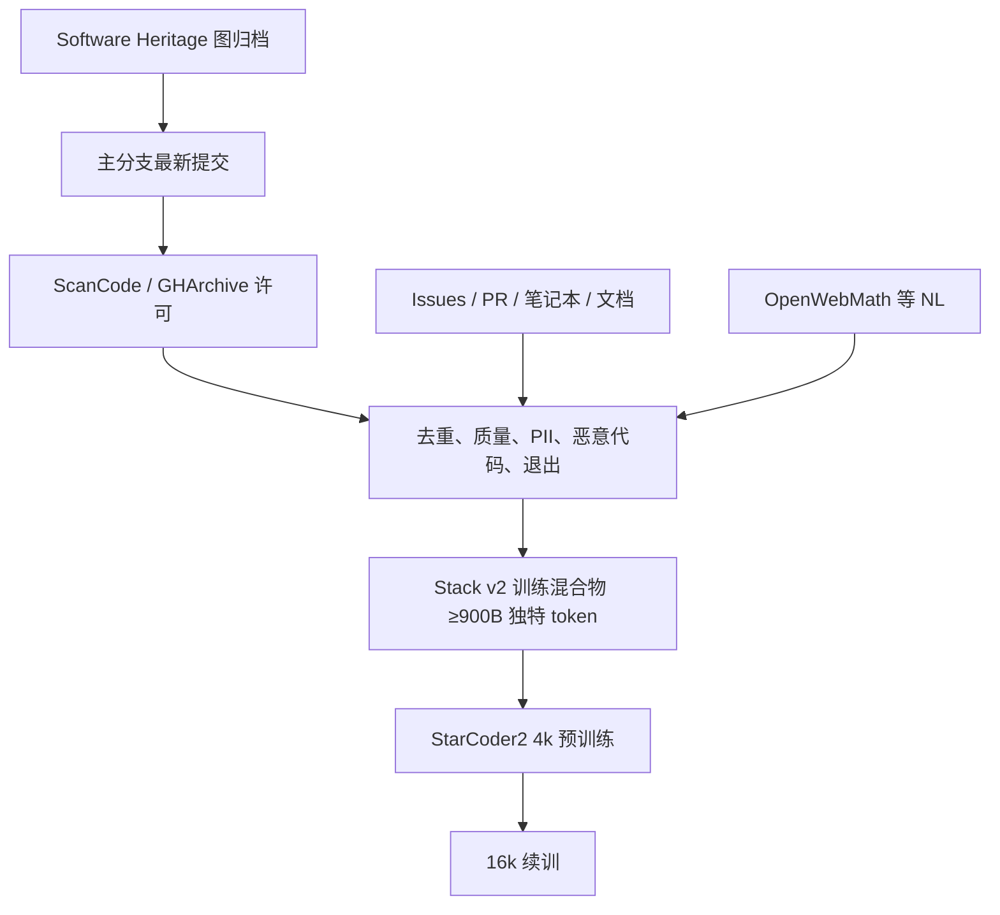

# Stack v2

代码模型要可问责，就不能只开权重：训练用了哪些仓库，应以 Software Heritage 的持久标识公开，并给作者退出的路径。

<footer>—— Lozhkov et al., StarCoder 2 and The Stack v2: The Next Generation, 2024</footer>

BigCode 与 Software Heritage 把 The Stack 做成下一代：v2 不再只从 GitHub 宽松许可仓库抽样，而是建立在 Software Heritage 对全球源代码的归档之上，覆盖 619 种程序语言。去掉重复、低质量、PII、恶意软件并处理退出请求之后，用于训练的独特 token 超过 900B，约为第一代 StarCoder 数据的四倍。旁边还混入 GitHub issue 与 PR、Kaggle / Jupyter 笔记本、文档，以及数学与推理相关的自然语言（含 OpenWebMath）。StarCoder2 的 3B/7B/15B 在这份数据上先以 4k 上下文预训练，再以 16k 续训，总 token 3.3–4.3T，远超 Chinchilla 最优、但不超过五遍数据。v1 证明「宽松许可的 GitHub 能训代码模型」；v2 证明「以数字公共品归档为底、把治理写进数据集」可以同时放大规模与问责。

## 问题

闭源代码模型与仅开权重的 Code Llama、DeepSeekCoder 让三件事无法做：作者不知道自己的文件是否被训；社会科学无法查偏见与恶意模式；研究者无法测基准污染。The Stack v1（Kocetkov 等人）给出 6.4TB、384 种语言的宽松许可代码，以及 “Am I in The Stack” 查询与退出。缺口是覆盖：GitHub 不是全世界的代码，宽松许可只是许可分布的一截，文件级质量与仓库级默许许可经常对不上。Software Heritage 的使命是保存所有以源码形式存在的知识，其图数据集把文件、目录、提交与仓库状态收成去重后的 Merkle DAG。把预训练建立在这份公共归档上，才能把「代码数据」从爬虫产物变成可引用的文化遗产切片。

第二问题是训练还需要代码周围的自然语言。补全不只看函数体，也看 issue 里的复现步骤、PR 里的审查意见、笔记本里的叙事单元格。v1 几乎只有源文件。v2 要把这些模态收进来，同时不让垃圾 issue、未脱敏日志和恶意仓库吞掉 token 预算。

### 许可要从仓库落到文件

GitHub 元数据里的 SPDX 常常缺失。v2 对 2023-09-06 的 SWH 图取 GitHub 仓库的最近主分支（`main`/`master` 或 GHArchive 默认支），只保留最新提交，按目录哈希去重仓库，目录树最多走 64 层，单文件压缩后超过 10MB 不下载。许可检测：先对齐 GHArchive 的仓库级许可证；对约 96.93% 没有仓库级声明的，用 ScanCode 在 LICENSE/README 一类文件上找 SPDX，并传播到同一路径前缀下的文件。然后按 Blue Oak 与 ScanCode 的宽松/公有领域清单，把文件标成宽松、非宽松或无许可。v2 相对 v1 的关键政策变化是：宽松与无许可都进入训练集，copyleft 与明确商业许可排除。无许可不是「作者同意训练」，只是归档中常见的缺失状态。退出通道因此变成治理的必要补丁，而不是礼貌功能。

## 方法

源码之外，issue、PR、笔记本与文档各有清洗与去重。质量过滤去掉明显非代码、过短或自动生成的噪声；PII 用规则与模型打码；恶意软件检测试图在训练前拿掉明确有害的仓库。退出名单按作者请求从训练集聚除，并在发布时用 SWHID 列出实际用过的源码对象，使「我的文件在不在里面」可独立核验，而不必分发全部字节。自然语言侧纳入 OpenWebMath 等，是为了让代码模型在数学与推理基准上不至于纯靠函数名猜测。

StarCoder2 的训练刻意不走计算最优短训。3B/7B/15B 分别看到 3.3–4.3T token，远超 Hoffmann 比例，但遵循 Muennighoff 等人的重复上限：整库不超过约五 epoch。两阶段上下文：先 4k 再 16k，做法对齐 Code Llama 与 DeepSeekCoder。评测覆盖 HumanEval、MBPP、MultiPL-E、DS-1000、CRUXEval、GSM8K、安全与偏见套件等。结果：3B 在多数基准超过同尺寸代码模型，并赶上甚至超过 StarCoderBase-15B；15B 超过同尺寸 CodeLlama-13B，匹敌或超过 CodeLlama-34B；高资源语言补全上 DeepSeekCoder-33B 仍更强，但 15B 在若干低资源语言以及需要执行推理、数学的任务上可以反过来。7B 相对 DeepSeekCoder-6.7B 偏弱，论文承认未完全解释。

### 发布权重仍要发布标识符

模型权重走 OpenRAIL，数据层走 SWHID 清单而不是把 67.5TB 级归档整包镜像到每个用户磁盘。这是一种折中：可审计「训了哪些对象」，不一定可便捷地本地重放全部字节。对污染分析，研究者可用 SWHID 与基准仓库对齐；对退出，作者可对照清单。v1 的查询工具在 v2 上必须改接到 SWH 标识，否则「Am I in The Stack」会指着过期的 GitHub 快照。

900B+ 独特 token 是去重后的源码与附属数据合计；StarCoder2 训练 3T+ 是多 epoch 与多模态混合物上的看到次数。把「数据集大小」和「训练 token」写成同一个数，会高估独特代码量或低估重复遍数。

## 机制

Merkle DAG 去重改变的是文件级频率：相同内容无论出现在多少 fork 里，归档里只有一个 blob。这对语言模型的含义是：流行库的标准实现仍会通过「被多少仓库引用」以外的途径进入（例如出现在笔记本、文档、issue 引用），但不会按 fork 数线性放大。许可传播改变支撑：copyleft 文件被拿掉，模型对 GPL 风格项目的补全要靠无许可与宽松文件里的近邻，分布会偏 Apache/MIT 生态。退出是事后从支撑里挖洞，可能在小语言上留下可见缺口。

附属自然语言改变条件分布 $p(\mathrm{code}\mid \mathrm{issue})$。没有 issue 文本，模型只会 $p(\mathrm{code}\mid \mathrm{prefix})$。PR 审查意见则提供负例与风格约束。数学 NL 把符号推理从「纯代码」接到 OpenWebMath 的讲解体，这与 Llemma 用代码模型接数学混合物是同一方向的弱形式。两阶段上下文让早期训练在 4k 上更便宜，后期把仓库级长文件放进窗口——对「跨文件补全」有用，但不能替代真正的仓库级检索。

### 与 Dolma 代码桶、StarCoder v1 的关系

Dolma v1.6 的 GitHub 桶是通用 LM 的代码调味；v1.7 换成 StarCoder 集合，等于承认通用混合物应引用 BigCode 的专业清洗。v2 相对 v1：语言从 384 到 619，许可政策纳入无许可，来源从 GitHub 抽样升级为 SWH 归档，并系统加入对话式开发痕迹。训练上，v1 的 StarCoder 15B 已被 v2 的 3B 在不少任务上追上，说明数据覆盖与治理改进可以转化为小模型的能力，而不是只能堆参数。

## 边界与工程取舍

无许可文件的法律与伦理争议没有消失，只是被退出机制和 SWH 的保存使命部分覆盖。ScanCode 误检会让 copyleft 漏进或把宽松误杀。10MB 与 64 层限制丢掉单体生成代码与深度嵌套的 vendored 树。恶意软件检测是召回有限的分类器，不能当安全保证。OpenRAIL 限制用途，与「完全公有领域权重」不同。7B 相对同尺寸闭源数据模型偏弱，说明这份公开混合物仍不是补全任务的全局最优，尤其在高资源语言上。低资源语言的胜利可能来自 SWH 的长尾覆盖，但评测集也更小、方差更大。

不要把 Stack v2 当通用网页。它几乎不含 FineWeb 式散文；反过来，FineWeb 也不含可编译的仓库结构。配比里二者应分桶。需要数学时，引用的是混合物里的 OpenWebMath 切片，不是源码 blob 自己会变 Minerva。

## 小结

- Stack v2 以 Software Heritage 归档为底，619 种语言，训练用独特 token 超过 900B，约四倍于 StarCoder v1 数据。
- 许可在文件级检测：纳入宽松与无许可，排除 copyleft 与商业许可，并以退出与 SWHID 做问责。
- 除源码外混合 issue、PR、笔记本、文档与数学自然语言。
- StarCoder2 3B/15B 显示小模型可因数据覆盖赶上甚至超过上一代大模型；7B 对位仍有缺口。
- 训练远超 Chinchilla，但限制在约五 epoch，并做 4k→16k 两阶段。
- 公开的是标识符与权重许可，不等同于把全部归档字节再分发一遍。
- 出处：Lozhkov et al.，*StarCoder 2 and The Stack v2*，arXiv:2402.19173，2024；对照 Kocetkov et al. The Stack v1、Software Heritage、Paster OpenWebMath。
