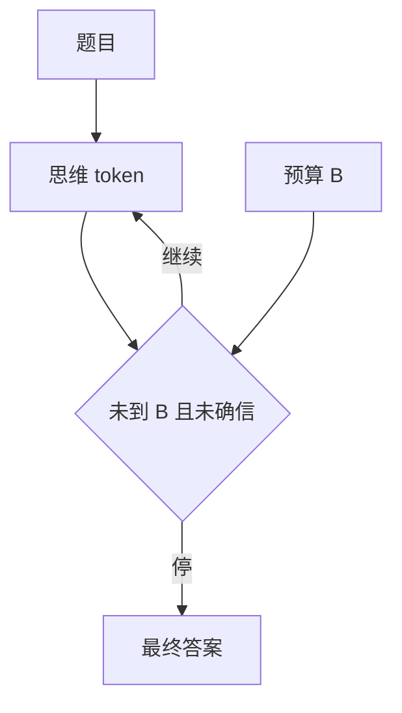

# 思考预算与自适应思考

同一套权重，多给一些推理 token 往往更准；预算从哪来、谁来停，是测试时缩放的旋钮。

<footer>—— OpenAI o1 / o3 的思考时间；Snell 等测试时计算；Muennighoff 等 s1 的预算强迫</footer>

[上一课](/llm/rl-scaling-laws)把训练 RL 算力与金标画在一张图上。本单元改画**一次推理的长度**。缺口是：R1 / o1 类模型会自己长链，但产品需要上限；太短截断推理，太长烧钱。[DeepSeek-R1](/llm/deepseek-r1) 已写行为表象。本课写预算与自适应：何时想够了。接到混合思考、过度思考。

## 问题

训练侧 [GRPO](/llm/grpo) 用终局 $R$，长度涨是因为长搜索更容易撞对。推理侧若无上限，延迟与 KV 爆。预算 $B$：思维 token 的硬顶。自适应：模型或控制器在 $<B$ 时决定 EOS。s1 的 budget forcing 在还没停时插入「Wait」强迫续写，显示额外 token 仍能抬分。o1 产品把思考时间当用户可见档位。

自适应失败有两头：简单题也写满 $B$（过度思考，后课）；难题在预算内乱收尾（过长过滤课的截断问题在推理时再现）。

### 预算是策略的一部分

训练若从不见 $B$，推理突然截断，分布外。应在 RL 中随机 $B$ 或对超 $B$ 塑形，使策略会收束。与训练-推理精度不匹配同类：解码约束属于 $\pi_{\mathrm{beh}}$。

隐藏思维 + 用户可见摘要时，预算计的是隐藏链。摘要器另占 token，不要混进 $B$ 的 SLA。

## 方法

硬顶：到达 $B$ 插入收束提示或强制 boxed。自适应：用内部置信、自检头、或「答案已稳定」规则早停。训练：过长软惩罚（DAPO）+ 随机长度上限，让策略在多档 $B$ 下都还能得 $R$。评测：同一题扫 $B$，画准确率–延迟帕累托，对应 Snell 的测试时计算曲线。

与并行思考（后课）对照：预算是串行加长；并行是多样本。两者都花测试时 FLOPs，可互换一段。

## 机制

额外 token 提供串行工作记忆（必要性论点，见 CoT monitorability 课）。自适应要估计边际收益。模型的口头「已经想清楚」不可靠（诚实课）。更好的是：答案跨续写稳定、或校验器可中途调用（工具课）。无校验器时，早停偏冒险。

RL 若奖励只看对错、不看 $B$，自适应不会自己省 token。必须把预算写进 $R$ 或多档训练。

## 边界与工程取舍

竞赛评测常给足长度，产品 SLA 短，必须单独报两套。用户可见档位应与训练见过的 $B$ 对齐，中间档不要只在网关截断。下一课混合模式：有些请求根本不进思维块。预算只对思维模式有意义。

用户档位必须是训练见过的 B。隐藏思维与可见摘要分开计 SLA；省 token 不会从对错奖励里长出来。

## 小结

- 思考预算是测试时缩放的硬顶；自适应是早停。
- 训练要见过 $B$，否则推理截断分布外。
- 准确率–延迟曲线比单一准确率更能描述推理模型。
- 省 token 必须写进奖励，不会从对错 $R$ 里长出来。
- 出处：OpenAI o1；DeepSeek-AI R1；Snell 等测试时计算；Muennighoff 等 s1。
