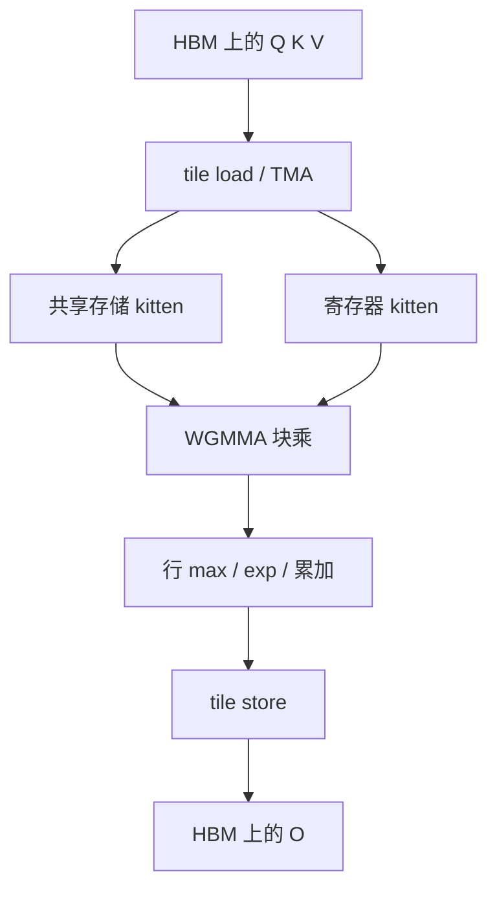

# ThunderKittens

把寄存器与共享存储里的小块当成一等类型，内核就可以写成对这些块的几行线性代数，而不必先成为 warp 指令百科全书。

<footer>—— Spector et al., ThunderKittens, 2024</footer>

Hopper 一代 GPU 把高性能核的写法从「手排 shared memory 与 MMA」推进到 TMA 异步拷贝、WGMMA、warp specialization 叠在一起。能写对的人很少，能写快的人更少。Spector、Arora、Singhal 与 Ré 的 ThunderKittens 给出另一条路：以固定形状的 tile（他们叫 kitten）为原子，在 C++ 模板里提供加载、存储、mma、softmax 一类操作，让注意力和 GEMM 看起来像对块做的 numpy。目标不是新的注意力公式，而是让实验室能在 H100 上把自定义核写到接近 FlashAttention 的速度，而不掉进一千行内联 PTX。

## 问题

现代注意力核的正确性约束已经清楚：分块、在线 softmax、不物化 $n\times n$。真正挡住迭代速度的是实现约束。WGMMA 要求特定的寄存器布局与 warp group 协作；TMA 要描述张量映射而不是朴素的 `cudaMemcpy`；double buffering 要把拷贝与计算重叠成软件流水。CUTLASS 能表达这些，但层次深、编译慢、学习曲线陡。手写 CUDA 则把布局、同步、数值精度缠在同一份文件里，改一个头维度就要重排寄存器。

研究侧经常要试「多一点」：滑动窗口、额外的 logit 偏置、与另一条序列的交叉注意力、非标准的头维。每次都去改 FlashAttention 的生产核，风险高、周期长。需要一种抽象：块的形状与存储层次是显式的，块上的运算是可组合的，生成的指令仍能打到 Tensor Core。ThunderKittens 把这个问题收成——给 SRAM 与寄存器里的小矩阵一个类型系统。

### 为什么是 16×16 这一级

Hopper 的 WGMMA 原子操作的是特定形状的累加器与操作数碎片，16 是反复出现的公约数。把「一只 kitten」定在这一级，加载一条 tile 就对应一次（或少数几次）对齐的拷贝与 MMA，而不是任意 $m\times n$ 再在运行时切。更大的算法块由多只 kitten 拼成。抽象层太厚（整层注意力当一个算子）会藏掉占用率问题；太薄（逐元素）又写不出 MMA。16×16 左右是 Spector 等人选的折中：人能在脑子里模拟，机器能直接映射到指令。

「Adorable」不是玩笑话里的装饰。作者把可读性当成性能工作的一部分：核若无法在一页里讲清数据从 HBM 进寄存器、在哪一级做 softmax，就很难做对在线归一化。Kittens 用类型把这件事按存储层次拆开。

## 方法

编程模型是：声明寄存器 tile 与 shared tile，用库提供的 `load` / `store` 在 HBM、共享存储、寄存器之间搬，用 `mma` 做块乘加，用行级原语做 softmax 的 max、exp、reduce。注意力核于是写成双重循环：外循环扫 query tile，内循环扫 key/value tile，循环体里更新行统计量与输出累加器——与 FlashAttention 伪代码同构，只是循环变量的类型是 tile 而不是原始指针。因果掩码在 tile 级做：整块都在下三角之外就跳过，块内再按坐标填 $-\infty$。

库针对 Hopper 把 TMA 与 WGMMA 藏进这些原语的特化里。写核的人仍要选择 tile 布局、是否 double buffer、warp group 如何分工，但不需要从零描述指令级碎片。Spector 等人展示的案例包括注意力、GEMM、以及若干融合模式；报告的数字是在 H100 上接近当时最优手写核，而源代码短一个数量级。这不是保证「任何 kitten 程序都是最优」，而是保证有一条从算法到指令的短路径，值得先走再 profile。

### 与 CUTLASS、Triton 的位置

[CUTLASS 3 / CuTe](/llm/cutlass3-cute) 提供更完整的布局代数与 collective：生产库、任意 GEMM 形状、与 NVIDIA 工具链的长期兼容。ThunderKittens 更窄：为 AI 核里常见的小块运算提供一套意见强烈的默认。Triton 把并行层次收到 `program_id` 与编译器自动插入的共享存储，写起来更快，但对 warp group MMA、TMA 描述的控制力弱于 C++ 模板。三条路不是替代关系。要交生产 GEMM，CUTLASS；要两天内试一种新注意力变体，Triton 或 Kittens；已经确认变体有用、需要抠 Hopper 指令，Kittens 与 CUTLASS 都能往下沉。

## 机制

性能机制与 FlashAttention 相同的部分：算术强度来自 tile 在寄存器与 SRAM 上的复用，二次张量不落 HBM。Kittens 多出来的机制是布局约束提前到类型检查。错误的 stride、无法喂给 WGMMA 的形状，倾向于在编译期失败，而不是在 NCU 里看到神秘的占用率。软件流水可以表达为两只（或多只）shared tile 轮流当生产者与消费者：TMA 填下一只时，WGMMA 消耗当前只。这与「软件流水与 double buffering」篇是同一件事，只是对象有了名字。

在线 softmax 仍必须手写递推：tile 库不会自动把「分块注意力」变正确。作者能把注意力写短，是因为 max/exp/rescale 可以作用在寄存器 tile 的行上，不必为每次归约手写 warp shuffle 样板。数值精度仍要显式：累加器与 softmax 用较高精度，进出 HBM 用 FP16/BF16，这与 SDPA 的半精度卫生一致。

把 ThunderKittens 当成「Python 级框架」会用错。它是 C++ 模板库，编译时间、错误信息和 CUTLASS 同类。收益是语义更接近线性代数，而不是运行时解释器。部署进服务还要自己处理变长、分页、与 PyTorch 的绑定。

### 服务布局不是库的默认

Kittens 的示例注意力多半假设相对规整的 $Q,K,V$ 张量，这适合训练、基准与算法原型。服务里的页表 gather、ragged batch、级联前缀，要在 tile 循环外再包一层索引，或先把页搬成连续 tile。FlashInfer 把这件事做成产品契约；Kittens 把「如何写一只快的 tile 核」做成产品契约。用 Kittens 重写服务注意力完全可行，但工作量在页表与调度，不在 MMA 本身。

## 边界与工程取舍

抽象有代价。固定 kitten 形状对奇怪的头维（例如 80、96 再加非对齐 RoPE 中间态）需要填充或另写特化。编译期模板爆炸与 CUTLASS 同源：每个头维、每种子块布局一份代码。非 NVIDIA 或非 Hopper 上，TMA/WGMMA 特化不存在，库要么降级要么不能用。可读性也有上限：真正的 warp specialization 仍会把生产者 CTA 与消费者 CTA 写开，kitten 不能消灭并行图，只能让图的节点是线性代数而不是 PTX。

研究代码若以 Kittens 为唯一后端，会把可复现性绑在特定 GPU 世代。论文应同时给算法伪代码（与硬件无关的分块 softmax）和内核实现。Spector 等人把「简单」当作目标，读者应检查：简单的是 tile 运算，不是整个服务栈。

不要用 kernel 基准上的 TFLOPS 直接预测端到端 step time。注意力只是一层里的一块；若 KV 布局、采样或 CPU 提交才是墙，换一套更可爱的 MMA 包装不会改变墙钟。先确认算术强度真的受 MMA 限制，再引入 Kittens。

## 小结

- ThunderKittens 用固定形状的 tile 类型，把 Hopper 上的加载、MMA 与行归约收成可组合的 C++ 原语。
- 它不发明新注意力，而是缩短「分块在线 softmax」到 Tensor Core 指令之间的路径。
- 16×16 一级对齐 WGMMA 的公约数；更大的算法块由多只 kitten 拼成。
- 与 CUTLASS、Triton 分工：生产布局代数、快速原型、意见强烈的 AI 小块核，三者重叠但默认不同。
- 在线 softmax、因果掩码、精度选择仍要算法作者负责；库负责存储层次上的块运算。
- 分页与 ragged 服务布局不是默认对象，需要额外的索引层。
- 出处：Spector, Arora, Singhal, Ré, *ThunderKittens: Simple, Fast, and Adorable AI Kernels*, 2024。
