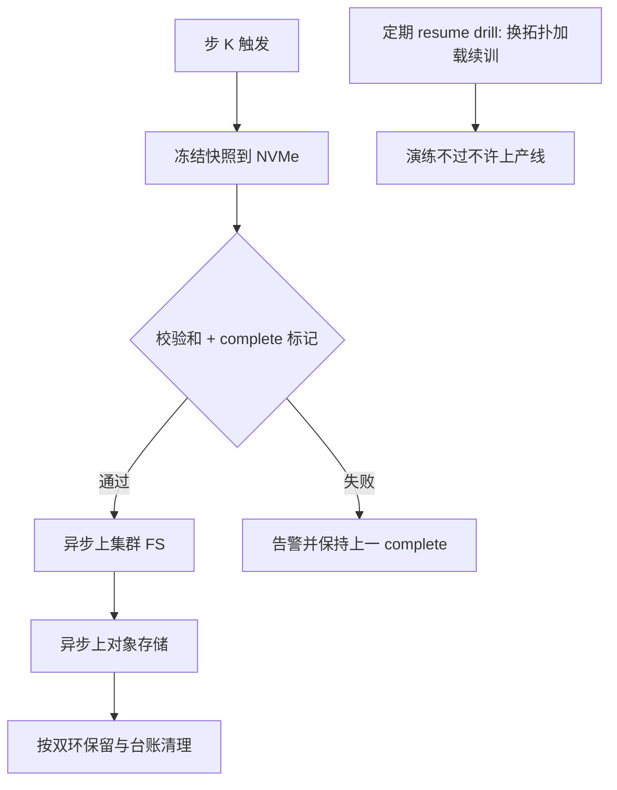
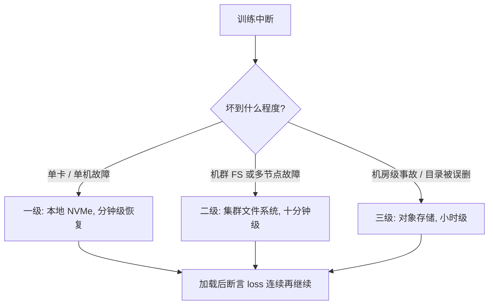

# checkpoint 工程深入

检查点不是「保存」这个动作，而是一套存储系统：有层级、有带宽预算、有保留策略，还要定期演练——没人恢复过的检查点等于不存在。

<footer>—— 据 PyTorch Distributed Checkpoint、Megatron-LM 与大规模训练容错实践整理</footer>

[上一课](/llm/ti-data-pipeline)把数据侧收成三本账，流水线挂在前向之前。step 骨架上还剩一件每 $K$ 步触发、却要为整场训练兜底的东西：检查点。保存清单与原子发布在 [Checkpoint 与 resume](/llm/pretrain-ckpt) 已写全——参数、优化器、日程、缩放器、RNG、数据进度一样不能少。本课不再讲「存什么」，讲「怎么运营」：存到哪、多久存、坏了怎么知道、发布怎么走，以及这堆快照的账。

## 问题

清单正确只是及格线，运营层面有四个更深的坑。**层级错位**：直接写对象存储，HBM 到网络的带宽被序列化挤占，[检查点 I/O 带宽](/llm/checkpoint-io-bandwidth)的账没有先算。**策略错配**：间隔凭感觉定，与[万卡训练的故障率](/llm/large-scale-failure-rate)给出的实际 MTBF 对不上——故障间隔两天的机群，按一周一存的策略，每次事故平均回滚半周。**完整性错觉**：「写入无报错」被当成「可恢复」，坏盘产生的静默损坏、部分 rank 失败产生的拼接残片，都要等到真出事那天才暴露。**发布混线**：对外发布的仅权重转换与研究 resume 争用同一份权威快照，转换任务把训练目录写坏。

### 存储层级与保留策略

生产配置分三级：本地 NVMe 做一级落点（吃掉序列化峰值），集群文件系统做二级（供本机群快速 resume），对象存储做三级（防整机群事故与机房级故障）。异步上传必须先冻结快照再刷盘，撕裂问题在[异步检查点](/llm/async-checkpointing)已写。保留按双环：近环保最近 $N$ 个高频点，远环保里程碑（每 $K$ 步、退火起点、评测峰值点）。删环要有台账——「哪个作业的哪些快照占了多少 TB」若无人能答，存储预算必然失控。

术语翻译：MTBF（Mean Time Between Failures，平均无故障间隔）就是机群「平均多久坏一次」的实测值。存检查点的合理间隔大约是把它再除以一个安全系数——机群两天坏一次，就别一周才存一次，否则每次事故平均白干三天。

量级账：7B 模型混合精度全状态约 16 字节每参数，单点约 112 GB；4M token 批次跑 1T token 共 25 万步，若每 1000 步一存，近环 10 个点就要 1.1 TB，外加里程碑与转换副本——检查点存储超过数据集存储是常态，预算要单列。

## 方法

四件事把坑补上。其一，频率自动化：间隔由观测到的 MTBF 除以安全系数动态给出，写入策略配置而不是写死在代码里。其二，校验与演练：每个快照写校验和并登记 complete 标记；CI 里常驻一条 **resume drill**——训几十步、存、换卡数加载（走[分布式检查点格式](/llm/distributed-ckpt-format)的 reshard）、续训，断言逐步损失连续；演练不过的作业不许上机群。其三，发布分线：仅权重导出与 [EMA 与检查点平均](/llm/ema-checkpoint-averaging)一类的派生加工，从权威快照单向生成、单独存放，派生失败不触碰训练目录。其四，元数据完备：每个快照记录配置哈希、数据指纹、loss 快照，让「从哪一份恢复」成为可查询的决策而不是考古。

## 机制

演练为什么是唯一可信的完整性证明：检查点的价值只有在恢复时兑现，而损坏模式（静默位翻转、部分写入、元数据与张量错版本）没有一种能靠「保存时没报错」排除。演练把「恢复」变成每周执行的代码路径，发现的是真实可恢复性，包括 reshard 正确性与 RNG 接续。三级层级为什么值得：恢复速度决定故障成本——一级本地恢复以分钟计，三级跨区恢复以小时计，层级让常见故障走快路、罕见故障走慢路，用存储钱换停机时间。

发布分线的机制与实验纪律同源：权威快照是「训练发生了什么」的事实，派生物是「我们想让别人拿到什么」的观点；两者混在一个目录，等于允许观点污染事实。

不同故障走不同恢复路径，代价不同：

直觉类比：三级层级像放钱——零钱放钱包（NVMe，随取随用），积蓄放家里保险柜（集群 FS，要回家取），房产证放银行金库（对象存储，最慢但连房子着火都不怕）。日常故障走快路，罕见灾难走慢路，各付各的代价。

## 边界

本课不重复保存清单本身，也不管激活重计算——[激活重计算](/llm/activation-checkpointing)是显存换算力的 autograd 手段，与作业级快照同名不同物，监控与文档里必须分开说。恢复也有极限：换框架大版本、换并行方案之外的结构改动，rescue 不回来，只能当新实验重开。跨机群迁移、与数据游标对接的细节分别归分布式与数据两课的口径。

常见误区：初学者容易把「checkpoint」一个词当成一回事——训练里的激活重计算检查点（为省显存，前向中丢激活、反向时重算）和作业级快照（为容灾，把参数与优化器状态落盘）完全不同，前者不产生任何可恢复的文件，挂了就挂了。排查「为什么没存下东西」之前，先确认说的是哪一个。

## 小结

- 检查点运营四件套：三级存储层级、按 MTBF 定频、双环保留加台账、派生发布分线。
- 完整性靠校验和加定期 resume drill，换拓扑加载是演练的必选项。
- 单点全状态约 16 字节每参数，检查点存储预算单列，常超数据集。
- 权威快照只写不改，派生物单向生成，事实与发布不混目录。
- 出处：PyTorch Distributed Checkpoint 文档；Megatron-LM（Shoeybi et al., 2019）；据大规模训练容错实践整理。
