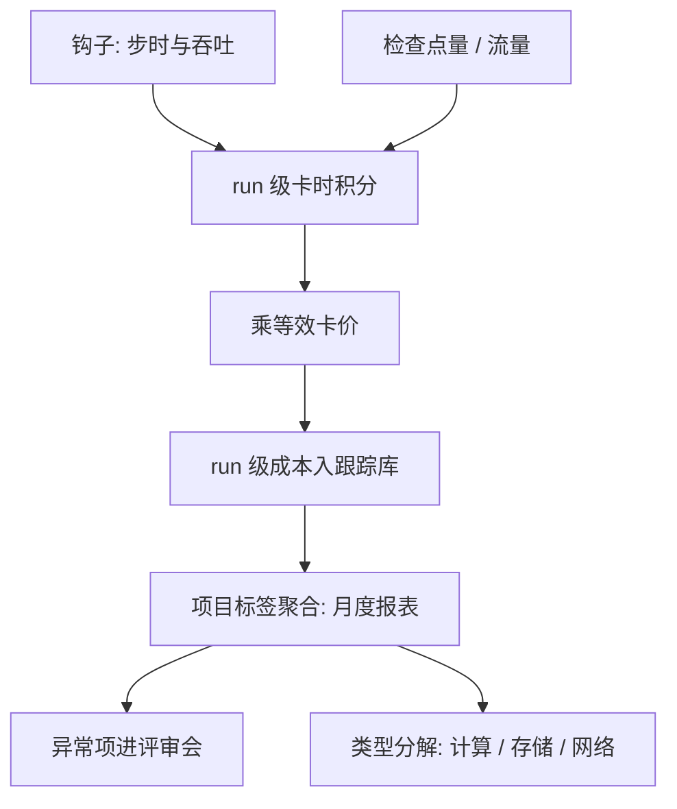

# 成本分析

算力账与物理账同构：成本等于单价乘卡时，卡时等于步时乘步数；第一步解剖里的每一毫秒，最后都要在这条乘法里付钱。

<footer>—— 据 Chinchilla 计算最优口径与大规模训练预算实践整理</footer>

[上一课](/llm/ti-team-review)解决了人与流程，评审会上最硬的一类决定仍悬着：这场实验值多少钱、这个月机群花在哪了。本课写成本分析。第一课立下的乘法——总账等于步时乘步数——在这里兑现成货币：单价乘卡时。规模与数据怎么分预算是 [Chinchilla](/llm/chinchilla) 的口径；本课管的是既定预算之内的记账、归因与省钱。

## 问题

成本失明有三种表现。**无单价**：机群对内没有等效卡价，「跑一场实验」的成本靠猜测，于是消融在目标规模上随手开，一次扫描烧掉一个季度的预算。**无归因**：月底账单只有总数，哪个项目、哪场 run、哪类开销（计算、存储、网络）占多少无人能答；省成本的讨论没有抓手。**无学费概念**：失败的 run 从账面上消失——它的卡时确实沉没了，但[死因档案](/llm/ti-failed-exp-archive)里没有成本字段，同类失败再犯时，没人知道这次学费交了多少遍。

### 记账的三个层次

第一层，**run 级**：每场 run 的卡时按步时积分自动累计，乘等效单价得货币成本，与检查点存储量、网络流量一起写进跟踪库——记账是钩子的产物，不是月底的手工工程。第二层，**项目级**：run 打上项目标签，聚合出各项目的月度消耗与份额执行情况，接调度课的公平份额记账。第三层，**类型级**：把开销拆成计算、存储、网络三类——长跑的账大头在计算，检查点近环与里程碑的存储、数据流水线的跨区流量都单列，否则「省计算」的努力会被存储膨胀吃掉。

量级示例：按等效卡价每小时 2 美元计，256 卡跑一天约 1.2 万美元；一场步时 6 秒、25 万步的训练约 10.7 万卡时、二十余万美元。MFU 从 45% 提到 50%，同样一步的墙钟缩短约一成，整场直接省下两万美元级——利用率就是钱，等数据的空转也是钱。

## 方法

成本工程三个动作。其一，**定价**：与财务定一次等效卡价（自建按折旧加电力摊销，租用按市场价加余量），全组统一口径发布——定价的意义不在准，在唯一。其二，**归因**：run 级与项目级的成本报表月度发布，异常项（某项目环比翻倍、某 run 存储占用异常）进评审会议程；成本数据与判读曲线同地位，都是决策依据。其三，**省钱的优先级**：按杠杆排序——利用率（MFU 与数据等待）、实验设计（代理规模消融、早杀死线，动[搜索工程](/llm/ti-hparam-search-eng)）、架构与精度（动训练方案本身）。反过来的浪费也要点名：无主 run 的空转、被抢占后从未重排的僵尸作业、检查点保留失控的存储，三类在记账上线第一周就会现形。

## 机制

按钩子记账有效的机理是**实时性**：月底手工对账发现超支时，钱已花完；run 级积分让每场实验启动前就能给出预估、结束时给出决算，预算成为实验设计的输入而非事后清单。类型分解有效的机理是成本结构随负载变化：消融池的账可能一半在存储（检查点密度高、run 数量大），只盯 MFU 会完全打偏。学费入账的机理是闭环：死因档案带成本字段，「这个方向已经花了多少」成为可查事实，沉没成本不该左右去留，但同类学费的累计额必须左右。

省钱的杠杆排序也有机理：利用率与实验设计作用于所有卡时（乘法的底数），架构改动只作用于未来的 run；先动底数，再动因子。

## 边界

本课管既定预算内的记账与优化，不管预算怎么定：训练规模与数据量的计算最优分配用 [Chinchilla](/llm/chinchilla) 的口径，立项与采购是组织决策。等效单价是内部尺子，不与外部报价对标——它的用途是比较与归因，不是财务审计。成本优化有边界：压 MFU 压到牺牲数值稳定、砍检查点频率砍到故障回滚半天，是把可见的小钱换成不可见的大钱，成本报表要与分析课的可靠性指标同看。

## 小结

- 成本等于单价乘卡时，卡时等于步时乘步数；第一课的乘法在此兑现为货币。
- 记账三层：run 级自动积分、项目级标签聚合、类型级拆计算存储网络。
- 等效卡价全组唯一；MFU 与数据等待都是钱，利用率优先于花招。
- 死因档案带成本字段，学费累计额可查；僵尸作业与存储失控最先现形。
- 出处：据 Chinchilla（Hoffmann et al., 2022）计算口径与大规模训练预算实践整理。
