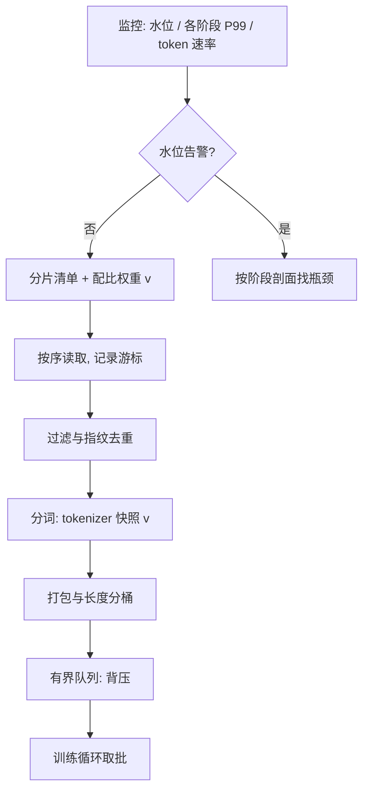

# 数据加载与预处理流水线

数据侧的工程目标只有一句话：让队列在 P99 之下非空，并且任何时刻都能说出「下一批是什么、凭什么」。

<footer>—— 据 WebDataset、Mosaic Streaming 等流式加载实践与 BLOOM 训练纪事整理</footer>

[上一课](/llm/ti-training-loop-anatomy)把步时拆成计算、通信、等数据三桶，钩子与状态都钉在 step 骨架上。「等数据」那桶不会自己消失：取批阶段底下是一条跨磁盘、网络、CPU 与 GPU 的流水线。流水的阶段划分——分片、抽权、过滤、分词、打包、预取——[数据加载流水线](/llm/dataloader-pipeline)已经写过，存储介质的取舍在[数据集存储与流式加载](/llm/dataset-storage-streaming)。本课写的是把它当生产设施来运营：吞吐有账、确定性有契约、故障有隔离、变更有版本。

## 问题

流水线的失败模式很少是「读不到文件」，而是三类更隐蔽的错位。其一，**吞吐错位**：均值够、P99 不够，某个冷分片或慢 worker 让队列周期性见底，GPU 每步插一小段空转，混进「等数据」桶却常被误记成通信。其二，**一致性错位**：预分词正则或特殊 token 用了与训练快照不同的版本，[预分词正则](/llm/pretokenization-regex)一变，fertility 报表与实际 token 流对不上，配比账全错。其三，**可复现错位**：出了坏批想回放，却发现洗牌种子、分片顺序、过滤版本没有一项被钉住，坏批永远无法重现。

### 把流水线当设施运营的三份账

吞吐账：每主机记录队列水位、各阶段耗时的分位数与每秒产出的 token 数，报警条件是「队列低于阈值持续若干步」而不是 CPU 利用率。确定性账：全局游标、shuffle 种子、过滤与打包的版本共同构成**数据指纹**，与上一课的「不改变轨迹」契约对接——resume 与坏批回放都靠它。变更账：tokenizer 快照、正则、过滤规则、配比权重任何一项变更都要升流水线版本号，旧版本必须仍可重建。

回放坏批的最小配置是四元组：流水线版本号、shuffle 种子与 epoch、全局游标位置、worker 数。缺一项，事故复盘就只能靠猜；这四项应当随每个微批的日志一起落盘。

## 方法

运营动作按三账落。吞吐账上，先测单 worker 的阶段耗时剖面，找出瓶颈在解压、正则还是分词；[分词并行](/llm/tokenizer-parallel)决定 CPU 侧怎么扩，预取槽深按 P99 解压延迟而不是均值设定，并以队列水位做背压。确定性账上，洗牌用「种子 + epoch」的确定性算法，游标存「分片 id + 偏移」，坏批回放时固定 worker 数重跑该区间——这也是流水线的 CI 用例：每次改动后，用黄金区间重放，比对 token 序列哈希，不一致即失败。变更账上，配比调整走[数据配比](/llm/data-mixture-laws)的实验口径，但**分发**走版本号：正在跑的作业永远绑定创建时的版本，新版本只对新作业生效。

## 机制

三份账为什么缺一不可：流水线是分布在一批主机上的有状态系统，没有吞吐账，退化是渐进的——每步多等 5 毫秒，在日志里只是吞吐从 42 掉到 40，直到有人对账才发现已损失一成算力。没有确定性账， resume 回到的是「差不多同一处数据」，轨迹契约无声失效，[检查点](/llm/pretrain-ckpt)存的数据进度变成空引用。没有变更账，两周后复现某条曲线时，无人能答「当时喂的是哪个版本的数据」——这不是记忆问题，是设施没有提供查询接口。

版本绑定的机制要特别钉死：作业启动时把流水线版本的哈希写进运行元数据，之后即使有人改了配比文件，在跑作业读到的仍是旧快照。实现上常把「配置读取」收敛为一次启动时的物化，而不是每 epoch 重读。

## 边界

本课管的是把 token 按时、按账、可复现地送到 GPU，不管喂什么：语料怎么选、去重与污染怎么清、配比怎么定，属于数据课程与配比各课的口径；也不管数据并行下的分片到 rank 的拓扑细节。回放能力有边界：涉及随机丢弃（如随机过滤、dropout 式增强）的流水线，确定性要连 RNG 状态一起钉，否则黄金区间比对只能在关掉随机项的配置下做。流式数据源若上游本身变动（对方删了文件），版本号也救不回，只能靠本地缓存层兜底。

## 小结

- 流水线运营三账：吞吐（水位与阶段 P99）、确定性（数据指纹）、变更（版本号绑定）。
- 报警看队列水位持续值，不看 CPU 利用率；预取深度按 P99 设。
- 坏批回放最小四元组：版本、种子与 epoch、游标、worker 数；进 CI 的黄金区间比对。
- 作业启动时物化配置快照，在跑作业不受后续变更影响。
- 出处：据 WebDataset、Mosaic Streaming 文档与 BLOOM 训练纪事（Le Scao et al., 2022）整理；阶段划分见[数据加载流水线](/llm/dataloader-pipeline)。
