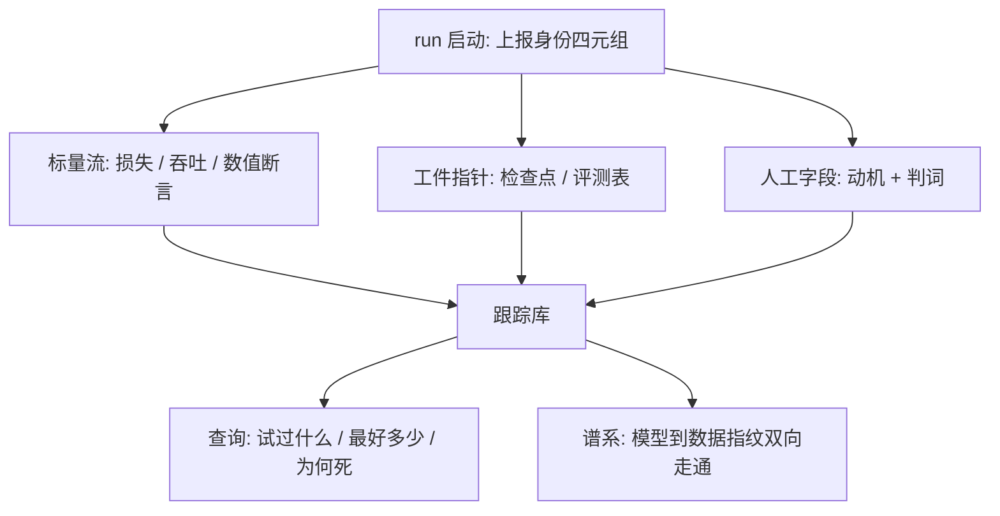
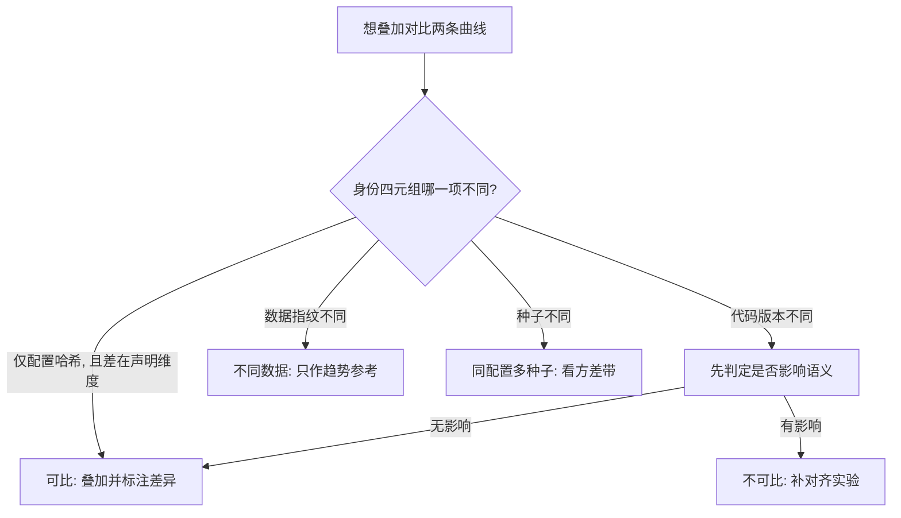

# 实验跟踪

实验跟踪系统是研究组的记忆：没有它，三个月后无人能答「这个模型是哪次 run、用什么数据、改了哪行配置训出来的」。

<footer>—— 据 MLflow、Weights &amp; Biases 等跟踪系统与大规模训练团队实践整理</footer>

[上一课](/llm/ti-hparam-search-eng)把搜索产出收成「响应面入档」，入档默认了一个系统的存在。本课把这个系统补全：实验跟踪。前几课埋的纪律在此汇合——step 钩子产出的标量、[判读设施](/llm/ti-loss-curve-reading)要求的配置哈希、[检查点元数据](/llm/ti-checkpoint-engineering)里的数据指纹，都需要一个统一的家。本课写 run 的身份、要记什么、怎么查，以及为什么自建不如采用现成系统。

## 问题

没有跟踪系统的团队靠三种脆弱载体记实验：目录名（`run_v3_final_real`）、个人笔记、口头记忆。三者共同的失败是**链条断裂**：评测表上有一条好成绩，反向找训练 run 时，目录已被清理或从未关联；正向复现时，配置文件改过三轮，当时那份只在某个人的未提交改动里。链条断裂的代价随团队规模复利：重复已失败的实验、把别人的模型当自己的基线、审计时拿不出「数据从哪来」的证据。

术语翻译：配置哈希就是把整套训练配置（学习率、批大小、层数……）序列化成文本后算出的指纹——内容变一个字符，哈希就变。数据指纹同理，钉住「喂了哪些数据」。四元组合起来相当于 run 的身份证：指纹相同才谈得上复现，不同则能精确指出差在哪一项。

### run 的身份与最低记录

一次 run 的身份由四元组钉死：配置哈希（含配方版本）、代码版本、数据指纹、种子。最低记录三层：**标量**——逐步损失与吞吐，由第一课的钩子自动写入；**工件**——检查点指针、评测表、外部链接，工件只存指针不存副本，权威在检查点课的分线目录里；**人话**——动机一句话、结果判词一句（win/lose/inconclusive）、死因若被杀。判词字段最常被省略也最值钱：查询系统知道所有曲线，只有人知道「这次实验证明了什么」。

验收跟踪系统的硬标准：任取一个模型文件，能否在十分钟内走通「模型 → run → 配置哈希 + 数据指纹 + 检查点指针」的链条，并从链条任一端反向走回？走不通的环节就是要补的记录。

## 方法

落地三条。其一，**采集自动化**：身份四元组与标量由训练作业启动时自动上报，不依赖人工填写；人工只填动机与判词两个自由文本字段——凡是要求人工手抄哈希的系统，最终得到的是空字段。其二，**对比守纪律**：系统支持任意两条曲线叠加，但叠加是否有效由调用方按判读课的口径判断——配置哈希只在声明维度上不同才可比，跟踪系统记录事实，不担保可比性。其三，**查询当接口**：团队的高频问题是「某某方向试过没有、最好成绩多少、死在哪」，这些应当是查询而不是会议；搜索课的响应面、收束课的决策单，都以它为存储层。

## 机制

跟踪有效的机理是**把记忆外置成数据库**：个人记忆的检索靠资历，数据库的检索靠字段；判词字段把「人才知道的部分」结构化，其余全部自动化。工件存指针不存副本的机理与发布分线一致：检查点目录是权威事实，跟踪库是索引，两处都存全量必然漂移。对比的机理照搬判读课：系统降低画错图的成本，不消除画错图的可能——所以口径检查留在人这边。

常见误区：初学者容易以为把检查点、评测表也复制一份进跟踪库「更保险」，实际上两处存全量必然漂移——哪天原件被清理，副本和权威谁对谁错就说不清了。存指针、留权威，让事实只有一处说了算，索引跟着走。

自建不如采用的机理更直接：跟踪系统的难点不在写入，在查询界面、多项目组织、长期迁移这些无聊工程；开源系统已把无聊部分做平，自建团队的收益只剩字段定制，而字段定制恰是配置化就能解决的。

为什么重要：「查询当接口」意味着「这个方向试过没有」从一次会议变成一条查询。按一场消融两万美元计，跟踪系统每月拦住一次重复失败实验，就够付它全部的部署与维护成本——这是少数投入产出比可以直接算出来的基础设施。

## 边界

跟踪系统不生产可比性：垃圾进垃圾出，配置哈希覆盖不到的改动（手改的脚本、未版本化的数据清洗）依然留下不可比曲线。它也不替代归档：判定死亡并写成死因归档是后一课的流程，跟踪库只保证「查得到」，不保证「读得懂」。指标口径本身（每 token CE 还是 PPL）由判读课统一，跟踪库照单全收，改口径等于换轴，旧曲线作废要标注。

## 小结

- run 身份四元组：配置哈希、代码版本、数据指纹、种子；采集自动化，人工只填动机与判词。
- 工件存指针不存副本，权威在检查点分线目录。
- 跟踪库是团队记忆：试过什么、最好多少、为何死，应当查询可得而非开会口传。
- 验收标准是模型与配置之间的双向谱系十分钟走通。
- 出处：据 MLflow、Weights &amp; Biases 文档与大规模训练团队实践整理；对比纪律见[loss 曲线的解读](/llm/ti-loss-curve-reading)。
