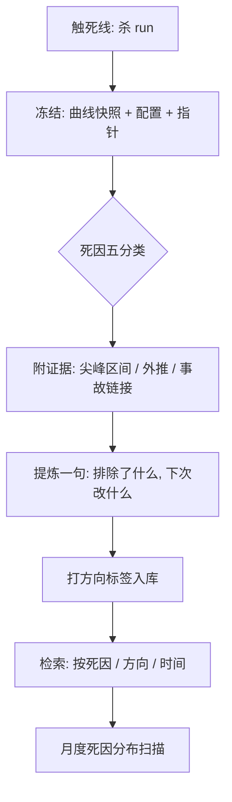

# 失败实验的归档

被归档的失败是资产，被遗忘的失败是按时复利的负债：没有死亡档案的团队，会反复为同一个死法付学费。

<footer>—— 据 OPT 训练日志与大规模预训练团队复盘实践整理</footer>

[上一课](/llm/ti-multiexp-scheduling)把卡分给各个实验，而实验的一部分注定失败：发散、平台、被更好的想法取代。失败的去向是本课的主题。跟踪系统保证查得到每次 run 的曲线与判词，但「查得到」不等于「读得懂」：死因散落在聊天记录里，曲线快照随目录清理消失。本课写失败实验的归档制度。量化栏的[复盘与案例写作](/quant/research-postmortem)为策略失败定了同构的规矩，本课把它落到训练场景。

## 问题

不归档的失败以三种方式反弹。**重跑**：半年后有人提出「试试更大的 dropout」，没人记得这方向试过三次、死在哪一步——当时的结论从未写成可检索的字段。**误归因**：死掉的 run 只留下「效果不好」一句评价，而这不是死因；下次遇到相似症状，团队在错误的假说上再烧一轮卡。**幸存者偏差**：只复盘成功，方法论从成功案例里归纳，而成功常含运气；失败才暴露机制的边界。归档的对象因此不只是「死掉的 run」，还有每一次「为什么停」的判断本身。

### 死因分类学

死因必须落在**判据**上，判据就是判读课启动时写下的死线。最小分类五类：发散（触发散线，附尖峰区间与分因结论）、平台（触平台线，附外推证据）、资源（预算耗尽或被抢占，附进度）、被取代（同方向的更优 run 存在，附指针）、事故（基础设施故障不可恢复，附事故链接）。每条死因必须带**证据指针**：曲线冻结快照、评测表、当时的绊网日志。「感觉不好」不允许作为死因入库。

曲线快照在杀 run 当刻冻结：原始序列、双档 EMA、分期与尖峰标注一并定稿。事后补画的曲线会被后续知识污染——归档的是「当时知道什么」，不是「现在怎么看当时」。

## 方法

归档流程三个动作，在杀 run 的当下完成，不做「以后补」。**冻结**：曲线快照、配置哈希、数据指纹、检查点指针锁定成不可变记录，挂进跟踪库该 run 的条目。**判死**：按五分类填死因与证据指针，判据引用启动时的死线原文——触线就是触线，不因投入了多少卡而改判。**提炼**：一句话写「这次失败排除了什么、下次该改什么」，并打上方向标签（配比、稳定、容量、流程）。提炼是唯一需要判断力的步骤，也最常被跳过：没有提炼的档案是坟场，有提炼的档案是地图。

组织动作两条：新人入职先读十份历史死因档案；月度扫一次死因分布，占比上升说明某层防线在漏水——「事故」类上升指向基础设施，「发散」类上升指向数值或数据。

## 机制

归档有效的机理是**把负结果变成可检索状态**：试过什么方向的查询成本降到一次检索，重复学费才真正停付；五分类让死因可统计，统计才暴露系统性弱点。冻结快照的机理与证据保全相同：归档的价值在「当时的完整上下文」，任何事后可变的字段都会让档案失去作证资格。提炼的机理是压缩：档案读的是结论与指针，不是全量曲线；一句话排除法把整场 run 的信息压进可传递的尺寸。

免责文化是制度的隐形前提：归档若被用作追责证据，下次的死因栏会集体写成「资源不足」。复盘免责、案例同权，与死因落在判据上是同一套纪律的两面。

## 边界

归档管失败的**记录与复用**，不管失败的技术成因：发散为什么发生、平台意味着什么，归判读与数值各课；也不管被杀 run 的资源回收——那在调度课的退出流程里。五分类之外的长尾（例如「保密原因停跑」）允许自由文本，但要单独标注而不混入统计。档案也有寿命：基础设施换代后，「事故」类死因的细节不再可迁移，按方向标签保留结论、按时间归档细节即可。

## 小结

- 不归档的失败按时复利：重跑、误归因、幸存者偏差三种反弹。
- 死因五分类：发散、平台、资源、被取代、事故；必须落在判据上并附证据指针。
- 杀 run 当刻完成冻结、判死、提炼，提炼一句写明排除了什么。
- 曲线快照定稿不可变，归档的是「当时知道什么」。
- 出处：据 OPT 训练日志（Zhang et al., 2022）与大规模训练复盘实践整理；同构纪律见量化栏[复盘与案例写作](/quant/research-postmortem)。
