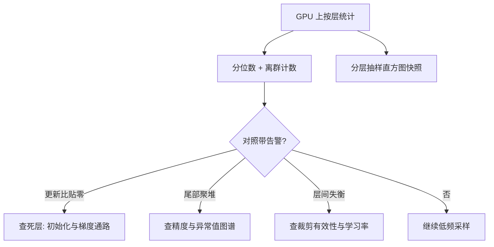
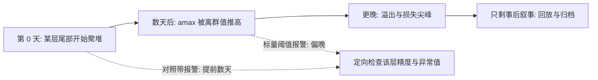

# 梯度与权重直方图

标量聚合报告平均值，直方图报告形状；病常长在形状里——范数一切正常，某一层早已停止学习。

<footer>—— 据梯度监控与大规模训练健康检查实践整理</footer>

[上一课](/llm/ti-loss-curve-reading)把标量层面的判读设施搭好，但损失与全局梯度范数都是聚合数，聚合会掩盖分布的病：某层梯度常年为零、某层权重正在向少数异常值集中、更新相对权重小于一个 ULP 而纹丝不动。全局范数对这一切无感。本课写分布层面的观测：直方图记什么、多贵、形状怎么判。逐层范数的基线在[梯度范数监控](/llm/grad-norm-monitoring)，消失与爆炸的机理在[梯度消失与爆炸](/llm/vanish-explode-grad)，本课只补分布侧。

## 问题

分布观测要回答三个标量答不出的问题。**谁没在学**：更新与权重之比长期低于权重精度的相对 ULP（bf16 约 $2^{-8}$，fp32 约 $2^{-24}$）的层，等价于没训——[长期训练的健康监控](/llm/num-longrun-health)称之为零更新层，它在损失平台出现之前只存在于直方图里。**谁在聚堆**：权重或梯度的质量向少数 bin 迁移、尾部长出孤立离群柱，是[异常值图谱](/llm/num-outlier-atlas)的早期形态，等它推高 amax 触发溢出已晚数天。**谁在失衡**：层间范数相差几个数量级，裁剪全局范数时实际只裁了最大那几层，其余层的学习率名义共享、实际失真。

数字实例：bf16 的相对精度约 $2^{-8}$，即约 0.4%。若某层某权重为 0.05，一次更新量小于 $0.05 \times 2^{-8} \approx 2 \times 10^{-4}$ 时就会被舍入吃掉、权重纹丝不动——这个层「在训练」只是名义上的，只有逐层更新比能把它揪出来。

### 采集的成本纪律

直方图是钩子里最贵的一类：全参数统计要求在 GPU 上归约再拷到主机，序列化与落盘都按层数乘频率增长。纪律有三条：低频采样（每 100 步量级，尖峰期临时加密）；分层抽样（固定关注层加轮换层）；存形状摘要（分位数与离群计数）而不是原始数组。采集预算仍按第一课的「全程折算」口径审，直方图不许把步时推过预算线。

最有性价比的单指标是逐层「更新与权重之比」：Adam 的 $\Delta\theta$ 除以 $|\theta|$ 的分位数。它把学习率、精度、初始化三类问题的症状压进一个数——持续贴零是死层，持续爆表是学习率或异常值，层间差异数量级是失衡。

## 方法

观测配置按三层展开。**每层标量**（高频）：梯度范数、更新比、零更新计数，与损失同节奏落盘。**分布摘要**（低频）：权重、梯度、Adam 二阶矩各取 P50/P99/P999 与离群比例，加上分层抽样的直方图快照。**形状告警**：不设绝对阈值，设与自身基线的偏离——同层同分布的对照带，越带即查，机制与 amax 水位一致。

判读对应关系钉成表：死层查初始化与梯度通路的层间衰减诊断；聚堆查精度方案与异常值（对照[异常值图谱](/llm/num-outlier-atlas)）；二阶矩与实际梯度长期背离查 [AdamW](/llm/adamw) 的 $\beta_2$ 与 $\epsilon$ 配置。每条判读都要能落到「改哪个配置再验」，读不出动作的直方图只是装饰。

## 机制

分布观测有效的机理在于它看的是**过程量**而非结果量：损失是积分效应，等它异常，病因已存在数天；逐层更新比与形状漂移是每步都在发生的局部事件，能在后果到达损失之前报警。对照带而非绝对阈值的机理是张量尺度天然异质：嵌入与注意力输出的范数相差量级，全局阈值要么只报嵌入、要么永不触发；与自身基线比，才把「变化」从「大小」里分离。

术语翻译：对照带就是「和自己的历史比」——为每层记录同分布时期的正常波动区间，新样本越出区间才告警。相当于给每层配一条个人体温基线：有人常年 36 度、有人 37 度，若用同一条全国红线，必然有人误报、有人漏报。

低频采样的机理与检查点频率同构：统计是旁路，主路是训练，把旁路做重会付出整程复利。这也是为什么判读表强调「可落到动作」——低频数据天然滞后，若读它不能换来一次定向的配置变更，它就只剩事后叙事价值。

直觉类比：低频采样像体检而不是心电监护——定期抽血能追踪趋势，但若每分钟抽一次血，人就活在被抽血里了。直方图是训练的旁路体检：采样太密，主路（训练本身）被拖慢，观测就喧宾夺主了。

## 边界

直方图是诊断面不是训练面：异常后怎么改（重初始化、调精度、隔离层）归数值与调试各课，本课只负责把病指出来。抽样必然有盲区——轮换层之间的病变可能漏采，关键层名单要靠历史事故反推维护。小模型上直方图的边际价值低，标量与少数层快照够用；观测设施随模型规模分档，不是越全越好。

## 小结

- 标量看聚合，直方图看形状；零更新层、尾部聚堆、层间失衡都先在分布里显形。
- 逐层更新与权重之比是性价比最高的单指标，贴零是死层、爆表是学习率或异常值。
- 采集低频、抽样、存分位数摘要，成本按全程折算，不占训练预算。
- 告警用自身基线对照带，不用全局绝对阈值；每条判读必须落到配置动作。
- 出处：据梯度监控与长期训练健康检查实践整理；机理背景见梯度消失爆炸与异常值图谱各课。
