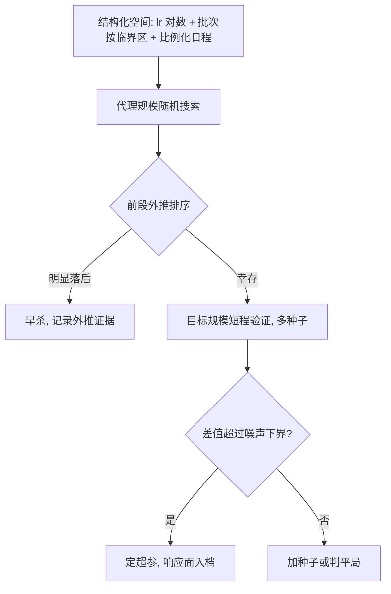

# 超参搜索工程

超参搜索的产出不是一组「最优值」，而是一张可迁移的响应面；搜索工程的任务是用最小预算把这张面画对。

<footer>—— 据 Kaplan 扩展律、Chinchilla 与小规模代理实验的迁移实践整理</footer>

[上一课](/llm/ti-numerical-health)把数值异常交给绊网，训练敢无人值守地跑。敢跑之后的问题是跑什么：学习率、批次、正则从哪来。机理各课已有：学习率与批次的耦合在[学习率与批次缩放律](/llm/lr-batch-scaling-law)，临界批次的判定在[梯度噪声尺度](/llm/gradient-noise-scale)，小模型外推的可行性在[小模型代理实验](/llm/proxy-model-experiments)，计算预算怎么分给规模与数据在 [Chinchilla](/llm/chinchilla)。本课把这些机理装成一条**搜索流水线**：空间怎么设计、预算怎么分、坏点怎么早杀、结果怎么归档。

## 问题

搜索失败的形态不是「没找到好点」，而是三种浪费。**空间浪费**：把耦合维度当独立维度——学习率与批次被缩放律绑成一个自由度，分开扫等于把一维问题烧成二维预算。**规模浪费**：在目标规模上直接扫，一组学习率点要烧数天机群时间；小规模扫、大规模验证的迁移路径没有制度，全凭个人勇气。**方差浪费**：两个配置差 0.002 的验证损失就被判胜负，而种子间方差本身就有 0.005——没有噪声下界的比较是在比随机数。

### 空间与预算的结构

空间设计的第一原则是**按量纲结构化**：学习率对数均匀取点（每数量级 3 到 5 个），批次由[梯度噪声尺度](/llm/gradient-noise-scale)定临界区后只在区内取值，warmup 与衰减写成峰值学习率的比例而不是绝对值——比例化的参数随规模更稳，µP 一类参数化正是这个思路的系统化。预算设计给两条硬约束：搜索总预算不超过项目预算的一成；每个点的种子数由[评测方差与种子](/llm/eval-variance-seed)的口径反推，先测方差再定重复数。

早期淘汰的依据是排序稳定性：学习率等强效应超参在训练前 5% 到 10% 的相对排序，通常已与终值一致；但弱效应超参（正则、dropout）的早期排序不可信——早杀只对强效应维度执行，且淘汰线要按外推斜率定，不按绝对值定。

## 方法

流水线按四步走。**扫**：代理规模上随机搜索强效应维度，弱效应维度沿用上一张响应面的值——搜索是增量更新认知，不是每项目从零重扫。**筛**：用前段损失斜率外推终值排序，淘汰明确落后的点；外推前按[损失曲线的阶段](/llm/loss-curve-phases)剔掉 warmup 与尖峰段——该课说过，阶段边界是拟合之前的标注工作。**验**：幸存的前几个点在目标规模各验一个短程，配 2 到 3 个种子，差异超过噪声下界才下结论。**存**：响应面（配置到指标的完整映射，含失败点）落进实验跟踪系统，成为下一项目的先验。

## 机制

结构化空间有效的机理是**自由度压缩**：真正的搜索维数远小于表面超参个数，耦合维度绑成一个、绝对值换成比例，预算从网格爆炸里解放出来。早杀有效的机理是强效应超参影响的是损失曲线的**斜率**而非终点装饰，斜率在前期已可分辨；反过来，弱效应超参影响终点的方式常被前期噪声淹没，所以只对强效应维度早杀。响应面入档的机理是复利：本次搜索回答「这批配置怎么样」，下次回答「往哪个方向更优」；没有历史响应面，每个项目都重付第一次的学费。

搜索与代理实验的衔接有一条机制约束：迁移假设「最优区随规模平滑移动」，数据规模或配比剧变时失效，验证一步不可省——[小模型代理实验](/llm/proxy-model-experiments)给的是效率，不是免检。

## 边界

本课管搜索的工程，不管超参的语义：耦合为何成立，机理课已写；搜索也不替代缩放律拟合——规模与数据的预算分配用 [Chinchilla](/llm/chinchilla) 的口径，搜索只在给定预算内调动态。贝叶斯优化适合高维离散空间；语言模型常用空间低维且连续，随机搜索加早杀通常够用，引入复杂搜索器前先确认瓶颈不是预算结构。

## 小结

- 空间按量纲结构化：学习率对数取点，耦合维度绑成一个自由度。
- 搜索预算封顶约一成，种子数由实测方差反推，先有噪声下界再比胜负。
- 早杀只对强效应维度执行，依据前段外推的排序稳定性。
- 产出归档为响应面（含失败点），成为下次搜索的先验。
- 出处：Kaplan et al., 2020 与 Hoffmann et al., 2022 的缩放口径；据小规模代理实验迁移实践整理。
