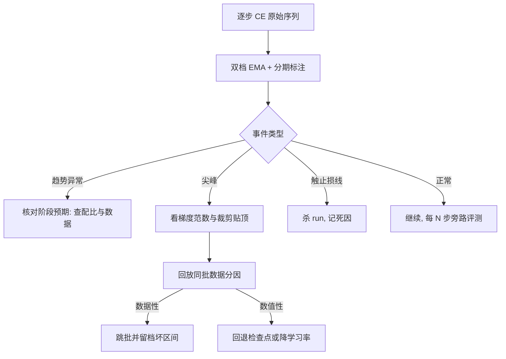
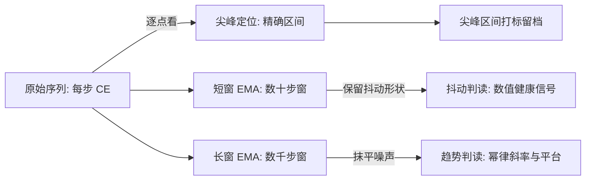

# loss 曲线的解读

曲线不会说话，说清「这条曲线意味着什么」的是坐标口径、分期标注与止损判据——三者缺一，看曲线就退化为看运气。

<footer>—— 据 OPT 训练日志与 PaLM 训练报告的尖峰记录整理</footer>

[上一课](/llm/ti-checkpoint-engineering)把兜底收进演练，从此训练敢长跑。长跑产出的第一类数据，是每步落盘的损失标量。曲线的**形状学**——压熵段、幂律段、尖峰、双下降——在[损失曲线的阶段](/llm/loss-curve-phases)已经分期；纵轴单位在 [perplexity 与 BPB](/llm/perplexity-bpb) 钉成每 token 交叉熵。本课写观测侧的工程：把「看曲线」变成一套可执行的判读设施，谁在看、看哪条、怎么比对、何时止损。

## 问题

判读失败有四种典型。**口径漂移**：横轴混用步数与墙钟、纵轴混用 CE 与 PPL，两条曲线画在同一张图上，斜率不可比。**平滑说谎**：EMA 窗口开太大，尖峰被抹成平缓回升，异常发现晚数天；开太小，噪声淹没趋势，人人都在追抖动。**对比失配**：把不同 tokenizer、不同序列长度、不同配比的 run 画进一张图比高低，差异被归因给「方法」，实际是口径。**没有止损判据**：run 已发散或平台期已超出预算允许的步数，却因沉没成本继续烧卡。

### 判读设施的最小配置

口径层：横轴统一 token 数，纵轴统一每 token CE，图题强制携带配置哈希与 tokenizer 版本——上一课的元数据纪律在这里兑现。平滑层：原始序列与两档 EMA（短窗看抖动、长窗看趋势）并存展示，分期标注（warmup 结束点、尖峰区间）由训练作业写进日志而非手绘。对比层：两条曲线可比的前提是配置哈希只在**声明过的维度**上不同；随机噪声下界用种子重复实验给出，[评测方差与种子](/llm/eval-variance-seed)的口径同样适用于验证损失。

术语翻译：EMA（指数滑动平均）就是给曲线装减震器——新值按权重混进历史平均，窗口越大曲线越平滑但越迟钝。短窗 EMA 保留抖动形状、用于定位异常，长窗 EMA 抹平噪声、用于看趋势；两者必须与原始序列并存，谁也不能互相替代。

PaLM 与 OPT 的训练报告都记录了训练中多次损失尖峰，处理手段是跳过可疑批次或从检查点回退，而不是重启训练。把尖峰当噪声不归档，同类尖峰必然回来——尖峰区间要打标并留档成因，这也是幂律拟合前必须剔除的数据。

## 方法

判读流程按事件分三条。**趋势判读**：对长窗曲线核对阶段预期——warmup 内不降是初始化或学习率问题，幂律段斜率显著变缓要查配比与数据质量，而不是先调参。**尖峰 triage**：尖峰发生时先看[梯度范数监控](/llm/grad-norm-monitoring)是否同步竖起、裁剪是否长时间贴顶（机制见[梯度裁剪与损失尖峰](/llm/grad-clip-loss-spike)），再按「回放同批数据」分数据性与数值性，处置在跳批、回退与降学习率之间按预案选择，不许现场发明。**止损判读**：run 启动时写明死线——发散（CE 超过初值）、平台（长窗斜率低于阈值持续 $M$ 步）、吞吐塌方（MFU 持续低于七成）；触线即杀，判据先于情绪存在。

## 机制

这套设施有效的原因是它把判读从「有经验的人盯着」变成「契约约束所有人」。口径层消灭了最便宜的错误——画错图；平滑层保留了异常的可见性，因为分期与尖峰标注是训练作业的义务，人只负责读；对比层把归因收敛到声明变量，防止「顺手改了三个配置，赢了却不知道为什么」。止损判据的机制价值在于对称性：启动前写下死线，杀 run 是执行合同；没有死线，杀 run 是否定某个人的判断，组织上永远执行不动。

旁路评测与曲线的关系也要钉住：验证损失每 $N$ 步在固定子集上计算，与训练 CE 分开两条轴，[训练中评测与早期信号](/llm/in-training-eval)的纪律不变——评测永不接入训练的数据预取队列。

数字实例：一百万步的 run，平台死线若定为「长窗斜率低于阈值持续 5000 步」，只占全程 0.5%——发现平台即止损，最多浪费约半天的卡时；没有死线，同样的平台常被「再观察观察」拖掉数周。持续步数 $M$ 要对照实测的尖峰恢复时间来定，不能拍脑袋。

常见误区：初学者容易把不同 tokenizer、不同序列长度的两条 CE 曲线画进一张图直接比高低，实际上口径不同时纵轴根本不是同一个量——每 token CE 与 PPL 还是指数关系。先统一口径，再谈输赢；否则差异会被错记到「方法」头上。

## 边界

曲线判读只回答「训练是否健康」，不回答「模型是否变强」：下游能力的出现、评测集上的名次，属于评测各课，验证损失与基准分数会背离。分期边界本身是判断，自动标注只能给出候选断点；尖峰分因的「回放」依赖上一课的坏批回放四元组，回放不可用时只能按相关性猜。多 run 对比在配置差异超过两个维度时基本失效，此时该做的是消融，不是画图。

## 小结

- 口径先行：横轴 token 数、纵轴每 token CE、图题带配置哈希与 tokenizer 版本。
- 原始与双档 EMA 并存，分期与尖峰标注由训练作业写入日志。
- 尖峰按预案 triage：梯度范数定位、回放分因、跳批或回退，处置后留档。
- 死线在启动时写明：发散、平台、吞吐塌方，触线即杀。
- 出处：据 OPT 训练日志（Zhang et al., 2022）与 PaLM 训练报告（Chowdhery et al., 2023）的尖峰处置整理；分期口径见[损失曲线的阶段](/llm/loss-curve-phases)。
