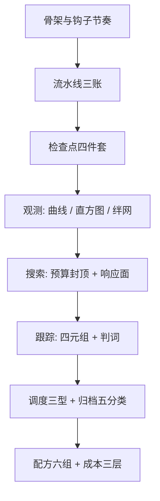

# 训练基础设施收束

基础设施的知识点会过时，账不会：骨架、契约与记账口径是这套课程的剩余物，其余皆可换代。

<footer>—— 据本课程十四课整理</footer>

[上一课](/llm/ti-cost-analysis)把账算到货币，十三课从 step 骨架走到数据、快照、观测、实验，再走到人、流程与钱。本课不添新内容，把决策收成三张单：新项目按单走一遍，老项目拿单来对账。本课程到此收束。

## 问题

为什么要收束：十四课的细节——预取槽深、双环保留、绊网分级——都会随工具换代失效，但事故的类型不会。收束课的任务与端侧收束同构：把每类事故倒推回它该被拦住的那一课，让细节退场后，防线仍在。训练基础设施的失败很少是「算法不行」，多数是账没建：数据指纹缺失导致续训换了轨迹、配置哈希分叉导致对比作废、死因没写导致学费重交。三类病根相同：某张单没有真的在跑。

### 三张单

**决策单**九步按依赖排：一，解剖 step 骨架，定钩子节奏（[训练循环的解剖](/llm/ti-training-loop-anatomy)）；二，数据流水线三账——吞吐、确定性、变更（[数据加载与预处理流水线](/llm/ti-data-pipeline)）；三，检查点四件套——层级、定频、保留、分线（[checkpoint 工程深入](/llm/ti-checkpoint-engineering)）；四，观测三层——曲线口径、直方图形状、数值绊网（[loss 曲线的解读](/llm/ti-loss-curve-reading)至[数值健康检查](/llm/ti-numerical-health)）；五，搜索预算封顶一成、产出响应面（[超参搜索工程](/llm/ti-hparam-search-eng)）；六，跟踪库记身份四元组与判词；七，调度分三型、抢占挂检查点；八，归档五分类、死因落判据；九，配方六组字段走版本评审，成本三层记账（[成本分析](/llm/ti-cost-analysis)）。

## 方法

三条不变量横贯九步。其一，**轨迹契约**：任何旁路设施——评测、存盘、监控——开与关的逐步损失逐点重合；答不出「它为什么不改变轨迹」的旁路是隐患。其二，**指纹唯一**：配置哈希、数据指纹、检查点指针在全链路同源同值，三处分叉则一切对比作废。其三，**账随时可查**：数据从哪来、配置是哪版、钱花在哪、死因为什么，四问在十分钟内可答；答不出的环节就是欠账。高频拦错事六件：只存权重当检查点；混画口径不一的损失曲线；配置哈希三处不一；顺手改配置不入档；尖峰当噪声不归档；死因栏写「效果不好」。六件在十三课里各占一课的份量，收束时并成一排。

## 机制

为什么按「决策单、不变量、拦错事」收而不是按章节复述：九步的依赖顺序就是故障的传播路径——骨架上没定钩子节奏，第四步的观测永远缺数据；指纹不唯一，后面一切对比与归档都在流沙上。对账因此从后往前问：成本报表为什么有僵尸作业、死因档案为什么找不到判据、跟踪库为什么对不上检查点——每一步都能指回前一步，这套设施才算真的在跑。

对账的硬指标：拿最近一次事故或废掉的 run 回放，能否在十分钟内指出它违反哪条不变量、该在九步的哪一步被拦住——指不出来，说明三张单没有真的在跑。

## 边界

本课程管训练基础设施的骨架、契约与账，不管并行怎么摊卡、通信怎么重叠——那是「分布式训练深入」的起点，与本课的骨架直接相接；RL 那种训练与采样交替的双引擎循环另起系统；数值方案的机理归低精度各课，本课只负责盯着它们别漏水。工具与数字会过时：检查点 API、调度器、跟踪系统都会换代，课程钉住的是 step 作为记账单位、指纹作为可比性地基、判据作为止损起点这三层不变量。云端预算与调度的对应内容在服务各课程，与端侧、训练三条线在各自的收束课各自归账。

## 小结

- 决策单九步按依赖排：骨架、流水线、检查点、观测、搜索、跟踪、调度与归档、配方与成本。
- 三条不变量：轨迹契约、指纹唯一、账随时可查。
- 六件高频拦错事：权重当快照、混画曲线、哈希分叉、改配置不入档、尖峰不归档、死因不落判据。
- 对账从后往前指：每一步的异常都能指回前一步的欠账。
- 出处：按本课程十四课整理；数量级与口径见各课出处行。
