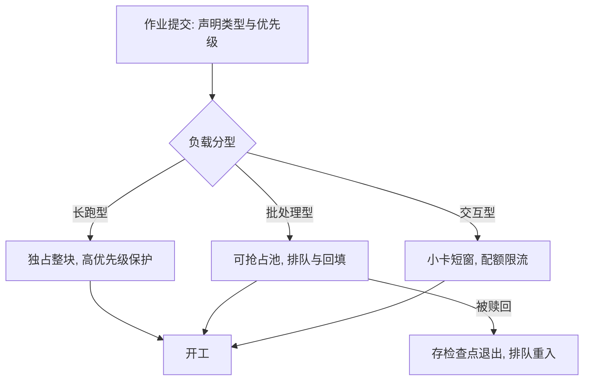

# 多实验的资源调度

机群调度的两难是：长跑要稳定，短测要即时；把两类负载放进同一条先来先服务的队列，两类都得不到满足。

<footer>—— 据 Slurm/Kubernetes 调度实践与机群公平调度经验整理</footer>

[上一课](/llm/ti-experiment-tracking)把团队记忆外置成数据库；团队共享的不止记忆，还有**机群**。同一时刻，预训练长跑、消融短测、调试作业挤在同一批卡上，先到先得很快退化成嗓门大者得。单作业视角到此为止，本课进入管理单元：多实验的资源调度。机群公平性的机制在[机群公平调度](/llm/cluster-fair-scheduling)已写，异构卡型的搭配在[异构集群调度](/llm/hetero-cluster)；本课写**实验负载**特有的一面：负载分型、gang 分配、抢占与回填。

## 问题

实验负载与稳定服务负载的差别在**弹性与原子性**。原子性：一个 32 卡的分布式作业分到 30 卡也开不了工——所有 rank 要同时到位、同时起步；没有整块分配的保证，碎片卡位只能空转等凑齐，机群利用率远低于单卡利用率之和。弹性不均：消融短测只跑几十分钟、要的是**现在**，长跑以周计、要的是**不被打断**；排队半小时对长跑无所谓，对想看结论的研究者意味着这一天白过。抢占的风险不对称：杀刚起步的调试作业无所谓，杀跑了六天的长跑是事故，除非它的检查点真能无缝续训。

### 负载分型与池化

第一刀是按 SLA 分三型：**长跑型**（预训练主力的独占整块、最高优先级保护）、**批处理型**（消融与超参扫描的批量吞吐、可排队可抢占）、**交互型**（调试与 notebook 的小卡短窗、配额限流保即时）。分型之后池化：批处理型共享可抢占池，交互型限定小卡与时长上限。池子之间留溢流——交互池空闲时批处理可借用，被高优先级作业赎回时靠检查点退出。

回填（backfill）保住的是短作业的产能：长跑排队等整块资源时，允许预估不会推迟队头长跑的小作业插空进卡。没有回填的机群常见奇景是「利用率八成，谁都在等」——碎片被短作业填上，队头的整块需求不被推迟。

## 方法

调度策略按四条落地。其一，**gang 调度**是分布式作业的硬要求：全有或全无分配，凑不齐就排队，不用部分资源开工。其二，**优先级与抢占**：抢占只对开了[高频检查点](/llm/ti-checkpoint-engineering)的作业放行，被抢时存盘退出、资源释放，恢复时排队重入——检查点频率从此有了第二个决定因素（第一个是故障率）。其三，**公平份额**：跨团队按份额分池，空转份额可借出、可赎回，记账进[成本分析](/llm/ti-cost-analysis)的口径；份额争论以跟踪库的用量记录为唯一依据。其四，**配额护栏**：交互型限单作业时长与卡数，批处理型限并发数，防止单一实验吞掉整池。

## 机制

分型有效的机理是**把矛盾拆开**：长跑与短测的冲突本质是 SLA 不同，一条队列一个策略无法同时满足两类延迟目标；分池后每类负载有匹配自己的排队论参数。抢占与检查点挂钩的机理是安全性：抢占把「资源被夺」从致命错误降级为例行事件的前提，是状态可以在任意时刻落盘——基础设施各课在这里咬合成环。回填的机理是保守调度：以「不推迟队头」为约束放行插空，牺牲一点等待顺序的公平，换整块碎片时间的产出。

公平份额要防的病是**囤积**：团队为旺季预留却平时空转，借出与赎回机制让空转份额流动起来；机制只在记账可信时工作，这正是上一课与下一课的存在理由。

## 边界

本课管机群内的实验编排，不管单卡内的多任务共享（MPS、时间片属系统层），也不管跨机群与跨云的调度——那是异构集群课的口径。抢占上限要设：被抢三次还没跑完的批处理作业应升优先级或降级为长跑型重排，无限抢占会让某些作业永远跑不完。调度器不知道实验的**价值**，它只执行声明的优先级；声明错了，机群在高效地跑错的事。

## 小结

- 负载分三型：长跑独占、批处理可抢占、交互限流，各配各的队列参数。
- 分布式作业 gang 分配全有或全无；碎片靠回填，约束是不推迟队头。
- 抢占只放行高频检查点的作业，恢复走排队重入。
- 公平份额可借可赎，记账进成本口径；调度器执行优先级，不判断价值。
- 出处：据 Slurm/Kubernetes 与内部机群调度实践整理；公平机制见[机群公平调度](/llm/cluster-fair-scheduling)。
