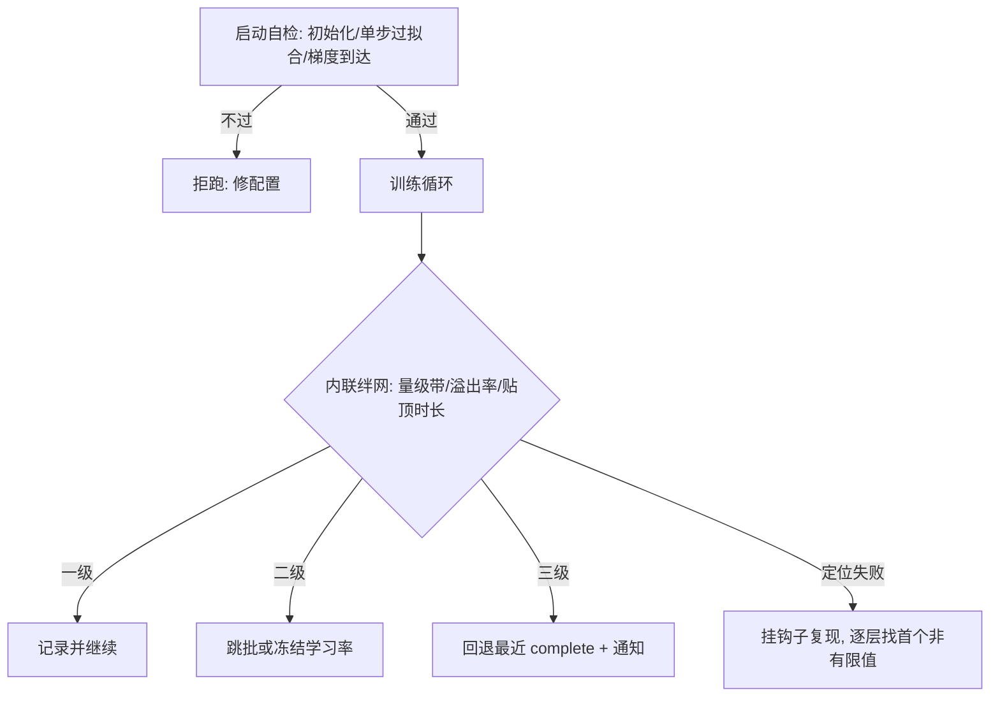

# 数值健康检查

健康检查的本质是把「希望有人盯着」改写成机器可执行的断言，让人不做第一发现者。

<footer>—— 据 FP8/FP16 混合精度训练与大规模训练健康监控实践整理</footer>

[上一课](/llm/ti-gradient-weight-histograms)把分布形状接进观测面，而形状漂移常是数值病的皮肤。数值的**监控内容**——溢出计数、amax 水位、尺度抖动、零更新层——[长期训练的健康监控](/llm/num-longrun-health)已经列成仪表盘；精度格式的边界在[浮点格式谱系](/llm/num-float-formats)，混合精度方案在[混合精度 BF16 / FP8 训练](/llm/pretrain-mixed-precision)。本课写观测之上的执行层：把数值健康做成**自动检查**，让异常触发动作而不是通知。

## 问题

仪表盘有个结构性缺陷：它默认有人看，而长跑以周计、注意力以分钟计；损失可见时能做的只剩回滚。检查要补的是三个时间点的自动化。**启动时**：初始化统计是否在预期区间、假批能否一步过拟合、梯度能否到达所有层——这些在 step 0 就该挡住作业，而不是三天后由曲线回答。**每步中**：出现 NaN 与 Inf 时，只报「损失变 NaN」等于没有信息，作业继续跑出几千步废数据。**越线后**：人不在时绊网先动——跳批、冻结学习率、回退检查点——而所有自动动作都要留痕，否则复盘分不清「系统自愈」与「带病续跑」。

数字实例：fp16 能表示的最大数约 65504，某个 logit 涨到十万，一步之内就变成 Inf；Inf 减 Inf 得 NaN，而 NaN 会顺着梯度传遍全网——所以定位必须找「首个非有限值」，等损失整体变 NaN 再查，每一层都已是 NaN，什么也查不出来。

### 三层检查的分工

启动自检是一次性门禁：初始化统计、单步前反向的非有限值扫描、十步过拟合小样本。内联绊网是廉价常开的断言：损失与 logit 的量级带、溢出与跳步计数率、梯度范数贴顶时长，超带即触发分级响应。诊断复现是昂贵非常开的：首个非有限值的逐层定位靠挂前向钩子逐层检查，框架的完整 anomaly 模式让每步慢数倍，只在回放调试时打开。三层共享同一条纪律：**断言失败必须带定位**（哪层、哪个张量、第几步），不带定位的告警会被养成忽略习惯。

术语翻译：断言（assertion）就是写进程序的一句「此处必须成立，否则立刻报错」，比如「损失必须有限」「梯度范数不得超过一亿」。它与「希望有人盯着仪表盘」的区别在于：断言由机器在当步执行，人从第一发现者的位置上退了下来。

fp16 的表示上限约 65504，一次未裁剪的激活爆炸足以把整场训练打成 NaN；而定位首个 NaN 的钩子链只在调试时全开——健康检查的预算同钩子纪律一样按全程折算，常开的必须是廉价断言。

## 方法

落地按四步。其一，把断言写进作业配置而不是脚本里：量级带、计数率阈值、响应动作，随训练配方走版本评审，与 $\beta_2$ 尖峰模式（[Adam β₂ 与损失尖峰](/llm/adam-beta2-spikes)）等已知病症对应。其二，绊网分级：一级只记录，二级跳批或冻结日程，三级回退到最近 complete 检查点并通知；升级路径写死，禁止现场改阈值。其三，稳定器当配置管：[z-loss](/llm/z-loss) 压 logit 漂移、[QK-Norm](/llm/qk-norm-pretrain) 压注意力 logits，开与关都记录在案——稳定器掩盖的病症仍要靠断言兜底。其四，演练：注入一次 NaN 与一次尖峰，验证绊网真的触发、定位、回退——没演练过的绊网与没恢复过的检查点同样不可信。

## 机制

断言优于盯盘的机理是延迟差：绊网在异常当步读到信号，仪表盘要等人看到再行动，中间隔小时级；对每秒都在恶化的 NaN 传播，小时级等于全损。分级响应的机理与熔断相同：一级收集证据、二级止损、三级恢复，级别与置信度对应，避免任何单一阈值既当报警又当开关。留痕的机理是归因闭环——自动动作改写了轨迹（跳过的批、回退的点），不留痕则下游所有对比分析的地基被悄悄抽掉。

演练的机理沿用检查点课的结论：恢复路径的价值只在执行时兑现，而断言代码是最常被「顺手优化掉」的路径，注入式演练是唯一能证明它还活着的手段。

常见误区：初学者容易把绊网阈值设得极敏感，「宁可误报不可漏报」——实际上持续误报的结局是全员养成忽略习惯，甚至干脆关掉绊网，比没有绊网更危险。正确姿势是从宽起步，每出一次真实事故，就用它的数据回推收紧一次阈值。

## 边界

本课管数值与过程健康的自动检查，不管数值方案怎么选：精度配比、缩放策略、稳定器取舍归低精度各课；损失曲线怎么读归上一课；「健康但错误」的静默错位要靠数据指纹与回放，不在断言能力内。断言过密也有成本：误报的结局是全员关闭绊网，阈值宁可从宽起步、按事故回推收紧。

## 小结

- 三层分工：启动自检挡低级错误，内联绊网常开廉价断言，昂贵诊断只在复现时全开。
- 断言失败必须带定位：哪层、哪个张量、第几步。
- 绊网分级响应，升级路径写死，所有自动动作留痕进日志。
- 稳定器与断言并用，注入式演练证明绊网活着。
- 出处：据 FP16/FP8 混合精度训练（Micikevicius et al., 2022 一线格式报告）与大规模训练监控实践整理；监控面清单见[长期训练的健康监控](/llm/num-longrun-health)。
