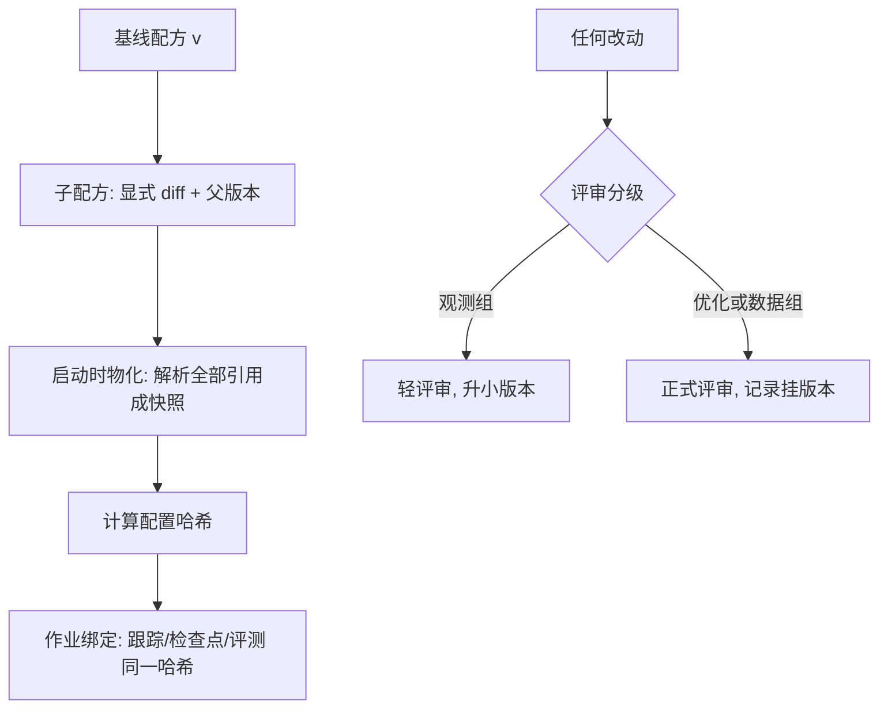
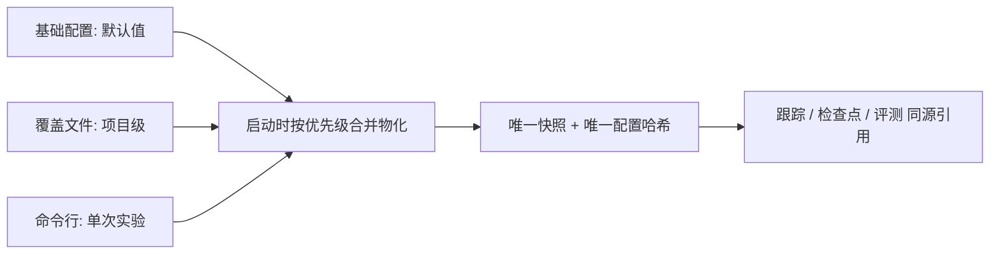

# 训练配方管理

配方是一篇 run 的完整声明：架构、数据、优化、数值、钩子、死线，全部版本化；改一行配置而哈希不变，是一切实验事故的起点。

<footer>—— 据大规模训练团队的配置管理与复现实践整理</footer>

[上一课](/llm/ti-failed-exp-archive)把失败写成档案，档案里的死因处处引用判据与配置——那些引用的实体就是本课的主角：训练配方。前几课已多次埋它：[run 身份四元组](/llm/ti-experiment-tracking)的首位是配置哈希，[绊网阈值](/llm/ti-numerical-health)说好随配方走版本评审，搜索课的响应面最终也落成配方。本课把配方定义清楚并给出管理制度。

## 问题

配置管理的反面不是「没有配置文件」，而是**声明不完整与来源不唯一**。不完整：配方只写了学习率与批次数，数值方案、钩子节奏、死线散在启动脚本与个人记忆里——run 出了结果，没人能说出全部自变量。不唯一：同一参数在基础配置、覆盖文件、命令行三处定义，谁覆盖谁靠约定；「顺手改一行没入档」的曲线混进库里，毒化后续对比。还有**变更无痕**：主干配方被直接修改，正在排队复现的人拿到的是新配置，比对实验悄然换底。

直觉类比：配方就像写全克数、火候与步骤的菜谱——只写「盐适量、炒一会儿」的菜谱，做不出第二盘同样的菜。run 的可复现性同理：散在启动脚本和个人记忆里的参数，等于菜谱里没写的「适量」，下次必然变味。

### 配方的最小字段组

一份完整配方至少六组字段：模型（架构、初始化）、数据（流水线版本、配比、序列长度）、优化（优化器、学习率日程、批次）、数值（精度方案、稳定器、缩放策略）、观测（钩子节奏、绊网阈值、评测计划）、治理（预算死线、止损判据、负责人）。字段组按引用组织：数据组引用流水线版本号而不是内联配比表，优化组的日程写峰值与比例——配方是**指针的集合**，单一事实在数据、数值各课的口径里。

配置哈希必须全链路同一：跟踪系统上报的、检查点元数据写入的、评测报告标注的，是同一哈希函数对同一份物化配置的计算。三处不一致时，涉及这两条 run 的一切对比结论作废——这不是形式洁癖，是可比性的地基。

## 方法

管理三条制度。其一，**版本即发布**：配方改动一律升版本号，旧版本只读；「正在跑的作业绑定启动时的版本」沿用数据流水线的物化纪律，在跑作业不受后续修改影响。其二，**评审分级**：改观测组字段（加日志、调绊网）轻评审即可；改优化组与数据组（学习率、配比、序列长度）走正式评审，评审记录挂版本；训练中途改配方被禁止，要改就开新 run。其三，**继承即显式**：家族树形组织（预训练基线 → SFT 变体 → 实验分支），子配方声明父版本与 diff；常用工作负载沉淀为模板，微调的学习率与批次起点可参照[全参微调的学习率与批次](/llm/full-sft-hparams)的口径。

## 机制

版本化有效的机理是**把自变量空间钉死**：实验的科学性要求「改了什么」有唯一答案，配方版本就是答案；哈希把配置压成可比对的指纹，三个系统的哈希一致才保证指纹没有分叉。物化有效的机理是消除时序耦合：引用的子配置（流水线版本、稳定器阈值）日后都会变，启动时解析成快照，把「引用关系」冻结成「值关系」。继承显式化的机理是控制认知负荷：审一份配方时，评审者要能在几分钟内说出「这条 run 与基线差在哪」，深层覆盖让 diff 不可读，不可读的 diff 就是没被审的 diff。

术语翻译：物化就是把「指针」在启动那一刻解引用成「值」——配方里写的流水线 v12 只是引用，物化时把 v12 的全部实际内容拷成一份快照。此后上游就算升到 v13、v14，这份快照一动不动，在跑作业读到的永远是启动时的世界。

配方与归档在此闭环：死因档案引用判据原文，判据是配方治理组的字段；配方版本可查，判据才可查，证据链才完整。

## 边界

配方管**声明与版本**，不管调参：值从哪来（缩放律、搜索、经验）归机理与搜索课；也不管密钥、路径等环境细节——那属于作业环境与部署配置，两者混在一个文件会让配方既不可读也不安全。过度版本化同样是病：为每次实验建新配方文件让家族树退化成灌木，正确粒度是「语义上的一次方法论变化升一版」，噪声级调参走搜索系统不进主干。

常见误区：初学者容易「为每次实验另存一个新配方文件」，半年后家族树长成几十个说不清辈分的灌木，没人知道该继承哪一份。正确粒度是语义上的一次方法论变化才升一版，噪声级调参交给搜索系统记录，不进主干配方。

## 小结

- 配方六组字段：模型、数据、优化、数值、观测、治理；配方是指针的集合。
- 配置哈希全链路同一：跟踪、检查点、评测三处一致是可比性的地基。
- 改动即升版，评审分级，训练中途改配方被禁止。
- 继承显式声明父版本与 diff，评审者几分钟内能说出与基线的差异。
- 出处：据大规模训练配置管理与复现实践整理；调参起点见[全参微调的学习率与批次](/llm/full-sft-hparams)。
