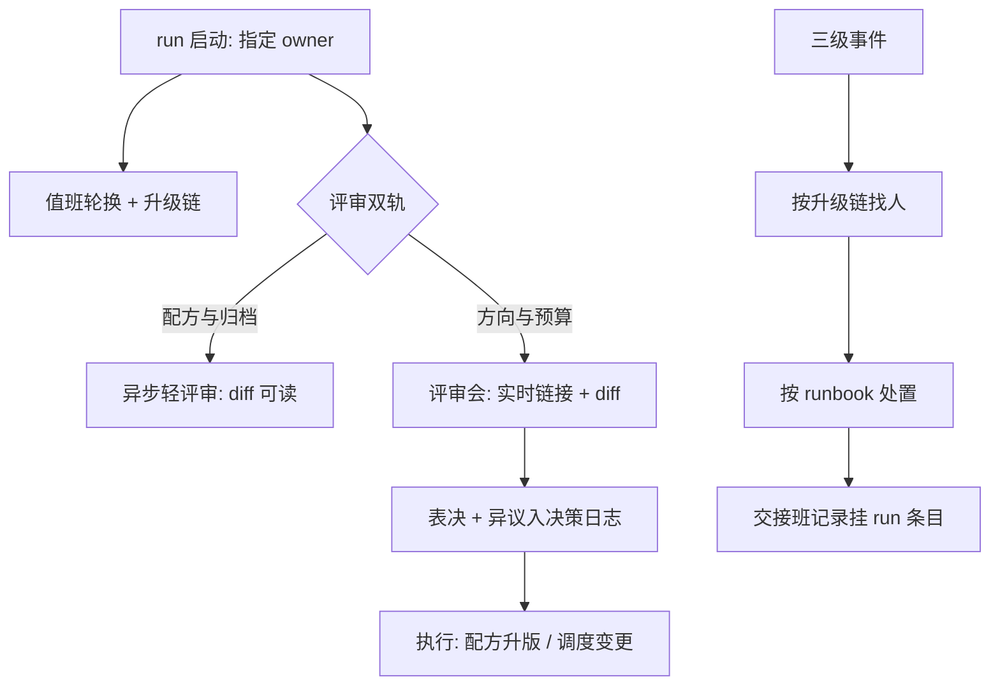
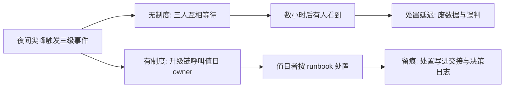

# 团队协作与评审

训练是团队运动：一场数周的 run 跨越多个假期与多人的注意力周期，没有协作制度的团队，靠运气衔接交接。

<footer>—— 据大规模预训练团队的值班与评审实践整理</footer>

[上一课](/llm/ti-recipe-management)把配置变成可评审的版本，而评审、值班、交接都要有人与流程承接。本课写团队协作与评审：run 怎么有负责人、会怎么开、长跑怎么值班、知识怎么流动。基础设施到此从物转向人——仪表盘、跟踪库、配方库、死因档案，只有在协作制度里被使用，才从存储变成组织的判断力。

## 问题

协作失败有三种典型。**无主 run**：长跑没有唯一负责人，尖峰发生时三个人都在等别人看一眼，处置延迟以小时计；事后无人能还原改过什么。**汇报式评审**：周会看截图听叙事，评审者无法回放到曲线与配置，「上周很好」式的汇报替代了数据；决策依据散会即失传。**值班空转**：绊网自动响应之后无人兜底，夜间触发的三级事件没人接手，回退动作卡在「等早上」——自动化把响应时间从小时缩到秒，前提是升级链上有人。

常见误区：初学者容易以为「群里人多，总会有人处理」——社会心理学称之为责任分散：旁观者越多，每个人越觉得不关自己的事。这正是无主 run 尖峰没人看的根源；唯一 owner 的作用，就是把「总会有人」变成「此刻是谁」。

### 协作的最小制度

制度四件。**负责人制**：每场 run 启动时指定唯一 owner，写进配方治理组；owner 不必亲手值班，但对处置与归档负最终责任。**决策日志**：方向调整、配方升版、杀 run 决定，各写一条——决策、依据（链接到曲线与配方版本）、执行人、日期；日志进跟踪库，与 run 条目互链。**值班轮换**：长跑期间按周轮值，升级链写明「绊网二级找谁、三级找谁」，交接班记录挂在 run 条目下。**评审双轨**：配方与归档走异步轻评审，方向与预算走周期性评审会——两轨共用上一课的评审分级。

评审会的准入题：评审者到会前必须能答「这条曲线与基线差在哪个变量」。答不出的问题不进会场，先去补配置 diff——这一条把评审会从汇报会拉回决策会。

## 方法

评审会的开法按数据先行三步。会前：材料就是跟踪库的实时链接与拟决策的配方 diff，无截图无 PPT。会中：每项议程先对曲线（判读课的口径），再对证据链（归档课的指针），最后表决；表决结果当场写进决策日志，含反对意见——让日后复盘能分清「无人反对」与「反对未被采纳」。会后：决策的执行走配方升版或调度变更，状态可查。值班侧配套 runbook：尖峰、NaN、节点掉线、存储满四类高频事故的处置预案各一页，与绊网的分级响应衔接——自动化处理一级二级，人按手册处理三级与未知。

## 机制

这套制度有效的机理是**决策与证据绑定**：决策日志强制每条决定带依据链接，事后审计与复盘有链可循；记录异议则是给未来的自己留证据——组织的记忆不止要记结论，还要记分歧。负责人制的机理是消除责任分摊：单一 owner 把「大家都在看」的社会惰性变成「此刻轮到谁」，升级链让责任在时间轴上也可分配。数据先行的机理是拉平信息差：实时链接让评审者与汇报者看同一份数据， Highest-paid-person 的叙事失去载体，争论收敛到配置 diff 与曲线形状这些可核对的对象上。

直觉类比：决策日志里的异议记录像判决书里的少数意见——判决按多数走，但少数理由留在纸上。半年后复盘时，你才能分清「当时没人想到」与「有人提醒过但被否了」，这是组织学习里最值钱的一条分界线。

值班与自动化的分工机理沿用绊网课的分级：机器处理已知模式（快、可复制），人处理未知与升级（慢、有判断）；手册是两者的接口，把个人处置经验固化成组织可执行的文本。

术语翻译：runbook 就是把某类事故的处置步骤写成的一页操作手册，像飞机的应急检查单——尖峰先查什么、回退按哪一步走、通知谁。它的价值在于夜里三点值班的人不需要灵感、只需要照单执行；个人经验借它固化成组织能力。

## 边界

本课管协作流程，不管人的绩效评价：评审记录与死因档案不作个人问责依据，免责纪律（归档课已立）同样约束评审——问责文化一出现，配置 diff 会先学会藏。也不管跨团队的资源仲裁：份额与优先级之争归调度课的公平机制，本课的评审会只消费它的记账数据。制度的粒度要随团队规模分档：三五个人的小组，决策日志加值班表可能已够；制度是为补当前最短的板，不是为齐全。

## 小结

- 每场 run 唯一 owner，写进配方治理组；处置与归档有最终责任人。
- 决策日志四要素：决策、依据链接、执行人、日期；异议与结论同权入档。
- 评审双轨：异步轻评审看 diff，评审会看实时数据，准入题过滤未读数的讨论。
- 值班与绊网分级衔接：机器处理已知，人按 runbook 处理三级与未知。
- 出处：据大规模训练团队的值班、交接与评审实践整理；分级响应见[数值健康检查](/llm/ti-numerical-health)。
