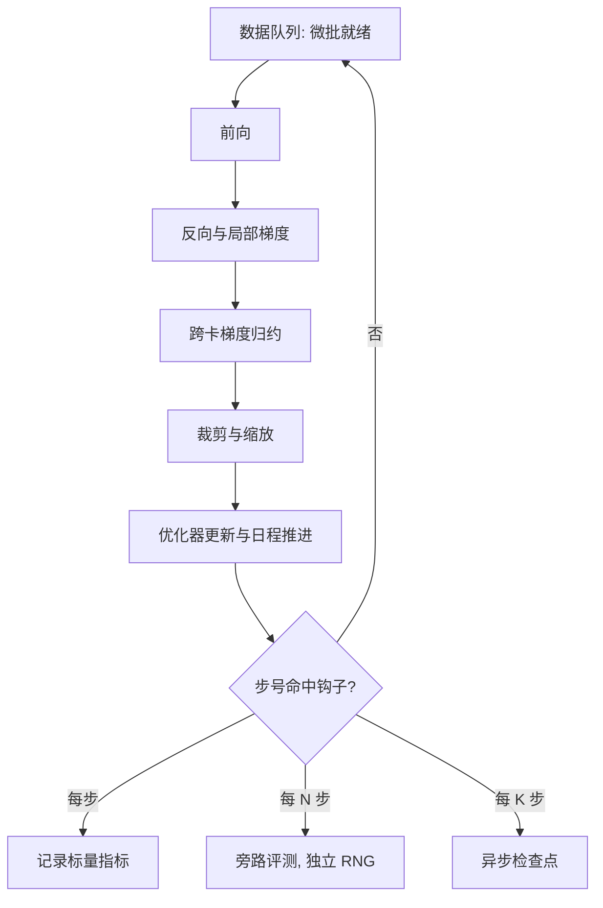

# 训练循环的解剖

训练基础设施的一切承诺，都是在「一个 step」这个最小完整单元上兑现的：预算按 step 记，状态按 step 断，观测按 step 落点。

<footer>—— 据 Megatron-LM、DeepSpeed 与 OPT 训练日志等大规模预训练工程报告整理</footer>

[上一课](/llm/edge-map)把端侧推理的决策收成一张七步账单，账算完之后不反悔；端侧课程的边界里明确留了一句：云端那一侧是另一条线。本课程「训练基础设施」就接这条线。逐个机制此前都写过——[AdamW](/llm/adamw) 写更新式、[混合精度](/llm/pretrain-mixed-precision)写数值、[梯度裁剪](/llm/grad-clip-loss-spike)写爆炸——但它们怎么拼进一个 step、step 之外挂着哪些钩子、账从哪里记起，没有一处总装。本课做解剖，本课程后十四课默认你手里有这具骨架。

## 问题

缺口不是任何一个机制的原理，而是它们的**装配图**。一个 step 里发生了什么、哪些状态被读、哪些被写、时间花在哪，若没有统一答案，三件事立刻失去锚点：MFU 没法分解（不知道慢在算、通信还是等数据）；故障没法归因（不知道尖峰该找数据队列还是找优化器）；钩子没法定价（不知道一次评测、一次存盘偷走了多少训练时间）。逐课学的机制像散落的器官，解剖要给出循环本体。

### 一个 step 的部件清单

一次迭代至少触碰六份状态：参数 $\theta$、优化器状态（Adam 的 $m,v$ 与步数）、学习率日程的进度、梯度缩放器、RNG（CPU、CUDA、数据侧）、数据游标。读侧进来一个微批，经[梯度累积](/llm/grad-accum-microbatch)凑成全局批次；写侧出去一次参数更新。step 之间才是日志、评测、检查点三类钩子的位置——它们不改变轨迹，只读取轨迹。

以 4M token 的全局批次跑 1T token，全程约 25 万步；每步若被日志加 10 毫秒，整程多出约 42 分钟，而一次同步评测偷走几分钟就要乘上评测次数——钩子成本必须按全程折算，不是按单次。

## 方法

把 step 写成显式阶段，每阶段标清在哪块硬件、多长时间：取批（数据队列是否 prefetch 就绪）、前向、反向、跨卡归约梯度、裁剪、优化器更新、日程推进、钩子。记录 $\mathrm{MFU}=\frac{\text{单步有效浮点量}}{\text{峰值浮点量}\times\text{步时}}$ 时，步时要能拆成计算、通信、等数据三桶，否则优化无从下手。钩子写成分层预算：日志每步记标量（损失、梯度范数、吞吐），评测每 $N$ 步在旁路数据上做且用独立 RNG，检查点每 $K$ 步异步落盘。三者的节奏彼此错开，避免同一步同时付三笔账。

## 机制

为什么 step 能当记账单位：它是状态的天然一致点。钩子插在更新之后，读到的是「第 $t$ 步末」的完整快照，参数与优化器状态不撕裂；日志、评测、存盘都以步号为坐标，跨子系统对齐才可能。反过来，任何声称「不影响训练」的旁路设施，验证标准也只有一条：同一份数据、同一串种子，开与关两种配置的逐步损失应当逐点重合。这给了基础设施一条可测试的契约，而不是一句口头保证。

时间预算同样以步为单位复利。训练一次 1T token 的账 = 步时 × 步数，而步时里的等待不会写在任何论文里：数据队列浅一档，GPU 就在每步里插进一段空转；钩子重一克，25 万步放大出小时级浪费。基础设施课的全部工程，都是在这条乘法里抢回分子。

## 边界

本课解剖的是**同步单作业循环**：一个作业、一次迭代、全局同步点收尾。并行怎么把一个 step 摊到成百上千张卡上、同步点内部怎么重叠，属于下一课程「分布式训练深入」；RL 那种训练与采样交替的双引擎循环，属于后文 RL 训练系统；推理侧的步进与调度已在服务各课收束。另外，解剖不代替机制：损失为什么不降、数值为什么溢出，仍要到观测各课里找成因。

后课默认：谈数据、检查点、直方图、成本，落点都是这个 step 骨架上的某个部件或某段钩子；部件名与钩子节奏沿用本课的记法。

## 小结

- 一个 step 触碰六份状态：参数、优化器、日程、缩放器、RNG、数据游标；钩子只读不写。
- 步时拆成计算、通信、等数据三桶，MFU 的归因从分解开始。
- 日志每步、评测每 $N$ 步、检查点每 $K$ 步，节奏错开，成本按全程折算。
- 基础设施的契约是「不改变轨迹」：逐步损失可复现才算旁路透明。
- 出处：据 Megatron-LM（Shoeybi et al., 2019）、DeepSpeed/ZeRO（Rajbhandari et al., 2020）与 OPT 训练日志（Zhang et al., 2022）等工程报告整理。
