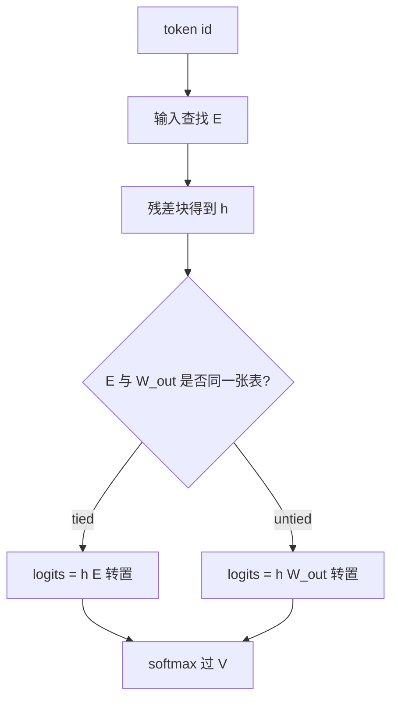

# Tied vs untied 嵌入

输出层的分类矩阵与输入嵌入描述的是同一批符号；让它们共享权重，等于把「读入一个符号」和「预测一个符号」放进同一套几何。

<footer>—— 据 Press & Wolf, Using the Output Embedding to Improve Language Models, EACL 2017；Inan, Khosravi, Socher, ICLR 2017 整理</footer>

[上一课](/llm/embedding-lookup)给出输入查找表 $E$，把 id 收成 $d$ 维向量。本课不重讲 gather。缺口是：语言模型最后还要把隐状态映回 $|V|$ 类，通常再要一张 $W_{\mathrm{out}}\in\mathbb{R}^{|V|\times d}$。两张表描述同一批符号，却占两份 $|V|\times d$。是否把它们焊成一张，是 tying；焊与不焊会改变参数量，也会改变输入几何与输出几何能不能各自演化。

## 问题

[Token 嵌入查找](/llm/embedding-lookup)只解决了读入。自回归的每一步还要一份条件分布 $P(t_i\mid t_{<i})=\mathrm{softmax}(h_i W_{\mathrm{out}}^\top)$（或 $W_{\mathrm{out}} h_i$，视行向量列向量约定而定）。若 $W_{\mathrm{out}}$ 与 $E$ 独立，同一个符号在「作为上文被读」和「作为下一词被写」时用两套向量，模型可以学到不一致的几何：读侧把某子词当功能词，写侧却把它当内容词。参数上也重复。Press 与 Wolf、Inan 等人指出，这两套向量应对同一符号，共享是合理的归纳偏置，也是直接的省参。

不共享也有理由。输入嵌入要和残差流、位置信息相加后被许多层改写；输出矩阵只在最后一刻做点积分类。两边的最优尺度可能不同。LayerNorm、温度、偏置项都会让「同一张表两用」在数值上别扭。本课要讲清焊死之后发生了什么，而不是把 tying 当成默认的道德正确。

### 共享的是哪一块

常见做法是 $W_{\mathrm{out}}=E$，即同一份存储。有的实现允许输出另加偏置 $b\in\mathbb{R}^{|V|}$，偏置不共享。编码器-解码器若输入输出词表相同，也可以让编码器查找、解码器查找与生成头三者共享；词表不同则不能直接焊。多模态里图像侧没有与文本 $V$ 对齐的行，谈不上与文本输出 tying。

BERT 一类掩码语言模型往往不把输入嵌入与输出分类器焊死，因为预训练目标、词表用法和后来的微调头并不总是「同一套自回归分类」。不要从 GPT 的默认反推编码器。

## 方法

Tied：前向用 $E$ 做查找，最后用同一 $E$ 做分类logits $h E^\top$。反向时，查找路径与分类路径的梯度加到同一张表上。Untied：两张矩阵，梯度各走各的。参数量在 tied 时少一份 $|V|\times d$；对大词表小模型，这一份可能占总参数的百分之十几到几十，对大模型占比下降，但绝对显存仍可观。

训练动态上，tied 把「这个符号该长什么样」的监督从两个入口灌进同一行：作为上文出现时，后续损失会改它；作为目标出现时，分类损失也会改它。Untied 则让读侧行跟着残差流的需要走，写侧行跟着 softmax 几何走。两者在困惑度上的差距因模型大小、词表大小和是否用输出偏置而异，没有与架构无关的定律，只有这笔明确的共享约束。

### 尺度与归一化

隐状态 $h$ 若经过最终 LayerNorm，幅度被管住，$E$ 的行范数就同时影响查找尺度和 logits 尺度。Tied 时不能再单独把输出矩阵放大、把输入矩阵缩小。有的工作在 logits 上除一个温度或乘一个可学习标量，给共享表留一点尺度自由度。Untied 没有这个冲突：输入行可以小，输出行可以大。选 tying 就要把尺度问题当成一等公民，而不是事后用学习率硬扛。

权重衰减会同时收缩读与写。若你希望输出层比嵌入更接近零以避免 logits 过大，tied 做不到这种差别对待。这是优化超参与架构绑死的一例。

## 机制

从功能上看，softmax 的每一类是「隐状态与该类原型向量的点积」。原型若就是输入嵌入，则模型被要求：读入该符号时所放置的方向，与预测该符号时所匹配的方向一致。残差流必须把「要说出符号 $t$」写成靠近 $E_t$ 的方向。这把输出空间直接焊在嵌入空间上，解释工作里常被当成便利：读嵌入方向约等于写方向。

Untied 切断这条焊缝。可以出现「输入嵌入几乎不用、全靠层去重写，输出矩阵自己长一套原型」的分工。小模型上这种分工往往只是过参数，大词表上则可能让输出矩阵学到比输入更锋利的分类边界。代价是两套几何要对齐到同一语言，数据不够时会对不齐。

### 与词表大小的耦合

$|V|$ 越大，tying 省下的绝对值越大，但每行的平均更新次数也越少。共享让稀疏的行同时接到两类梯度，可能比 untied 的两份稀疏表更稳。这与 [词表大小与 UNK](/llm/vocab-size-unk) 的长尾问题是同一条轴：长尾行最需要任何能来的梯度，tying 给它们第二条。下一课把 $|V|$ 与 $d$ 的乘积写成内存；本课只定「乘积算一份还是两份」。

自适应 softmax、分层输出头是另一条省输出矩阵的路，不一定与输入 tying。不要把「省 $|V|\times d$」全部记在 tying 名下。

## 边界

输入输出词表不一致时不能整表 tying，最多共享交集行，工程上很少这么做。编码器若无生成头，谈论 tying 没有对象。指令微调若冻结嵌入、只训其余，tied 的生成头也被冻住，生成分布几乎不能适应新的口头禅——这是冻结策略与 tying 叠加的陷阱。 vis 词表、工具调用的特殊符号若后加进 $V$，tied 要求同时扩展 $E$ 的行与分类面，初始化这些新行会同时影响读和写。

本课不改 $d$，也不引入残差公式。下一课在 tying 已经决定「一份还是两份」之后，把 $|V|$ 对 $d_{\mathrm{model}}$ 的内存账算清楚。

## 小结

- 输入查找与输出分类描述同一批符号；tying 令 $W_{\mathrm{out}}=E$，省一份 $|V|\times d$，并焊死读写几何。
- Untied 允许两套尺度与两套原型，代价是双倍表、长尾行更稀疏。
- 共享后不能再独立调节输出层范数；温度或标量是仅剩的尺度阀门。
- 词表不同、编码器无头、冻结嵌入，都会让 tying 的语义变形。
- 下一课在此基础上算 $|V|$ 与 $d_{\mathrm{model}}$ 的乘积。
- 出处：Press & Wolf, EACL 2017；Inan, Khosravi, Socher, ICLR 2017；Vaswani 等的 Transformer 亦采用共享嵌入。
