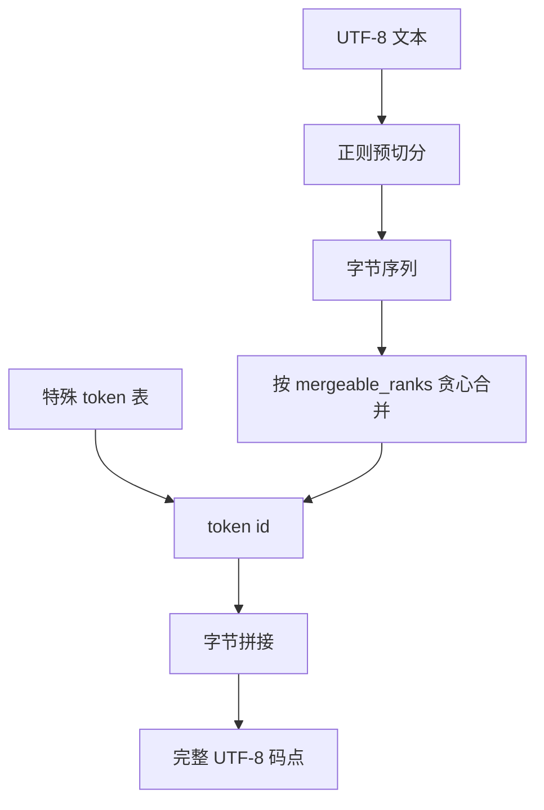

# tiktoken / BPE 实现

GPT 家族把文本收成 UTF-8 字节再做字节对编码；tiktoken 把这套已冻结的词表做成可在生产路径上每秒吃掉数 GB 的确定性编码器。

<footer>—— 对照 Sennrich et al. 的 BPE、Radford et al. 的 GPT-2 字节级切分，以及 OpenAI 的 tiktoken 实现</footer>

Gage 1994 年把字节对编码写成压缩算法；Sennrich、Haddow 与 Birch 2016 年把它变成 NMT 的稀有词方案：从字符表出发，反复合并语料里最频的相邻对。Radford 等人的 GPT-2 再把起点换成 256 个 UTF-8 字节，彻底消灭 UNK，并用一条正则预切分避免把无关片段焊在一起。OpenAI 的 tiktoken 不重新发明这套数学，它解决的是另一件事：在 API、计费、上下文闸门和本地推理里，对 `r50k_base`、`p50k_base`、`cl100k_base`、`o200k_base` 给出与模型训练时**逐 id 一致**且比 Hugging Face 当时的 Python 快路径快三到六倍的实现。SentencePiece 是可训练的实验室工具；tiktoken 是冻结编码表上的生产编码器。把二者当成「都是 BPE」而互换，是上下文溢出和账单对不上的常规原因。

## 问题

训练可以用任意慢的切分；服务不行。提示可能是数万字符的 JSON 与日志，网关必须在 GPU 看见矩阵之前用与权重相同的规则算出 token 数，否则 `--max-input-tokens` 是假的。Python 里每次构造 `AutoTokenizer`、走慢速循环合并，会在高并发下把 CPU 变成第二条延迟曲线。更糟的是多套「近似 GPT-2」词表：有的用 SentencePiece 空白符号，有的用 `Ġ` 前缀，有的正则略不同，同一句相差几个 token，聊天模板再叠一层，用户看到的「8k 上下文」与模型真实窗口错位。

字节级 BPE 自己的问题是：若从原始字节直接合并、不做预切分，空格、字母、标点会焊成稀奇古怪的跨类符号，词表被网页噪声污染。GPT-2 用正则先切出「大致像词」的片段，再在片段内做 BPE，这是预分词与无损字节回退的折中。tiktoken 把这条正则、合并秩表和特殊 token（`<|endoftext|>`、FIM、`<|im_start|>` 等）打包成名为 encoding 的对象。问题变成：如何让所有语言的绑定、所有网关进程，加载的是同一张秩表，而不是「看起来差不多的 100k 词表」。

### 编码表是模型的一部分

`cl100k_base` 服务 GPT-4 / GPT-3.5-turbo / `text-embedding-ada-002`；`p50k_base` 服务 Codex 与 `text-davinci-002/003`；`r50k_base` 即 GPT-2/GPT-3 davinci 系；较新的旗舰与 `gpt-4o` 一类走 `o200k_base`（词表约 20 万）。`encoding_for_model(name)` 存在的理由，就是禁止业务代码写死一种 encoding。聊天接口的账单 token 还包含模板与特殊符，不等于对用户可见字符串跑一遍 `encode`。用 tiktoken 在本地估算 API 费用，必须复现同样的 message 组装，否则会系统性低估。

## 方法

推理期 BPE 不扫描全局语料。给定预切分后的字节串，编码器反复把当前相邻对里、合并秩最高（训练时最早合并、秩最小）的一对焊成词表项，直到不能再合。实现上用哈希表存 `mergeable_ranks`，用正则 `pat_str` 预切分，特殊 token 走单独词典、可在 `encode` 时允许或拒绝。decode 把 id 映回字节再解 UTF-8；流式时必须缓冲不完整码点，不能对半个汉字的 id 单独 `decode` 成替换符。OpenAI 公开的 Python 包核心是 Rust，官方 README 称在 1GB 文本、GPT-2 词表上比当时 `GPT2TokenizerFast` 快 3–6 倍。教育子模块 `SimpleBytePairEncoding` 可从 `cl100k_base` 可视化合并，便于对照论文算法，但生产路径不要用它。

扩展编码的合法方式是复制 `pat_str` 与 `mergeable_ranks`，只改 `special_tokens` 并换新名字（例如为对话加上 `<|im_start|>`）。私自改合并表却沿用 `cl100k_base` 这个名字，会造成静默的 id 错位。插件机制 `tiktoken_ext` 用于注册自定义 Encoding，让 `get_encoding` 能找到它。tiktoken **不提供** 在新语料上重训 100k 词表的 API；要训练应回到 SentencePiece、Hugging Face tokenizers 或自写 BPE，再把秩表导出成与 tiktoken 兼容的结构——那是另一条供应链。

### 预切分正则决定「什么叫相邻」

BPE 只在预切分块内部合并。正则若把字母与紧跟的标点切开，`'s` 与 `end-to-end` 的焊法就变了；若允许跨空格合并，词表会出现带前导空格的词片，GPT-2 用 `Ġ` 表示这种空格。cl100k 相对 r50k 加大词表、调整正则，对多语言与代码更省长度，但不是「更智能的分词器」——只是另一张冻结合并表。o200k 继续加大覆盖。评估「这个 tokenizer 好不好」应看：目标语料的平均 token/字节、尾部语言是否碎、特殊符是否够用，而不是看名字里的数字。Sennrich 的原论文在词级预分词上训练；字节级方案删掉了 UNK，也把噪声字节放进词表，脏语料直接变成脏合并。

同一模型家族在不同 API 名下可能换 encoding。硬编码 `cl100k_base` 去数 `gpt-4o` 的上下文，闸门会偏。应用应调用 `encoding_for_model`，并在集成测试里锁一句多语言加代码的探针，断言 id 序列哈希不变。

## 机制

训练期 BPE 估计的是语料上的贪心压缩：频繁共现的字节块变成原子，交叉熵在更短序列上计算。推理期算法是确定性的查表，不再有「更新合并」。这与 Unigram 不同：Unigram 在推理仍可采样切分，tiktoken 路径没有概率。确定性使 KV 缓存、前缀复用和计费可复现。正则预切分把「空格、字母、数字、标点」的类型边界写进归纳偏置，减少跨类型垃圾合并，代价是语言相关——为英语设计的正则对无空格文字主要靠字节块，中文往往更碎，同样字符预算下中文有效上下文更短。这是编码表的政治，不是 bug。

相对 SentencePiece：空白处理（`▁` vs 字节/ `Ġ`）、规范化（NFKC FST vs 几乎不做兼容折叠）、训练（现场训 vs 冻结表）、UNK 策略（字符 UNK vs 字节回退）全都不兼容。Llama 2 用 SentencePiece，对它跑 tiktoken 的 cl100k 再喂模型，等于用错误词表解码权重。服务框架必须把 tokenizer 工件与 checkpoint 当成同一版本号。

### 速度来自实现，正确性来自表

3–6 倍来自 Rust、少分配、预编译正则与避免 Python 循环，不是来自近似算法。任何「更快但不保证 id 一致」的分词器都不能替换 tiktoken 去对 OpenAI 模型。本地开源模型若宣称兼容 GPT-4 tokenizer，应以 tiktoken 的 id 序列为金标准做差分，而不是只比词表大小。FIM 特殊符、`<|endofprompt|>` 是否允许进入普通 `encode`，会改变补全与对话的边界；默认拒绝特殊符、显式允许白名单，是安全默认。

## 边界与工程取舍

tiktoken 不训练、不解决词表污染、不自动升级。新语言或领域要降 token/字节，只能换一张表并重训模型。decode 在错误 id 或截断字节上的行为必须当成 API 契约测试。多进程各自加载大 rank 表会涨 RSS，应共享内存或在 router 进程集中分词（TGI 把 tokenizer 放在 router 一侧就是这个原因）。教育模块与生产 Encoding 混用会把慢路径带进热路径。开源复现 GPT 时，若无法获得完全相同的 `mergeable_ranks`，就不要声称 token 级兼容。

计费与长度闸门还要加上模板。只对用户文本 `encode` 会漏掉系统提示与工具 schema。嵌入模型 `text-embedding-ada-002` 与聊天模型共享 cl100k，不代表截断策略相同。o200k 的 20 万词表加大嵌入矩阵，对小模型是显存税，对多语言是长度收益——选表是模型设计，不是预处理细节。

不要在请求热路径里 `get_encoding` 失败再联网。编码表应随应用分发。也不要用字符数、单词数或「中文除以 1.5」去近似；闸门必须在真正 encode 之后。

## 小结

- tiktoken 是 OpenAI 冻结 BPE 编码表的高速确定性实现，不是通用训练器。
- 算法谱系：Gage 压缩 → Sennrich 子词 BPE → GPT-2 字节级加正则预切分。
- 常用表：`r50k` / `p50k` / `cl100k` / `o200k`，必须按模型名解析，不能写死。
- 预切分正则定义相邻关系；特殊符与聊天模板计入真实 token。
- 与 SentencePiece 的空白、规范化、UNK 策略不兼容，权重与 tokenizer 必须同版本。
- 生产路径用官方 Encoding；流式 decode 要缓冲不完整 UTF-8。
- 出处：Sennrich et al.，ACL 2016；Radford et al.，GPT-2，2019；OpenAI，tiktoken 代码库；对照 Kudo & Richardson SentencePiece。
