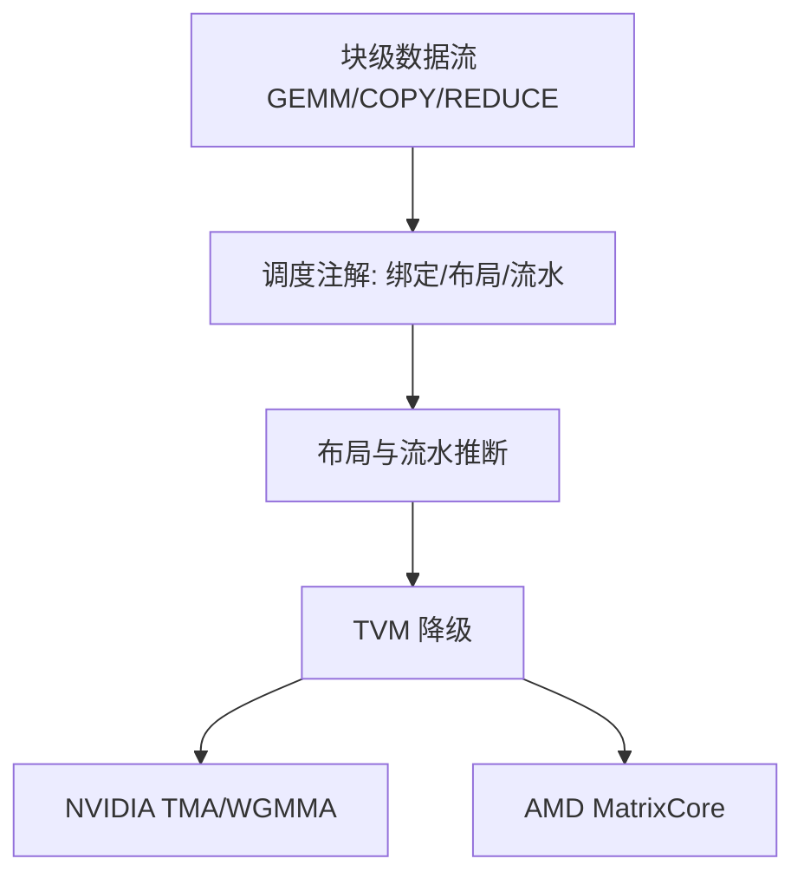

# TileLang

把调度空间——线程绑定、布局、tensorize、流水线——从数据流里拆出来，收成一套注解与原语；用户写块级数据流，把其余优化交给编译器。

<footer>—— Wang et al.，TileLang: A Composable Tiled Programming Model for AI Systems，arXiv:2504.17577，2025</footer>

写一个能吃满 Tensor Core 的核，难处往往不在公式，而在：瓦片放进哪一级存储、哪一维绑到 warp、拷贝与 MMA 如何流水、布局怎样满足 `ldmatrix` / WGMMA / `tcgen05`。Triton 把很多决定藏进编译器，写起来快，遇到 MLA、反量化 GEMM、MoE grouped 形状时，调度空间不够用就要下沉到 CUDA。Lei Wang 等人 2025 年的 TileLang（Microsoft Research 与合作者，GitHub `tile-ai/tilelang`）提出一种 **可组合的瓦片编程模型**：用 Python 写出 GEMM、COPY、ATOMIC、REDUCE 一类块级算子来定义数据流，调度（thread binding、layout、tensorize、pipeline）另用注解表达。编译器基于 TVM，在 NVIDIA 与 AMD 上都能降。目标不是取代 CUTLASS 手写峰值，而是在「Triton 的生产力」和「显式调度」之间给核作者一档中间语言。

## 问题

现代 AI 核的数据流其实很刻板：从 DRAM 搬一块到 SRAM，算一串 MMA，写回去，必要时融合 epilogue。刻板并不等于好写。Hopper 上 TMA 与 WGMMA 的异步握手、Blackwell 上 TMEM 与 `tcgen05.commit`，每一代都改操作数住哪。Triton 以块为中心，但对共享内存布局、warp 划分、软件流水的控制弱于手写。CUTLASS / CuTe 控制力足够，模板与形状代数的门槛高，库作者付得起，业务侧改一条 MLA 吸收核往往付不起。

Wang 等人把缺口写成：DSL 要么把调度藏死（好写、碰到新硬件原语就墙），要么把线程级细节全部摊开（能写峰值、组合性差）。需要一种 **瓦片是一等 IR** 的语言：索引、搬运、复用、流水对编译器可见，而不是程序员口头上的「一块 shared memory」。

### 和 ThunderKittens、Triton 的位置

论文把 ThunderKittens 列为更偏 CUDA 的瓦片抽象，TileLang 则让人全程写 Python，并把 Ampere 的 async copy、Hopper 的 TMA 流水作为默认降级，而不是强迫用户在前端手写流水。相对 Triton，宣称的是更细的调度空间：内存放置、warp 切分、layout、软件流水都是可调维。评测里他们给出相对 Triton 在 H100 与 AMD GPU 上的加速区间；具体倍数随核而变，引用时应指向论文表格，而不是单一「3×」。

仓库与论文都写明：内置算子目前仍可能依赖 CUTLASS 或手写 CUDA/HIP 包装。路线图里有 self-hosting 的 Tile 库。不要把 2025 年的 TileLang 理解成已经完全不需要厂商内核。

## 方法

前端是 Pythonic DSL。用户用块级算子拼数据流，例如一次 GEMM 的「拷 A 瓦片、拷 B 瓦片、累加、写 C」。调度以注解出现：这一块住 shared 还是寄存器、pipeline 深度、tensorize 到哪条 MMA 指令。编译器做布局推断、线程绑定、流水编排。动态形状与动态参数被明确列为库作者需要的特性——MoE 的 $M_i$、变长注意力都落在这里。

降级路径走 TVM。NVIDIA 侧验证过的设备包括 H100（自动 TMA / WGMMA）、A100、消费级 Ampere / Ada；AMD 侧包括 MI250 的 MatrixCore 与 MI300X 的 Async Copy。Blackwell 的 `tcgen05` / TMEM 是否作为一等 tensorize 目标，应以当时发行说明为准，不要把 Hopper 的 WGMMA 注解直接当成 SM100 合法。

### 典型核：GEMM、反量化、FlashAttention

仓库示例覆盖稠密 GEMM、反量化 GEMM、FlashAttention、线性注意力、卷积 im2col。反量化路径强调 **线程级细粒度控制**，许多行为后来成为 Microsoft BitBLAS 的默认；AttentionEngine 也用 TileLang。对 LLM 推理，有意义的不是再写一个标准 GEMM，而是：融合反量化与 MMA（NVFP4 / FP8 权重量化）、把 MLA 的吸收投影与注意力写在同一数据流里、给 grouped 形状留动态 $M$。这些都要求调度可见，Triton 里往往要拆成多核或放弃布局。

自动调优作为可选层存在：块大小、pipeline 深度可以搜。默认路径应已经能生成「像那么回事」的流水（Ampere async copy、Hopper TMA），用户只在编译器不够好时才在前端显式写 pipeline。

## 机制

解耦为什么有效：同一份 FlashAttention 数据流，在 A100 上应变成 `cp.async` + `mma.sync`，在 H100 上变成 TMA + WGMMA，在 SM100 上变成 TMA + `tcgen05`（若后端支持）。若数据流和流水写死在一起，每个架构一份代码；若流水是注解，编译器可以换 tensorize 目标。失败模式是注解假设了某一级存储（例如「累加器在寄存器」），而 Blackwell 的累加器在 TMEM——这时不是调参能解决，要扩展原语。

瓦片作为 IR 使拷贝与计算的依赖可分析：编译器能插入双缓冲，而不靠用户把 kernel 写成手工状态机。代价是瓦片以下的行为（bank conflict 的精确拍数、特定 `cp.async` 粒度）不能从稳定 API 里全部暴露。论文承认极细的硬件行为仍在模型外。

动态 $M$ 对 MoE grouped GEMM 是刚需。若 DSL 只能编译静态形状，最终仍要落到 CUTLASS grouped 或手写 visitor。TileLang 把动态参数列为卖点，落地时要看生成代码是否每步重新编译，还是形状作为 kernel 参数。

### 生产力数字怎么读

论文与后续材料给出相对手写实现的代码量下降、相对 Triton 的加速区间。这些数字绑定基准核与设备。业务核若包含不规则控制流（专家 id 分支、KV 分页间接访问），加速比会掉下来，因为调度器擅长的是规则瓦片套规则 MMA。分页注意力、MoE dispatch 本身更像是通信加 scatter，不是 TileLang 的主场；它的主场是 scatter 之后那块专家 GEMM、以及注意力分块。

和 CUTLASS 的关系是互补：CUTLASS 提供经过验证的 MMA 流水与 grouped scheduler；TileLang 让非模板专家也能拼出接近的数据流。峰值核、尤其 SM100 上带块缩放的 NVFP4 grouped GEMM，短期内仍以 CUTLASS / cuDNN 为合同。

## 边界与工程取舍

不要用 TileLang 替换整个推理运行时。它产出的是单个核或融合核，调度、分页 KV、连续批仍在框架里。集成成本是：编译缓存、动态形状分桶、与 PyTorch / TVM runtime 的生命周期。每步即时编译会把 TTFT 打穿。

跨厂商可移植「写一次」不等于「同一注解在 NVIDIA 与 AMD 都达峰值」。MatrixCore 与 Tensor Core 的形状约束不同，自动 TMA 在 AMD 上没有对应物。可移植的是数据流；调度仍要按设备特化。论文评测两边都做了，引用时分开报。

Blackwell TMEM、CTA pair、`kind::nvf4` 若尚未成为稳定 tensorize 目标，用 TileLang 写 NVFP4 核可能降到较慢的兼容路径。这时应直接走 CUTLASS SM100 或 Transformer Engine。语言的价值在迭代速度，不在替代厂商对第五代 MMA 的第一方核。

出处：Wang et al.，*TileLang: A Composable Tiled Programming Model for AI Systems*，arXiv:2504.17577，2025；Microsoft Research 出版物页；实现 `tile-ai/tilelang`。相关系统：Triton、CUTLASS、BitBLAS、AttentionEngine。不要把未出现在这些材料里的加速比写进规划。

调试比 Triton 更接近编译器：布局推断失败会表现为错误的 shared 形状或非法 MMA 描述符，而不是 Python 里一眼看得见的索引错误。需要看降级后的 PTX / 中间层。这是用调度解耦换来的税。

## 小结

- TileLang 用块级算子写数据流，用注解写调度，编译器负责布局、绑定与流水。
- 定位在 Triton 与 CUTLASS 之间：要更细的调度，又不想写模板元编程。
- 对 LLM 有用的是融合反量化、注意力变体、动态形状库核；不是再实现一个标准 GEMM。
- 瓦片以下的硬件细节与最新 MMA 原语可能仍要回退到厂商库。
- NVIDIA / AMD 可移植的是数据流，峰值仍需按设备特化调度。
- 出处：Wang et al.，arXiv:2504.17577；`tile-ai/tilelang`。
