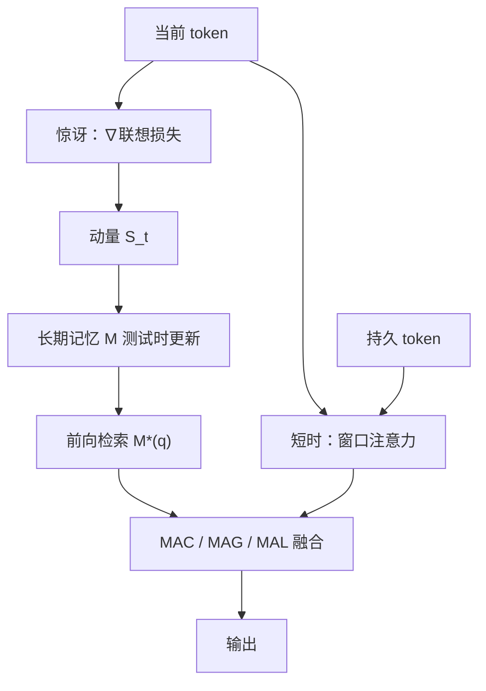

# Titans 测试时记忆

    
令人惊讶的事件更值得记住：用联想损失的梯度当惊讶度，在测试时更新一座深层记忆网络，注意力只负责当前窗口。

    <footer>—— Behrouz, Zhong, Mirrokni，Titans: Learning to Memorize at Test Time，arXiv:2501.00663 / NeurIPS 2025</footer>

线性 RNN 把历史压进固定向量或矩阵，长了一定糊；Transformer 把窗口内依赖建全，窗口外等于失忆。Google Research 的 Ali Behrouz、Peilin Zhong 与 Vahab Mirrokni 把注意力当**短时精确记忆**，另训一个在测试时仍走内环梯度的 **神经长期记忆**，再加一组与输入无关的持久记忆 token。三者合成 **Titans** 家族，并给出三种接入：Memory as Context（MAC）、as Gate（MAG）、as Layer（MAL）。语言建模、常识、基因组、时间序列上优于 Transformer 与当代线性 RNN；Needle-in-a-Haystack 可扩到 **2M+** 上下文。本篇写惊讶度更新与三种变体，不把「测试时学习」写成已替代 RAG。

## 问题

线性注意力 / SSM 的写入多是 $M_t=M_{t-1}+k^\top v$ 或带遗忘的对角转移：压缩是线性的，长上下文在小状态里必然碰撞。满注意力不压缩，但 $N\times d$ 的缓存把 $N$ 锁死。混合滑窗只能局部精确。作者从神经心理的记忆定义出发问五件事：记忆结构该是什么、如何更新、如何读取、如何把不同记忆模块连起来、以及线性矩阵是否根本不够——是否需要**深层**记忆。

「惊讶」来自人类：违背预期的事件更难忘。模型上，对当前输入的损失梯度大，说明与已存联想不一致。若只按瞬时梯度更新，连续惊讶之后梯度塌进平坦区，后续重要片段会被跳过。需要把「过去的惊讶动量」与「这一瞬间的惊讶」分开，并且在上下文切换时让动量衰减。这就是带数据依赖动量与权重衰减的内环 SGD，不是外环再训整网。

### 深层记忆对上线性回归

若 $M$ 只是矩阵，内环目标 $\|Wk-v\|^2$ 假定键值关系是线性的。$L_M\ge 2$ 的 MLP 在表达力上严格强于线性（Hornik 等），作者在 §5.5 用实验支持深层记忆。检索是**不更新权重**的前向：$y_t=M^*(q_t)$。内环只动 $M$ 的参数；外环动 $W_K,W_V$ 等其余权重。这是元学习嵌套，不是普通微调。

Titans 不是 MemGPT：没有外部向量库与函数换页。记忆是网络参数在推理过程中的在线更新。隐私与遗忘要按权重衰减 $\alpha_t$ 与是否持久化 $M$ 来设计，不能当成「可 SQL 删除的档案」。

## 方法

联想损失 $\ell(M_{t-1};x_t)=\|M_{t-1}(k_t)-v_t\|_2^2$。惊讶更新（简化瞬时形式）$M_t=M_{t-1}-\theta_t\nabla\ell$。完整形式拆动量：

$$
S_t=\eta_t S_{t-1}-\theta_t\nabla\ell(M_{t-1};x_t),\qquad M_t=(1-\alpha_t)M_{t-1}+S_t.
$$

$\eta_t\to 0$ 丢掉上一段惊讶（换话题），$\eta_t\to 1$ 把惊讶跨 token 延续；$\alpha_t\to 1$ 清空长期记忆，$\alpha_t\to 0$ 只加新惊讶。$\theta_t$ 控制瞬时惊讶掺入量。三者都数据依赖。训练把序列切成块，把带动量与衰减的 mini-batch GD 张量化成矩阵乘与 scan，深层 MLP 同理。

持久记忆：在窗口前拼接 $N_p$ 个可学习、与输入无关的向量 $p_1,\ldots,p_{N_p}$。三重动机：存任务级元知识；等价于数据无关的注意力权重（Sukhbaatar 等把 FFN 看成固定 KV）；以及缓解因果注意力对首 token 的汇偏置。

三种架构。**MAC**：把序列分段，从长期记忆取出与本段相关的摘要，与持久 token、当前段拼接后再做窗口注意力，再用注意力输出更新 $M$。**MAG**：滑窗注意力与记忆分支并行，输出用门融合。**MAL**：记忆层堆在注意力前，互补性最弱。另有只含长期记忆的 LMM 对照，用来问「没有短时注意力行不行」。

并行化关键是：块内梯度可一次算完，动量项是以 $u_t=\nabla\ell$ 为输入的线性递推，可用并行 scan；若把 $\alpha,\theta,\eta$ 做成块级常数，还能变成 LTI 卷积。主实验仍用 token 级参数。NIAH 上 Titans 比基线更准地扩到大于 2M 的窗口。

### MAC 不是把 KV 拼回去

MAC 检索的是 $M$ 压缩过的抽象，不是重放原文 token。窗口仍然短，精确匹配发生在段内注意力；跨段靠 $M$ 是否在惊讶时写下了那根针。若惊讶门把针当成「不惊讶」跳过，2M NIAH 也会丢。这与 RAG 的失败模式对称：一个漏在写入，一个漏在检索。

## 机制

短时注意力建模窗口内全连接依赖；长期 $M$ 把超出窗口的历史编进权重。动量让「一次大惊讶」照亮随后一整段相关 token，避免梯度塌缩后失写。权重衰减是遗忘门的推广，作者将其连到现代 RNN 的 $\alpha_t$。持久参数提供与上下文无关的任务先验，减轻对首 token 的过度注意力。

深层 $M$ 的前向在检索时是几次 MLP，比扫 2M KV 便宜，但内环每步要反传过 $M$，必须分块张量化，否则训练退回 $O(N)$ 逐步。Sun 等 TTT 是近邻：也是测试时梯度。Titans 强调惊讶动量、自适应遗忘、以及三种接入，而不是只换一层线性层。

论文把注意力称为有限但精确的短时记忆，神经记忆称为持久长时记忆。这是架构比喻，不要写成已实现人类记忆系统。基因组与时间序列结果说明更新规则不绑定语言 token，但超参 $\theta,\eta,\alpha$ 仍要按模态重扫。

## 边界与工程取舍

### 测试时更新的工程税

服务端必须决定 $M$ 是否跨请求持久化：持久则用户数据进权重，遗忘与合规变难；不持久则每次会话从 $M_0$ 开始，2M 优势只存在于单次超长请求。MAC 的段边界与块大小 $b$ 是精度 / 吞吐旋钮。MAL 论文认为互补差，生产应默认 MAC 或 MAG。复现应看 arXiv:2501.00663 与 NeurIPS 2025 正式 PDF 的实验设定是否一致。

与 [MemOS](/llm/memos-os) / Letta 对照：那些系统把记忆外置为明文与工具；Titans 把记忆内置为可在线训练的模块。与 Gated DeltaNet 对照：GDN 是一步矩阵 delta；Titans 允许深层 $M$ 与动量。不要把 NIAH 2M 写成开放聊天的 2M 产品上下文。

出处：Behrouz, Zhong, Mirrokni，*Titans: Learning to Memorize at Test Time*，Google Research，arXiv:2501.00663，NeurIPS 2025。相关：Sun et al. TTT；Yang et al. Gated DeltaNet；Sukhbaatar et al. persistent memory。

## 小结

- Titans 用测试时 SGD（惊讶梯度 + 动量 + 衰减）训练深层长期记忆，注意力管短窗口。
- 持久 token 存任务元知识并缓解汇偏置。
- MAC / MAG / MAL 三种接入；MAC 把检索记忆当上下文拼接。
- NIAH 可扩到 2M+；这是压缩写入，不是无损日志。
- 出处：Behrouz et al.，arXiv:2501.00663。
