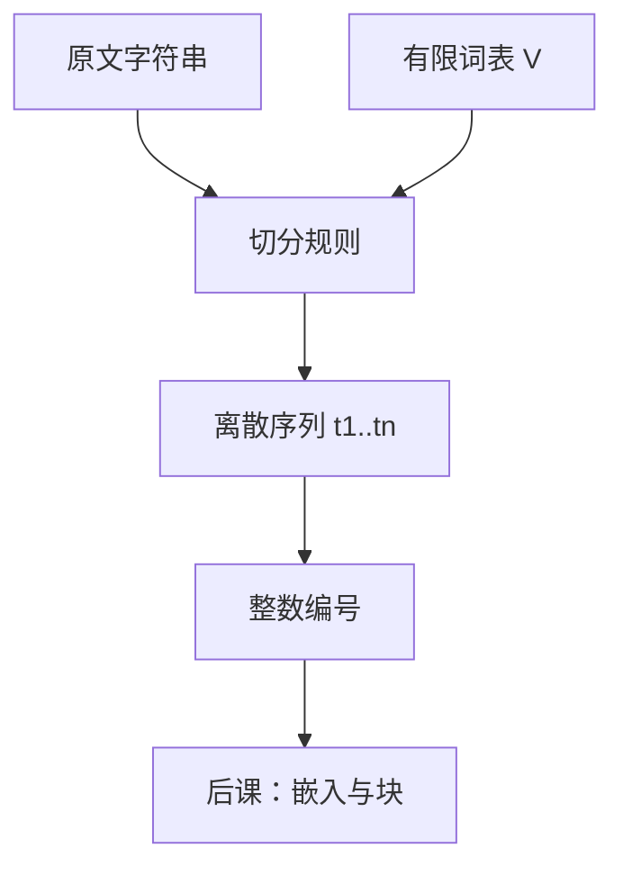

# 离散符号与词表

通信的基本问题，是在一点精确或近似地复现另一点所选定的消息；消息是从可能集合里挑出来的，而不是一段连续波形本身。

<footer>—— 据 Shannon, A Mathematical Theory of Communication, Bell System Technical Journal, 1948 整理</footer>

本课是整个 LLM 栏的第一课。后面的分词规则、嵌入查找、残差块和注意力，都默认你会「有限词表上的离散符号」，不再从连续文本或从点积注意力起笔。不能从 [SDPA](/llm/sdpa) 讲起：注意力假定每个位置已经是向量，而向量从哪来、位置上站着什么符号，是更早的一层约定。后课默认已经读完本课。

## 问题

神经网络做的是实向量上的连续映射：加减乘、非线性、归一化。自然语言却是符号串——字母、汉字、空格、标点——在任何固定编码下都是离散的。若把一段原文直接当成 $\mathbb{R}$ 上的波形来拟合，模型必须同时发明「什么算一个单位」和「单位之间如何组合」。训练目标、批处理和损失都没有稳定的指标集。缺口因此不是「怎样打分」，而是：先把文本收成一个有限集合 $V$ 上的序列，使每个位置上的对象可以编号、可以查表、可以数频次。

有限性是硬约束。若符号集合随语料无限增长，查找表无法分配，未知符号无法指称，损失也无法在固定的分类头上定义。离散性同样是硬约束：一旦切成原子，模型在这一层就不再看见原子内部的笔画或字节，除非后课的切分规则把内部结构暴露成更短的符号。本课只把「必须是有限离散词表」钉死；切分算法、词表大小、往返是否无损，分别是后面几课留下的缺口。

### 连续文本没有模型可索引的位置

「位置」在注意力里是序列下标。下标要有对象。一段 UTF-8 字节流可以按下标读，但字节与词、与任务相关的单位并不重合：英文一个词跨多个字节，中文一个字常是三字节，表情与控制符更乱。若不对齐到约定好的原子，批里的「第 $i$ 个位置」在不同句子里含义不同，掩码、长度、对齐都无法写。离散符号的第一件事，就是给出一套全体句子共享的下标对象。

本课的「token」就是词表里的原子符号，不是「子词」的同义词。子词、字节、词、汉字，都只是实现 $V$ 的粒度。后课会改粒度，不会改「$V$ 有限、元素可编号」这条公理。

## 方法

约定词表 $V=\{v_1,\ldots,v_{|V|}\}$，每个元素对应唯一整数编号 $\mathrm{id}:V\to\{0,\ldots,|V|-1\}$。一段文本在选定的切分规则下变成长度 $n$ 的序列 $t_{1:n}$，其中 $t_i\in V$。模型此后只看见这份整数序列，不再看见原文。特殊符号也是 $V$ 的成员：开头、结尾、填充、以及用来承接未登录形的未知符，都占编号，而不是额外的通道。

形式上看，语言模型在离散序列上定义联合分布

$$
P(t_{1:n})=\prod_{i=1}^{n} P(t_i\mid t_{<i}),
$$

条件分布的支撑集就是 $V$。分类头的最后一维必须是 $|V|$。嵌入表的第一维也必须是 $|V|$。这两处形状从本课起就锁在一起；后课只讨论它们是否共享参数、宽度取多少，不再问「为什么是分类」。

### 切分是进入 $V$ 的接口，不是另一种表示

把字符串映到 $t_{1:n}$ 的过程叫切分。本课不规定切分是按空格、按字符还是按统计合并——那是 [BPE 合并规则](/llm/bpe-merge-rule) 的题目。这里只需承认：切分是 $V$ 的实现，必须在训练与推理之间保持同一套规则。换规则等于换词表，即使表面符号长得像。编号一旦固定，梯度、检查点、缓存都按这个编号说话。

整数编号没有度量含义。编号相邻不表示语义相邻。任何「靠近」都必须由后课的嵌入向量来学，不能从 id 的算术里读出来。

## 机制

离散化把组合问题从「无限字符串」推到「有限字母表上的序列」。模型的容量于是花在两处：一处是每个原子自己的向量，一处是原子之间的排列与依赖。原子选得过粗，罕见形无法进入 $V$，只能挤进未知符；原子选得过细，序列变长，后面注意力的二次代价按长度涨。本课不解决这个权衡，只指出权衡的定义域是 $V$ 与切分，而不是注意力公式。

因为每个位置只站着一个符号，同一段原文的两种切分是两个不同的离散对象。训练分布是切分之后的分布。评测若用另一套切分，条件概率的项数和支撑都对不上。这就是为什么词表文件、合并表或 Unigram 概率表必须与权重一起版本化：它们不是预处理细节，而是模型定义的一部分。

### 未知与封闭

封闭词表意味着 $V$ 在训练结束时冻住。冻住之后出现的字形，要么被切分成仍在 $V$ 里的更短符号，要么落入未知符。未知符把许多不同的原文撞成同一个 id，信息在进入网络之前就丢了。开词表策略——例如用字节兜底——并没有取消离散性，只是把兜底符号也放进 $V$，使理论上任何字节串都有一条路径。覆盖与压缩的定量权衡留给 [词表大小与 UNK](/llm/vocab-size-unk)。

不要把 one-hot 当成额外的「真正表示」。编号经过嵌入表之后才是向量；one-hot 只是查找的代数写法。实现里从来没有物化 $|V|$ 维的稀疏向量。

## 边界

本课固定的是接口，不是某一种语言学单位。字节、字符、子词、词、甚至视觉切片，只要集合有限、元素可编号，都满足同一接口。多模态模型把图像块也叫 token，沿用的正是这套约定，而不是说图像变成了单词。反过来，连续扩散语言模型若在隐空间里不经过有限 $V$，就不在本课的定义里；本栏主干默认自回归分类头。

离散符号也不自动给出语法或语义。词表可以按频率堆符号，完全不问词性。任何结构都必须由后续层从序列里学出来。因此本课禁止后课再花篇幅解释「token 是什么」：它就是 $V$ 中的原子。后课只补：原子如何长出来、表有多大、如何映回字符串、如何变成 $d$ 维向量。

## 小结

- LLM 栏从有限词表 $V$ 上的离散符号开始，不从注意力或连续文本开始。
- 每个位置是 $V$ 中的一个原子，对应唯一整数编号；模型只看见编号序列。
- 语言模型的条件分布与分类头的最后一维都以 $|V|$ 为支撑。
- 切分是进入 $V$ 的接口，必须与权重一同版本化；本课不规定哪一种切分。
- 编号没有度量；未知符与开词表兜底是后课的覆盖问题。
- 后课默认已经读完本课，不再重讲离散符号与词表。
- 出处：Shannon, *A Mathematical Theory of Communication*, 1948；后续切分课从 Sennrich、Kudo 接起。
