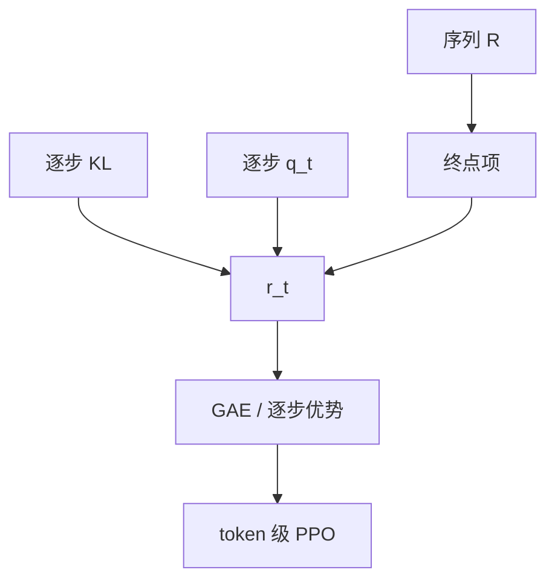

# token 级奖励塑形

序列只有终点一个标量时，前几百个 token 的优势近乎零；塑形是把信用挪到真正决策的位置，而不是另造一个偏好模型。

<footer>—— 对照 Sutton 的奖励塑形；过程奖励与逐步 KL 是语言模型里最常用的两种稠密化</footer>

[上一课](/llm/multi-objective-reward)得到一个序列标量 $r(x,y)$。接到 [PPO](/llm/ppo-llm) 时，动作却是逐 token 的。缺口是：**稀疏终点让中间步的梯度消失，模型只改结尾套话。** 本课写 token 级塑形：逐步 KL、过程分、格式分播到位置上。不重推 clip。下一单元从 GAE 的 $\lambda$ 接着讲如何把这些逐步奖励变成优势。

## 问题

轨迹长度数百到数千。若只在 EOS 放 $r$，REINFORCE 的信用分配把同一个回报赋给所有 token，方差大；配合价值函数时，早期 $V$ 也难学。InstructGPT 的逐步 KL 已经是一种塑形：每步减 $\beta\log(\pi_\theta/\pi_{\mathrm{ref}})$，中间 token 立刻有非零项。Lightman 的 PRM 把逐步对错变成更语义化的稠密奖励。[GRPO](/llm/grpo) 默认整条共享一个 $\hat A_i$，等于不做逐步塑形。

乱塑形会改变最优策略。Ng、Harada、Russell 的势函数塑形保证最优策略不变；随便把「看见关键词 +0.1」加进中间步，会教会刷词。本课只允许与任务同构的稠密信号：KL、过程合法、格式锚点。

### 广播不是塑形

把序列 $r$ 均摊到每个 token，或只放在最后一个 token，是实现约定，不增加信息。塑形要新的逐步可观测量 $r_t$。DAPO 的 token 级**损失平均**也不是塑形：它改的是梯度测度，奖励仍是序列标量。

PRM 的 $q_t$ 当 $r_t$ 时，归约（min / 乘积）与逐步奖励是两条用法。前者给 BoN，后者给 RL。不要混。

## 方法

逐步奖励常见三层：

$$
r_t = -\beta \log\frac{\pi_\theta(a_t\mid s_t)}{\pi_{\mathrm{ref}}(a_t\mid s_t)}
+\gamma_{\mathrm{p}}\, q_t
+\mathbf{1}[t=T]\, R_{\mathrm{seq}}.
$$

$q_t$ 来自 [过程监督](/llm/process-supervision) 或规则（是否仍在 boxed 前、是否非法结束）。$R_{\mathrm{seq}}$ 是 RM、校验器或多目标合成。实现上 $r_t$ 进入 GAE 或直接当逐步优势的素材。KL 已在奖励里就不要在损失里再加一份 $\beta$。

格式锚：只在抽取失败的位置给负分，而不是每步扣。否则模型学会极短回答以减少扣分次数。

## 机制

稠密 $r_t$ 降低方差，让早期决策（选哪条引理、是否调用工具）立刻看到反馈。代价是偏差：PRM 错标会把错误过程当正奖励。势函数观点：若 $q_t = \Phi(s_{t+1})-\Phi(s_t)$，最优策略不变；PRM 不是势，最优会变——这是有意的，我们就是要过程合法的策略。

GRPO 若仍整条共享 $\hat A$，塑形的逐步差会被抹平。要 token 级信用，需逐步 $r_t$ 或改 PPO-critic。这是本课与群体方法的接口，不是否定 GRPO。

长度惩罚按 token 扣还是只在超长后扣，会剧烈改变平均长度。与后课过长过滤一起设计，不要两处各扣一次。

## 边界与工程取舍

开放偏好几乎没有可靠 $q_t$，只保留逐步 KL + 终点 RM。可验证域优先终点校验器，过程项用轻量规则或小 PRM。塑形过度会让策略优化塑形项、忽略 $R_{\mathrm{seq}}$，又一条 Goodhart。下一课用 GAE 的 $\lambda$ 在偏差与方差之间插值，承接这里的逐步 $r_t$。

## 小结

- 稀疏序列奖励让早期 token 梯度近零；塑形引入逐步可观测量。
- 合法塑形：逐步 KL、过程分、格式锚；关键词刷分会改最优策略。
- 广播终点分 / token 级损失平均都不是塑形。
- GRPO 默认序列优势，逐步塑形需显式 $r_t$。
- 出处：Sutton 塑形；Schulman GAE 的输入；Ouyang 逐步 KL；Lightman PRM。
