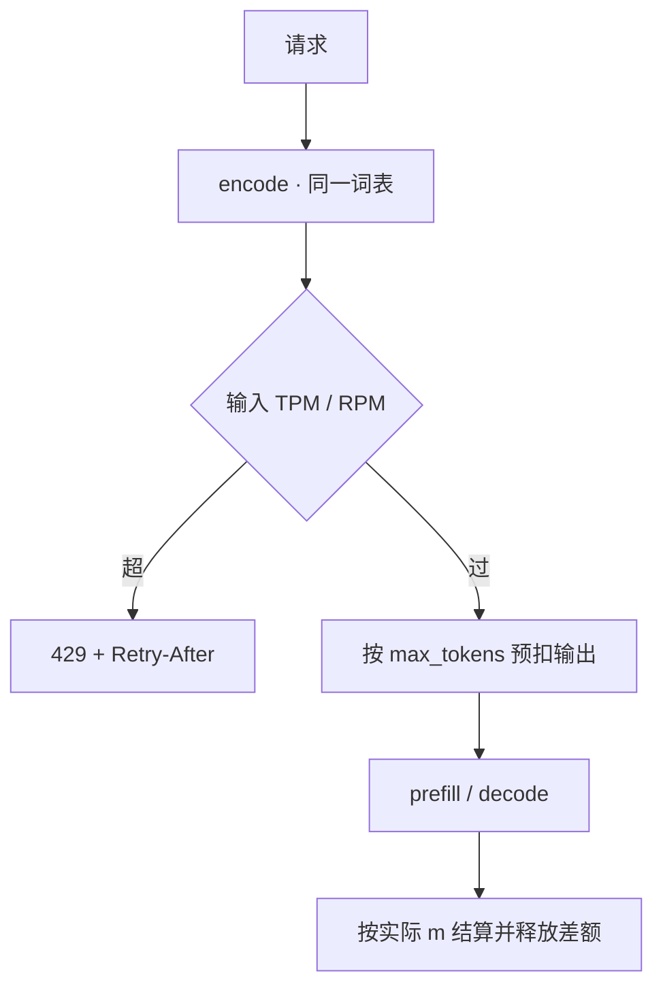

# token 计量与限流

    
配额若按请求个数，短补全与万 token 写作会被当成同一件事；计量单位必须是 tokenizer 之后的 token，限流才能贴近算力与账单。

    <footer>—— 对照云厂商 API 的 RPM / TPM 配额与服务端在 encode 之后、prefill 之前的闸门</footer>

HTTP 429 在普通 JSON API 里按请求计数就够。自回归服务里，一次「请求」的代价可以从几百 FLOPs 到一次数万长度的前填再加数千步 decode，差两个数量级。云厂商因此同时报 RPM（每分钟请求）与 TPM（每分钟 token），有的再拆输入 TPM 与输出 TPM。本篇把计量钉在与引擎相同的 tokenizer 上，说明预扣、结算、突发与拒绝；分词开销见 [tokenizer 服务成本](/llm/serving-tokenizer-cost)，账单里缓存折扣见 [提示缓存计费](/llm/prompt-cache-billing)。不编造一篇 token rate limit 的会议论文。

## 问题

按请求限流会系统性偏向重请求：同一 RPM 下，有人拿 128k 上下文做 RAG，有人做三字补全，GPU 与 KV 被前者吃光，后者在队列里看 429。按字符或字节限流对中文、代码、emoji 的误差很大，且与模型内部长度对不上——闸门必须发生在 [encode](/llm/serving-tokenizer-cost) 之后。按「估算 token」用 `len/4` 一类规则，会在中文上低估、在重复标点上高估，配额变成随机数。

输出侧更麻烦。到达时只知道 `max_tokens` 上限，不知道真实结束步。若只在结束后扣配额，用户可以先把 KV 池打满再 429，保护来不及。若按 `max_tokens` 预扣，短回复会长期占着额度，看起来像限流过严。需要预扣-结算，而不是只选一端。

### RPM 与 TPM 管的不是同一类事故

RPM 挡住的是连接与调度器唤醒：极短请求也能把前端、鉴权、连续批的成员更新打满。TPM 挡住的是前填 FLOPs、decode 带宽与 KV 字节。只有 RPM 时，一条超长提示合法地打穿全卡；只有 TPM 时，每秒成千上万条空消息仍能把控制面打死。两者要同时存在，拒绝原因要分开计数，否则会把「提示太长」与「QPS 太高」混成同一个告警。

`usage.prompt_tokens` / `completion_tokens` 必须与闸门同源。网关用 tiktoken、引擎用 SentencePiece，账单与 429 会对不上，客诉无法仲裁。兼容层应在同一进程、同一词表上计数，见 [OpenAI 兼容协议](/llm/openai-compat-api)。

## 方法

令请求 $r$ 的提示 token 数为 $n$，声明的最大输出为 $m_{\max}$，实际输出为 $m$。输入侧在 encode 之后立刻计量 $n$；输出侧先预扣 $m_{\max}$（或按产品设的默认上限），结束时按 $m$ 结算，释放差额。窗口 $T$（通常 60 s）内租户 $u$ 的消耗为

$$
C_{\mathrm{in}}(u)=\sum n,\qquad
C_{\mathrm{out}}(u)=\sum m,\qquad
C_{\mathrm{req}}(u)=\#\{r\}.
$$

超限当且仅当任一分项超过配额。实现上常用令牌桶：桶容量等于突发额度，每秒按持续速率加水。突发允许短时超过平均值，但桶空即 429，并带 `Retry-After` 或等价头。不要用「每分钟清零计数器」当唯一算法：边界上会出现第 59 秒打满、第 0 秒再打满的双倍尖刺。

优先级与配额成对。付费档 TPM 高、突发大；免费档 TPM 低、可抢占。过载时先拒低档，而不是大家一起排队到 [SLO](/llm/serving-slo) 集体违约，见 [优先级](/llm/priority-sla)。预填与 decode 可以分开记账：输入 TPM 打满时拒新的长提示，但允许已在生成的请求把输出桶用完——否则会在句子中间 429，流式协议更难处理。产品若必须中途停下，应发明确的 finish reason，而不是切断 TCP。

### 预扣要防占坑

恶意或粗心的客户端把 `max_tokens` 开到上下文上限，预扣会把整分钟的输出 TPM 锁死，别人进不来。对策：对 $m_{\max}$ 设产品上限；预扣按 $\min(m_{\max}, m_{\mathrm{budget}})$；对长时间占坑的连接做空闲超时。工具调用多轮时，每一轮都是新的 $n$ 与 $m$，配额按轮累加，不要只在会话开始扣一次。

流式计量：每吐出 $k$ 个 token 向桶扣一次，避免结束才发现已经超了两个数量级。扣的粒度太细会打爆计数器；太粗又失去保护。常见折中是每步或每 8/16 token 批扣，与引擎迭代对齐。

## 机制

token 近似于工作量，但不是恒等。前填成本随 $n$ 近似二次（注意力）加线性（FFN）；decode 每步扫权重，与 $m$ 近似线性，但步墙钟还被批大小与 KV 长度调制。因此 TPM 是**计费与公平**的单位，不是精确的 GPU 秒。同一 TPM 下，全是长前填与全是长 decode 对硬件的伤害不同；精细运营应再按长度桶拆配额，或对超长提示走单独队列。

### 闸门必须在分配 KV 之前

限流点要放在 KV 分配之前。先准入再 429，空洞已经占上了，保护失败。正确顺序：鉴权 → encode → 查桶 → 拒或预扣 → 进调度器。分布式网关要用同一后端计数（Redis 一类）或按租户一致性哈希到固定限流分片，否则每个副本各有一个桶，配额被乘以副本数。

缓存命中的提示 token 还算不算 TPM，是产品条款。许多云 API 仍把缓存 token 计入速率上限，只在**账单**上打折。限流与计费拆开写，避免「缓存省钱却仍然 429」的意外，细节见提示缓存计费专文。

## 边界与工程取舍

多模态：图像/音频被编成许多 token，必须用模型卡上的计数规则，不能按文件字节。思维链若对用户隐藏，对外计量要声明是否含内部 token——隐藏却计费会引发客诉；隐藏且不计费会变成一条绕过 TPM 的通道。投机解码拒绝的草稿不应计入用户输出，但算力已经花了；goodput 与 TPM 不是同一张表。

不要在客户端「自行估算」代替服务端闸门。SDK 可以提示剩余配额，权威在服务端。时钟回拨、重试未去重会把同一请求扣两次或零次：重试必须带幂等键，限流统计按用户可见的一次尝试。跨区域的桶是否共享，决定用户能不能靠换区翻倍配额，见 [多区域故障转移](/llm/multi-region-failover)。

429 的响应体应可机器读：哪个维度超了、当前窗口剩余、建议等待。只返回字符串 “rate limit” 会迫使客户端盲退避，把尾延迟写得更肥。

## 小结

- 计量单位是与引擎同一词表的 token；RPM 与 TPM 同时要，分别挡住控制面与算力。
- 输出按 `max_tokens` 预扣、按实际 $m$ 结算；流式批扣，防止占坑与事后超支。
- 令牌桶比整分钟清零更能打突发；分布式必须共享桶或按租户分片。
- 闸门在 encode 之后、KV 分配之前；`usage` 与 429 同源。
- 缓存折扣、思维链可见性、多模态计数都是条款，不是算法细节。
- 出处：对照 OpenAI / Anthropic 等公开 API 的 RPM·TPM 模型与令牌桶限流实践；无单独经典论文名。
